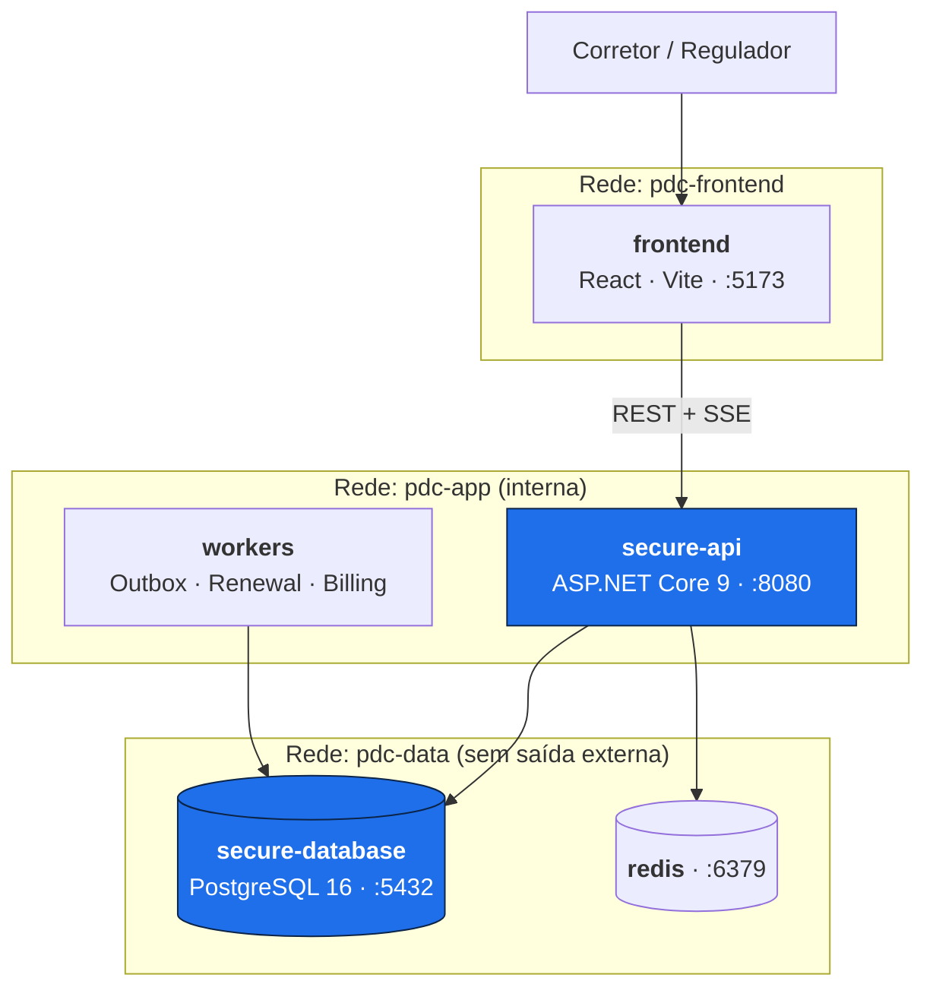
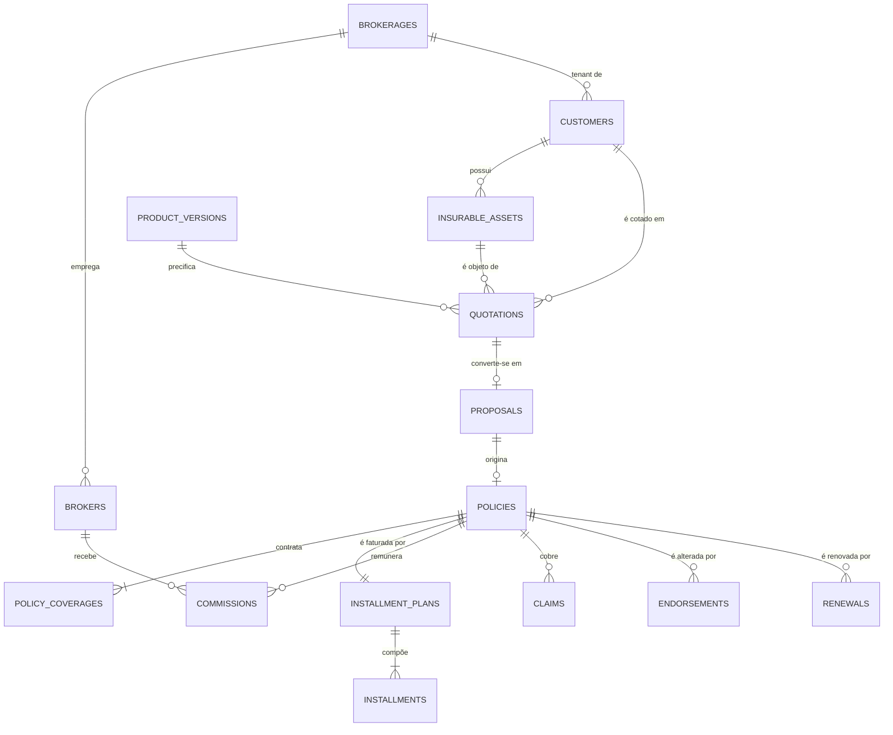
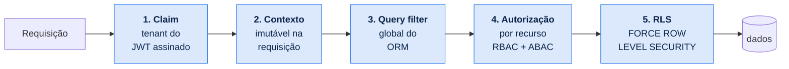

<div align="center">

# Portal do Corretor

**Plataforma de gestão para corretores de seguros**

Banco de dados objeto-relacional · Modelo de domínio rico · Arquitetura modular

[](https://dotnet.microsoft.com/)
[](https://www.postgresql.org/)
[](https://react.dev/)
[](https://docs.docker.com/compose/)
[](#14-testes)
[](LICENSE)

</div>

---

## Índice

| | Seção | | Seção |
|---|---|---|---|
| ⚡ | [**Quick Start**](#-quick-start) | 9 | [Arquitetura](#9-arquitetura) |
| 1 | [Visão geral](#1-visão-geral) | 10 | [Modelo de domínio](#10-modelo-de-domínio) |
| 2 | [Instalação e execução](#2-instalação-e-execução) | 11 | [Banco objeto-relacional](#11-banco-objeto-relacional) |
| 3 | [URLs](#3-urls) | 12 | [Segurança de aplicação](#12-segurança-de-aplicação) |
| 4 | [Workers](#4-processamento-assíncrono-workers) | 13 | [Observabilidade](#13-observabilidade) |
| 5 | [Área administrativa](#5-área-administrativa) | 14 | [Testes](#14-testes) |
| 6 | [Variáveis de ambiente](#6-variáveis-de-ambiente) | 15 | [Ferramentas de engenharia](#15-ferramentas-de-engenharia) |
| 7 | [Fluxo da aplicação](#7-fluxo-da-aplicação) | 16 | [Decisões arquiteturais](#16-decisões-arquiteturais-adrs) |
| 8 | [Estrutura do repositório](#8-estrutura-do-repositório) | 17 | [Solução de problemas](#17-solução-de-problemas) |
| | | 18 | [Estado do projeto](#18-estado-do-projeto) |

---

## ⚡ Quick Start

Um único comando sobe **banco, migrations, dados, backend e frontend**:

```bash
./start.sh
```

No PowerShell:

```powershell
.\start.ps1
```

Ao final o script imprime todas as URLs. Abra **http://localhost:5173**.

| Comando | O que faz |
|---|---|
| `./start.sh` | Sobe o ambiente completo (preserva dados existentes) |
| `./start.sh --reset` | Recria o banco do zero e recarrega a massa sintética |
| `./start.sh --no-seed` | Sobe sem carregar dados de demonstração |
| `./start.sh --stop` | Encerra backend, frontend e contêineres |

O script é idempotente: rodar duas vezes não duplica dados nem quebra o ambiente.

---

## 1. Visão geral

O Portal do Corretor cobre o ciclo de vida comercial da corretagem de seguros —
**cliente → bem segurável → cotação → proposta → apólice → parcelas → comissão → renovação →
sinistro** — implementado como um monólito modular com Clean Architecture, DDD tático e
PostgreSQL usado como banco objeto-relacional de verdade.

O portal **não é só de consulta**: a área de administração cadastra, edita, exclui logicamente e
restaura registros, com toda operação persistida no PostgreSQL e refletida imediatamente na
interface e no Live Processing Console.

### Capacidades técnicas

| Área | Implementação |
|---|---|
| **Persistência** | PostgreSQL 16 com tipos compostos, domains, enums, `daterange`, constraints de exclusão, índices parciais e GIN, particionamento mensal |
| **Domínio** | Rich Domain Model — agregados com invariantes, 19 Value Objects imutáveis, eventos de domínio, specifications, serviços de domínio |
| **Escrita** | CRUD completo com validação em três camadas (DTO, domínio, banco), transações e mensagens de erro derivadas das constraints |
| **Concorrência** | Optimistic locking com `xmin` nativo, chaves de idempotência, `SELECT ... FOR UPDATE SKIP LOCKED` |
| **Multi-tenancy** | Isolamento em 5 camadas independentes, terminando em Row-Level Security com `FORCE` |
| **Assincronismo** | Outbox transacional — evento e estado confirmados na mesma transação |
| **Auditoria** | Trilha append-only imposta por `REVOKE` no banco, particionada por mês |
| **Tempo real** | Live Processing Console via Server-Sent Events, com redação automática de dados sensíveis |
| **Qualidade** | 236 testes (unitários, propriedade, arquiteturais e integração com PostgreSQL real via Testcontainers) |

### Perfis de acesso

- **Corretor** — usuário operacional, opera dentro do tenant da sua corretora.
- **Regulatório** — perfil de supervisão somente-leitura, multi-tenant por escopo autorizado.

Funções de segurança, auditoria e administração são **capacidades internas** exercidas por contas
técnicas (`Outbox Dispatcher`, `Renewal Scanner`, `Billing Scheduler`, `Integrity Checker`).

---

## 2. Instalação e execução

### 2.1 Pré-requisitos

| Ferramenta | Versão | Verificar | Obter |
|---|---|---|---|
| .NET SDK | 9.0+ | `dotnet --version` | [download](https://dotnet.microsoft.com/download/dotnet/9.0) |
| Docker Desktop | 24+ | `docker --version` | [download](https://www.docker.com/products/docker-desktop/) |
| Node.js | 20+ | `node --version` | [download](https://nodejs.org/) |
| Git | 2.40+ | `git --version` | [download](https://git-scm.com/) |

> **Windows** — o Docker Desktop exige **WSL 2**. Se `wsl --status` disser que não está instalado,
> abra o PowerShell **como Administrador**, rode `wsl --install` e reinicie. Sem isso o engine do
> Docker não sobe.

### 2.2 Instalação automática (recomendado)

```bash
git clone https://github.com/volksec/0009098.git && cd 0009098
```

```bash
./start.sh
```

O script executa, em ordem: verifica pré-requisitos → gera `.env` com senhas aleatórias →
restaura pacotes .NET e npm → compila → sobe PostgreSQL e Redis → aguarda o healthcheck →
aplica as 12 migrations → carrega a massa sintética → inicia backend e frontend → imprime as URLs.

### 2.3 Instalação manual

Para entender cada etapa ou depurar um passo específico.

**Passo 1 — variáveis de ambiente**

```bash
cp .env.example .env
```

```bash
cp infrastructure/secrets/db_password.txt.example infrastructure/secrets/db_password.txt
```

Edite os dois arquivos com valores próprios. Nenhuma credencial é versionada — o Compose **falha
explicitamente** se uma variável estiver ausente, em vez de subir com padrão inseguro.

**Passo 2 — banco e cache**

```bash
docker compose up -d secure-database redis
```

```bash
docker compose ps
```

Espere `pdc-secure-db` e `pdc-redis` com status `healthy`.

**Passo 3 — migrations**

```bash
for f in database/secure/migrations/V*.sql; do \
  docker exec -i pdc-secure-db psql -U pdc_migrator -d portal_do_corretor -v ON_ERROR_STOP=1 -q < "$f"; \
done
```

**Passo 4 — massa de dados**

```bash
docker exec -i pdc-secure-db psql -U pdc_migrator -d portal_do_corretor -q < database/secure/seeds/demo-seed.sql
```

**Passo 5 — backend**

```bash
export POSTGRES_APP_USER_PASSWORD="$(grep POSTGRES_APP_USER_PASSWORD .env | cut -d= -f2)"
```

```bash
dotnet run --project apps/secure-api --no-launch-profile --urls http://localhost:8080
```

**Passo 6 — frontend** (em outro terminal)

```bash
cd apps/frontend && npm install && npm run dev
```

### 2.4 Verificação

```bash
curl http://localhost:8080/health/ready
```

Resposta esperada: `{"status":"ready","tables":71}`

---

## 3. URLs

| Recurso | URL | Descrição |
|---|---|---|
| **Portal** | http://localhost:5173 | Interface principal |
| **Administração** | http://localhost:5173 → *Clientes* | CRUD de clientes |
| **Cotação** | http://localhost:5173 → *Cotações* | Assistente e comparação dos três planos |
| **Propostas** | http://localhost:5173 → *Propostas* | Análise de risco e emissão de apólice |
| **Live Console** | http://localhost:5173 → *Live Console* | Eventos em tempo real |
| **Banco de dados** | http://localhost:5173 → *Banco de dados* | Catálogo, RLS e invariantes |
| **Isolamento** | http://localhost:5173 → *Isolamento* | Demonstração de multi-tenancy |
| **Swagger UI** | http://localhost:8080/swagger | Documentação interativa da API |
| **OpenAPI JSON** | http://localhost:8080/swagger/v1/swagger.json | Especificação |
| **Health (liveness)** | http://localhost:8080/health/live | Processo vivo |
| **Health (readiness)** | http://localhost:8080/health/ready | Banco e migrations |
| **SSE** | http://localhost:8080/api/events/stream | Stream de eventos |
| **Eventos recentes** | http://localhost:8080/api/events/recent | Fallback por polling |
| **PostgreSQL** | `localhost:5432/portal_do_corretor` | Banco (loopback apenas) |

### Endpoints da API

| Método | Rota | Descrição |
|---|---|---|
| `GET` | `/api` | Índice: rotas, cabeçalhos e por onde começar |
| `GET` | `/api/brokerages` | Corretoras (tenants) |
| `GET` | `/api/brokers` | Corretores do tenant |
| `GET` | `/api/customers` | Clientes — paginação, busca, filtros |
| `GET` | `/api/customers/{id}` | Cliente por identificador |
| `POST` | `/api/customers` | **Cadastrar** cliente |
| `PUT` | `/api/customers/{id}` | **Editar** cliente |
| `DELETE` | `/api/customers/{id}` | **Excluir logicamente** (motivo obrigatório) |
| `POST` | `/api/customers/{id}/restore` | **Restaurar** cliente excluído |
| `GET` | `/api/products` | Catálogo de produtos e coberturas |
| `GET` | `/api/customers/{id}/assets` | Bens seguráveis do cliente |
| `GET` | `/api/quotations` | Cotações — paginação e filtro por status |
| `GET` | `/api/quotations/{id}` | Cotação com os três planos e o snapshot de cálculo |
| `POST` | `/api/quotations` | **Cotar** — calcula os três planos |
| `POST` | `/api/quotations/{id}/convert` | **Converter** cotação em proposta |
| `GET` | `/api/proposals` | Propostas — paginação e filtro por status |
| `GET` | `/api/proposals/{id}` | Proposta com decisões, pendências e histórico |
| `POST` | `/api/proposals/{id}/underwrite` | **Decidir** análise de risco (versionada) |
| `POST` | `/api/proposals/{id}/issue` | **Emitir** apólice (aceita `Idempotency-Key`) |
| `GET` | `/api/policies` | Apólices |
| `GET` | `/api/billing/summary` | Resumo de parcelas: pendentes, vencidas, quitadas |
| `GET` | `/api/billing/installments` | Parcelas — paginação e filtro por status |
| `GET` | `/api/billing/policies/{id}/installments` | Plano de parcelas de uma apólice |
| `POST` | `/api/billing/installments/{id}/pay` | **Quitar** parcela (pagamento simulado) |
| `GET` | `/api/commissions` | Extrato do corretor corrente |
| `GET` | `/api/commissions/monthly` | Consolidação por competência |
| `POST` | `/api/commissions/{id}/release` | **Liberar** comissão prevista |
| `POST` | `/api/commissions/{id}/reverse` | **Estornar** — cria lançamento inverso |
| `GET` | `/api/claims` | Sinistros — paginação e filtro |
| `GET` | `/api/claims/{id}` | Sinistro com linha do tempo |
| `POST` | `/api/claims` | **Avisar** sinistro |
| `POST` | `/api/claims/{id}/events` | **Acrescentar** evento à linha do tempo |
| `POST` | `/api/claims/{id}/decide` | **Decidir** (simulado) |
| `GET` | `/api/dashboard` | Indicadores consolidados |
| `GET` | `/api/engineering/schema` | Estatísticas do catálogo |
| `GET` | `/api/engineering/rls` | Políticas de Row-Level Security |
| `GET` | `/api/engineering/invariants` | Constraints do modelo |

**Parâmetros de `GET /api/customers`:** `search`, `kind` (`INDIVIDUAL`/`BUSINESS`), `status`,
`brokerId`, `includeDeleted`, `page`, `pageSize` (1–100).

### Cabeçalhos

| Cabeçalho | Uso |
|---|---|
| `X-Tenant-Id` | Corretora corrente. **Provisório** — passa a vir do claim do token com a autenticação |
| `X-Actor-Id` | Ator da operação (`created_by`, `deleted_by`, auditoria) |
| `X-Correlation-Id` | Correlação; gerado se ausente e devolvido em toda resposta |
| `Idempotency-Key` | Emissão de apólice: reenviar a mesma chave devolve a resposta original |

---

## 4. Processamento assíncrono (workers)

Cinco *background services* rodam em `apps/workers`, cada um no próprio laço — a falha de um
não interrompe os demais. Conectam como `app_worker`, papel distinto do `app_user` porque o
dispatcher precisa atravessar tenants para processar a fila inteira, e essa permissão não deve
existir no papel que serve requisições de usuário.

| Worker | Intervalo | O que faz |
|---|---|---|
| **Outbox Dispatcher** | 500 ms | Publica mensagens com `FOR UPDATE SKIP LOCKED`; *backoff* exponencial até 10 tentativas |
| **Renewal Scanner** | 6 h | Abre renovações para apólices vencendo em 45 dias |
| **Billing Scheduler** | 1 h | Marca parcelas vencidas |
| **Quotation Expirer** | 1 h | Expira cotações fora do prazo |
| **Integrity Checker** | 12 h | Executa `app.run_integrity_checks()` e grava o resultado |

```bash
tail -f .run/workers.log
```

Saída típica na inicialização:

```
Outbox Dispatcher iniciado (lote 100)
Renewal Scanner iniciado (intervalo 06:00:00)
Billing Scheduler iniciado (intervalo 01:00:00)
Quotation Expirer iniciado (intervalo 01:00:00)
Integrity Checker iniciado (intervalo 12:00:00)
Integrity Checker: 10 verificação(ões), nenhuma divergência
```

**Por que `SKIP LOCKED`** — vários dispatchers podem rodar em paralelo e cada mensagem vai para
exatamente um deles. Sem isso, o segundo worker ficaria bloqueado esperando o primeiro em vez de
pegar o próximo lote. A entrega é **ao menos uma vez**; exatamente-uma-vez é inalcançável sem
coordenação distribuída, então o consumo é idempotente por `processed_messages`.

**Integridade medida, não presumida** — se o modelo estiver correto, as 10 verificações retornam
zero sempre. Qualquer valor diferente indica invariante contornada, por bug, script manual ou
migration errada, e é registrado com nível de erro.

---

## 5. Área administrativa

A tela **Administração** opera diretamente sobre o banco.

| Operação | Comportamento |
|---|---|
| **Cadastro** | Formulário com máscara de CPF/CNPJ e campos que mudam conforme PF ou PJ |
| **Consulta** | Paginação, busca full-text (`tsvector`) e filtro por tipo |
| **Edição** | Documento e tipo **não** são editáveis — alterá-los mudaria a identidade do cliente e invalidaria o histórico de apólices |
| **Exclusão** | Lógica, com motivo obrigatório e cascata em contatos, endereços e bens na mesma transação |
| **Restauração** | Devolve o registro e os filhos excluídos **no mesmo lote** |
| **Feedback** | Toasts de sucesso e erro; erros de campo destacados no formulário |

### Validação em três camadas

1. **DTO** (`CustomerInput`) — obrigatoriedade, tamanho, formato de e-mail. Retorna `422` com
   erros por campo.
2. **Domínio** (`DocumentNumber`) — dígito verificador de CPF/CNPJ e coerência com o tipo.
3. **Banco** — `ck_customers_individual_fields`, `ux_customers_tenant_document` e as demais
   constraints. Cada violação vira uma mensagem acionável:

| Constraint | Resposta |
|---|---|
| `ux_customers_tenant_document` | `409` — "Já existe um cliente com este documento nesta corretora." |
| `ck_customers_individual_fields` | `422` — "Pessoa física exige nome, sobrenome e data de nascimento…" |
| Apólice vigente | `409` — "Cliente possui N apólice(s) vigente(s) e não pode ser excluído." |

O DTO **não tem propriedade `TenantId`**, e isso é deliberado: o tenant vem do contexto da
requisição, nunca do corpo. Um DTO que o aceitasse seria a porta de entrada para mass assignment.

---

## 6. Variáveis de ambiente

### `.env` (raiz)

| Variável | Descrição | Padrão |
|---|---|---|
| `POSTGRES_APP_USER_PASSWORD` | Senha do papel `app_user` (a aplicação usa este) | gerada pelo `start.sh` |
| `POSTGRES_APP_REGULATOR_PASSWORD` | Senha do papel `app_regulator` | gerada |
| `POSTGRES_APP_WORKER_PASSWORD` | Senha do papel `app_worker` | gerada |

### Backend

| Variável | Descrição | Padrão |
|---|---|---|
| `POSTGRES_APP_USER_PASSWORD` | Senha do banco — **não** fica no `appsettings.json` | obrigatória |
| `PDC_DOCUMENT_PEPPER` | Pepper do HMAC de busca por documento | `pdc-local-dev-pepper` |
| `ASPNETCORE_URLS` | Endereço de escuta | `http://localhost:8080` |

### Frontend (`apps/frontend/.env.development`)

| Variável | Descrição | Padrão |
|---|---|---|
| `VITE_API_BASE_URL` | Base da API | `http://localhost:8080` |

### Arquivos de segredo

| Arquivo | Conteúdo | Versionado |
|---|---|---|
| `.env` | Senhas dos papéis do banco | ❌ `.gitignore` |
| `.env.example` | Marcadores | ✅ |
| `infrastructure/secrets/db_password.txt` | Senha do superusuário | ❌ `.gitignore` |
| `infrastructure/secrets/db_password.txt.example` | Marcador | ✅ |

---

## 7. Fluxo da aplicação

### Cadastro de cliente, ponta a ponta

```
Formulário React
   │ validação de forma no cliente (máscara, obrigatoriedade)
   ▼
POST /api/customers  +  X-Tenant-Id  +  X-Correlation-Id
   │
   ▼
Middleware ─── cabeçalhos de segurança, correlation ID
   │
   ▼
RequestContext ─── set_config('app.tenant_id', …, is_local) ⇒ RLS ativa
   │
   ▼
Validação do DTO ──────────── falha ⇒ 422 com erros por campo
   │
   ▼
DocumentNumber.Parse ──────── falha ⇒ 422 "Documento inválido"
   │                                    (a mensagem nunca ecoa o valor recebido)
   ▼
BEGIN TRANSACTION
   ├── INSERT customers   (tenant_id vem do CONTEXTO, não do corpo)
   ├── INSERT contacts    (o agregado exige ao menos um contato)
   ├── CHECK  ck_customers_individual_fields
   ├── UNIQUE ux_customers_tenant_document ⇒ 409 se duplicado
   └── RLS    WITH CHECK ⇒ bloqueia tenant forjado
   │
   ▼
COMMIT ─── falha em qualquer ponto ⇒ ROLLBACK total
   │
   ├──▶ ActivityStream.Publish  ⇒  SSE  ⇒  Live Processing Console
   │
   ▼
201 Created ⇒ a lista recarrega e o toast confirma
```

### Exclusão lógica

```
DELETE /api/customers/{id}  { "reason": "…" }
   │
   ▼
Guarda de integridade ── SELECT count(*) FROM policies WHERE status='ACTIVE'
   │                     └── > 0 ⇒ 409 CUSTOMER_HAS_ACTIVE_POLICIES
   ▼
BEGIN TRANSACTION
   ├── UPDATE customers SET deleted_at, deleted_by, deletion_reason, deletion_batch_id
   └── cascata LÓGICA: contacts, addresses, insurable_assets (mesmo lote)
   ▼
COMMIT ⇒ some da listagem padrão (query filter), volta com includeDeleted=true
```

> `DELETE` físico é **revogado** do papel da aplicação no banco. Nem um bug consegue destruir
> histórico.

### Cotação → proposta → apólice

O caminho comercial completo, todo pela interface. O assistente de cotação percorre quatro
passos — cliente, bem e produto, coberturas, questionário de risco — e devolve os três planos
calculados lado a lado.

```
POST /api/quotations
   │
   ▼
PremiumCalculator ── domínio puro: sem I/O, sem relógio, sem aleatoriedade
   ├── escore de risco derivado do questionário (curva em U por idade, uso, garagem, sinistros)
   ├── recusa se faltar cobertura obrigatória  ⇒ MANDATORY_COVERAGE_MISSING
   ├── recusa se o valor do bem sair da faixa  ⇒ ASSET_VALUE_OUT_OF_RANGE
   └── recusa se o risco exceder o apetite     ⇒ RISK_NOT_ACCEPTABLE (persistida como REJECTED)
   │
   ▼
3 planos × N coberturas, cada plano com CalculationSnapshot dos fatores de entrada
   │
   ▼
POST /api/quotations/{id}/convert   { plano, parcelamento }
   ├── UPDATE quotations → CONVERTED  +  INSERT proposals   (mesma transação)
   └── ux_proposals_quotation_active ⇒ uma proposta viva por cotação
   │
   ▼
POST /api/proposals/{id}/underwrite   { resultado, motivo }
   └── decisão VERSIONADA e imutável — v2 não apaga v1
   │
   ▼
POST /api/proposals/{id}/issue        Idempotency-Key: <uuid>
```

**A emissão é o caso de uso central**, e a duplicidade é barrada em três camadas
independentes — cada uma sobrevive à falha da anterior:

| Camada | Mecanismo | O que ela pega |
|---|---|---|
| 1 | `Idempotency-Key` persistida | Retentativa do cliente, rede instável, duplo clique |
| 2 | Lock otimista via `xmin` | Duas requisições concorrentes que já passaram da camada 1 |
| 3 | `ux_policies_proposal` + `ex_policies_no_overlap` | Qualquer escrita, inclusive fora da API |

Uma única transação grava apólice, coberturas **congeladas** no momento da emissão, plano de
parcelamento (com o resto de centavos distribuído pelo método do maior resto), comissão pela
regra vigente e a mensagem de outbox — ou nada disso.

> A emissão só é liberada para o **corretor responsável pela proposta**. Tentar emitir como
> outro corretor devolve `403 NOT_PROPOSAL_OWNER`; removida essa checagem, a política
> `RESTRICTIVE` de `commissions` ainda recusaria a gravação no banco.

---

## 8. Estrutura do repositório

```
0009098/
├── apps/
│   ├── frontend/                 React · TypeScript · Vite · design system próprio
│   ├── secure-api/               Host ASP.NET Core do monólito modular
│   └── workers/                  Outbox Dispatcher · Renewal Scanner · Billing Scheduler
│
├── modules/                      Um projeto por bounded context
│   ├── identity/    brokers/     customers/    products/
│   ├── quotations/  proposals/   policies/     billing/
│   ├── commissions/ claims/      documents/    notifications/
│   ├── regulatory/  auditing/
│   │
│   └── <módulo>/
│       ├── Domain/               Sem dependência de framework
│       ├── Application/          Casos de uso (vertical slices)
│       ├── Infrastructure/       EF Core, Dapper, adaptadores
│       └── Contracts/            Único assembly referenciável por outros módulos
│
├── shared/
│   ├── PortalDoCorretor.SharedKernel/   Entity, AggregateRoot, Value Objects, eventos
│   ├── PortalDoCorretor.Persistence/    DbContext base, interceptors, conversores, RLS
│   └── PortalDoCorretor.Web/            Middlewares, problem details, rate limit, headers
│
├── database/
│   ├── secure/
│   │   ├── migrations/           12 migrations versionadas
│   │   ├── rollback/             Script de reversão por migration
│   │   ├── scripts/              Init de papéis, extensões, contexto de tenant
│       └── seeds/                Massa determinística
│
├── tests/
│   ├── unit/          integration/   architecture/
│   ├── contract/      e2e/           performance/     security/
│
├── docs/
│   ├── architecture/  adr/       c4/       uml/
│   ├── domain/        database/  plan/     threat-model/
│
├── infrastructure/
│   ├── docker/        compose/   monitoring/   ci/   scripts/
│
├── Directory.Build.props         TreatWarningsAsErrors, nullable, .NET 9
├── docker-compose.yml
└── PortalDoCorretor.sln
```

### Regras de dependência

Verificadas automaticamente por NetArchTest — violação falha o build, não vira observação em
code review.

| # | Regra |
|---|---|
| 1 | `*.Domain` não referencia EF Core, ASP.NET, Serilog ou qualquer framework |
| 2 | `*.Domain` não referencia `*.Application` nem `*.Infrastructure` |
| 3 | Um módulo só referencia `<Outro>.Contracts` |
| 4 | Não existem ciclos entre módulos |
| 5 | O módulo `regulatory` não contém nenhum command handler |
| 6 | Toda entidade `ITenantScoped` tem query filter configurado |
| 7 | Nenhum agregado expõe coleção mutável pública |

---

## 9. Arquitetura

**Monólito modular** com Clean Architecture por módulo, portas e adaptadores na fronteira, DDD
tático no núcleo, *vertical slices* na camada de aplicação e CQRS seletivo.

### Por que não microserviços

16 bounded contexts, mantidos por uma pessoa. As invariantes mais críticas — emissão de apólice
com coberturas, parcelas, comissão, evento e auditoria — exigem atomicidade. Distribuí-las
trocaria consistência forte por sagas, compensações e estados intermediários visíveis:
complexidade real em troca de escalabilidade que este sistema não precisa.

O monólito modular preserva as fronteiras lógicas sem o custo operacional, e as fronteiras são
verificadas por teste. ([ADR-0002](docs/adr/0002-monolito-modular.md))

### Contêineres



### Camadas dentro de um módulo

```
Infrastructure  →  Application  →  Domain
      │                                ▲
      └──────── implementa portas ─────┘
```

A regra de dependência aponta para dentro. O domínio não conhece ninguém — é o que permite testar
toda a lógica de negócio sem banco, sem HTTP e sem mock de framework.

### Bounded Contexts

| Classe | Contextos |
|---|---|
| **Core** | Quotations · Proposals · Policies · Commissions |
| **Supporting** | Customer Management · Broker Management · Product Catalog · Claims · Billing · Regulatory Supervision |
| **Generic** | Identity and Access · Documents · Notifications · Audit and Compliance |

[Mapa de contexto completo](docs/architecture/bounded-contexts.md)

### Stack

| Camada | Escolha | Racional |
|---|---|---|
| **Backend** | .NET 9, ASP.NET Core (Minimal API), Dapper, Npgsql, EF Core, Swashbuckle | Tipos fortes o bastante para expressar Value Objects e agregados. Dapper carrega as consultas: recursos como tipos compostos, `daterange` e `xmin` são escritos em SQL direto, onde ficam legíveis. EF Core está referenciado para *owned types* e query filters, mas a fatia atual usa Dapper |
| **Frontend** | React, TypeScript, Vite | **Três dependências de runtime, e nenhuma de interface.** O design system é escrito à mão em CSS com tokens `pdc-*` — trazer Tailwind ou uma biblioteca de componentes contradiria o requisito de componentes próprios. Estado de servidor resolvido com um hook de 20 linhas em vez de TanStack Query, e validação com o mesmo schema do backend em vez de Zod |
| **Dados** | PostgreSQL 16 | Detalhado na seção do banco objeto-relacional. Redis sobe no Compose mas **ainda não é usado pelo código** — está previsto para cache de catálogo e contador de rate limit |
| **Mensageria** | Nenhuma — Outbox no PostgreSQL | Broker externo não oferece garantia transacional sem 2PC ([ADR-0007](docs/adr/0007-sem-message-broker.md)) |
| **Testes** | xUnit, FluentAssertions, FsCheck, Testcontainers, NetArchTest | PostgreSQL real nos testes de integração: RLS, `EXCLUDE`, tipos compostos e `xmin` não existem em banco em memória |
| **Infra** | Docker Compose, GitHub Actions | Ambiente completo em um comando |

[Alternativas descartadas e trade-offs](docs/architecture/overview.md)

---

## 10. Modelo de domínio

Rich Domain Model: as regras vivem na entidade, no agregado ou em serviços de domínio — não no
controller nem no repositório.

### Agregados

```
Customer (root, abstrato)              Quotation (root)
 ├── Contacts                           ├── Items (um por plano)
 ├── Addresses                          ├── RiskProfile
 ├── Consents      [append-only]        ├── SelectedCoverages
 └── InsurableAssets [polimórfica]      └── CalculationSnapshots [imutáveis]

Proposal (root)                        Policy (root)
 ├── Documents                          ├── Coverages [congeladas na emissão]
 ├── Pendencies                         ├── Endorsements [versionamento]
 ├── UnderwritingDecision [imutável]    ├── Renewals
 └── StatusHistory [append-only]        └── → InstallmentPlanId, CommissionId

Claim (root)
 ├── Events [append-only]     ├── Documents
 ├── Damages                  └── StatusHistory [append-only]
```

### Herança e polimorfismo


O motor de precificação consome `asset.RiskFactors()` sem conhecer o tipo concreto. Adicionar um
novo tipo de bem exige uma subclasse e um valor de enum — nenhum `switch` existente muda.

**Persistência da herança:** TPH para `Customer` (atributos compartilhados, consultas
polimórficas frequentes) e TPT para `InsurableAsset` (atributos divergentes, `NOT NULL` por tipo).
([ADR-0005](docs/adr/0005-estrategia-de-heranca-tph-e-tpt.md))

### Value Objects

19 implementados, todos imutáveis, autovalidados, com igualdade por valor e testes próprios:

`Money` · `Percentage` · `CommissionRate` · `DocumentNumber` · `EmailAddress` · `PhoneNumber` ·
`PostalCode` · `StateCode` · `PostalAddress` · `DateRange` · `PolicyNumber` · `ProposalNumber` ·
`QuotationNumber` · `RiskScore` · `CoverageLimit` · `Deductible` · `TenantId` · `CorrelationId` ·
`IdempotencyKey`

```csharp
public sealed class Policy : AggregateRoot<PolicyId> {
    private readonly List<PolicyCoverage> _coverages = [];

    public PolicyStatus Status { get; private set; }        // enum, setter privado
    public Money TotalPremium { get; private set; }         // Value Object validado
    public IReadOnlyCollection<PolicyCoverage> Coverages => _coverages.AsReadOnly();

    private Policy() { }                                    // materialização pelo ORM

    public static Policy Issue(Proposal proposal, UnderwritingDecision decision,
                               PolicyNumber number, DateRange period, IClock clock) {
        if (proposal.Status is not ProposalStatus.Approved)
            throw new DomainException(ErrorCodes.ProposalNotApproved, ...);
        if (proposal.HasOpenPendencies)
            throw new DomainException(ErrorCodes.ProposalHasPendencies, ...);
        // único caminho de criação de apólice no sistema
    }
}
```

Não existe caminho de código que produza uma apólice com prêmio negativo ou status inválido.

[Modelo completo](docs/domain/domain-model.md) · [Agregados e invariantes](docs/domain/aggregates.md) ·
[Value Objects](docs/domain/value-objects.md)

---

## 11. Banco objeto-relacional

### Recursos do PostgreSQL utilizados

| Recurso | Uso |
|---|---|
| **Tipos compostos** | `money_amount`, `postal_address`, `deductible` — Value Objects persistidos como unidade coesa |
| **Domains** | `cpf_digits`, `cnpj_digits`, `uf_code`, `postal_code` — validação reutilizável por tipo |
| **Enums** | 16 tipos para conjuntos fechados pelo código |
| **`daterange` + `btree_gist`** | `EXCLUDE` impede sobreposição de vigência — invariante que `UNIQUE` não expressa |
| **RLS com `FORCE`** | Isolamento por tenant aplicado inclusive ao dono da tabela |
| **Índices parciais** | A Outbox mantém índice pequeno mesmo com milhões de linhas processadas |
| **GIN + `pg_trgm` + FTS** | Busca textual com tolerância a erro de digitação |
| **Colunas geradas** | `risk_band` derivada do escore; `search_vector` para full-text |
| **Particionamento** | `audit_events`, `security_events`, `outbox_messages` por mês |
| **`xmin`** | Optimistic locking nativo, sem coluna extra que possa ser esquecida em um `UPDATE` |
| **`SKIP LOCKED`** | Outbox consumida por múltiplos workers sem contenção |
| **`pg_stat_statements`** | Planos e estatísticas reais para o Query Inspector |

[Justificativa da escolha e alternativas](docs/adr/0003-postgresql-como-banco-objeto-relacional.md)

### Critério de modelagem

| Camada | Conteúdo | Exemplo |
|---|---|---|
| Relacional normalizado | Entidade com identidade, ciclo de vida ou integridade referencial | `policies`, `policy_coverages`, `installments` |
| Tipo composto | Value Object multi-campo reutilizado | `money_amount` |
| Domain | Value Object de campo único com validação reutilizável | `cpf_digits` |
| Conversor de valor | Value Object de campo único do agregado | `policy_number` |
| JSONB | Estrutura genuinamente variável, sem integridade referencial | `risk_profiles.answers` |
| Coluna gerada | Derivação determinística que precisa de índice | `risk_band` |

**JSONB** é permitido apenas quando: o esquema varia legitimamente entre instâncias, o dado não
participa de FK, e as consultas são por chave em vez de junções frequentes. Um teste arquitetural
exige o comentário `-- JSONB-JUSTIFICATION:` na migration. Coberturas, parcelas e comissões **não**
são JSONB — têm identidade, FK e agregação.

### Invariantes do domínio replicadas no banco

| Invariante | Mecanismo | Nome |
|---|---|---|
| Uma apólice ativa por proposta | Índice único parcial | `ux_policies_proposal` |
| Uma proposta ativa por cotação | Índice único parcial | `ux_proposals_quotation_active` |
| Vigências não se sobrepõem | Constraint de exclusão GiST | `ex_policies_no_overlap` |
| Σ parcelas = prêmio total | Constraint trigger deferida | `tg_installments_sum` |
| Documento único por tenant | Índice único parcial | `ux_customers_tenant_document` |
| Campos coerentes com o tipo (TPH) | Check constraint | `ck_customers_individual_fields` |
| Herança consistente (TPT) | FK composta `(id, kind)` | `ux_assets_kind` |
| Perfil regulatório sem tenant | Check constraint | `ck_users_tenant_by_profile` |
| MFA obrigatório na supervisão | Check constraint | `ck_users_regulator_requires_mfa` |
| Auditoria imutável | `REVOKE UPDATE, DELETE` + trigger | `tg_audit_immutable` |
| Isolamento por tenant | RLS com `FORCE` | `p_*_tenant_isolation` |
| Concorrência na emissão | Optimistic lock nativo | `xmin` |

O domínio impede que a aplicação crie estado inválido. O banco impede que **qualquer coisa** crie
— inclusive um script manual ou uma migration mal escrita.

```sql
-- Duas apólices ativas para o mesmo bem, no mesmo produto, com vigências que se
-- cruzam é um estado impossível. UNIQUE não alcança: sobreposição não é igualdade.
ALTER TABLE policies ADD CONSTRAINT ex_policies_no_overlap
    EXCLUDE USING gist (
        tenant_id          WITH =,
        asset_id           WITH =,
        product_version_id WITH =,
        coverage_period    WITH &&
    ) WHERE (status = 'ACTIVE');
```

### Modelo entidade-relacionamento



[Modelo físico detalhado](docs/database/physical-model.md) · [ER completo](docs/database/er-diagram.md)

### Emissão de apólice — transação e observabilidade

```
[01] Requisição recebida              [13] PolicyCoverages congeladas do snapshot
[02] Correlation ID criado            [14] Commission apurada (regra versionada)
[03] Token validado                   [15] Domain Event produzido
[04] Perfil identificado              [16] OutboxMessage persistida (mesma transação)
[05] Tenant resolvido do claim        [17] AuditEvent registrado
[06] SET LOCAL app.tenant_id          [18] Proposta → ISSUED
[07] Autorização por recurso          [19] COMMIT
[08] Idempotency-Key verificada       [20] Cache invalidado
[09] Proposal carregada com xmin      [21] Outbox Dispatcher publicou
[10] Invariantes verificadas          [22] Notificação criada
[11] UnderwritingDecision validada    [23] Métricas atualizadas
[12] Policy criada · PolicyNumber     [24] Trace concluído
```

Cada passo é inspecionável no Live Processing Console, com camada, classe, método, estado
anterior e posterior, query, índice e duração.

### Controle de concorrência

Duas requisições simultâneas de emissão para a mesma proposta encontram três camadas
independentes: o **optimistic lock** (`xmin` divergente faz o `UPDATE` afetar zero linhas), o
**índice único** `ux_policies_proposal`, e a **chave de idempotência**, que devolve a resposta
original em caso de replay. Resultado: exatamente uma apólice.

---

## 12. Segurança de aplicação

### Isolamento multi-tenant em cinco camadas



A camada 1 é garantida pelo **sistema de tipos**: o Value Object `TenantId` não tem construtor
público que aceite entrada de usuário.

```csharp
public readonly record struct TenantId {
    public Guid Value { get; }
    private TenantId(Guid value) => Value = value;

    // Única origem: claim autenticado ou leitura do banco.
    public static TenantId FromTrustedSource(Guid value) => ...;
}
```

Um DTO de requisição não consegue produzir um `TenantId` válido — a manipulação via payload é
impedida por tipagem, não por validação que pode ser esquecida. Há teste arquitetural que falha o
build se um overload público for adicionado.

A camada 5 usa `FORCE ROW LEVEL SECURITY`: sem ele, o usuário dono da tabela ignora as políticas.

```sql
ALTER TABLE customers ENABLE ROW LEVEL SECURITY;
ALTER TABLE customers FORCE  ROW LEVEL SECURITY;
```

Além do tenant, `commissions` tem política **restritiva** por `broker_id`: um corretor não acessa
a comissão de outro, mesmo dentro do próprio tenant.

[ADR-0004](docs/adr/0004-defesa-em-profundidade-multitenant.md)

### Tratamento de dados sensíveis

```csharp
// ToString() retorna a forma mascarada — interpolação acidental em log não expõe o dado
DocumentNumber.Parse("52998224725").ToString()   // "***.***.247-**"

// A exceção não ecoa o valor recebido
DocumentNumber.Parse("12345678901")   // DomainException: "Documento inválido."

// Busca por HMAC com pepper mantido fora do banco
document.SearchHash(pepper)
```

O documento é cifrado em repouso com chave fornecida por contexto de sessão a partir de um segredo
externo — a função de decifragem falha fechado quando a chave não está presente.

### Privilégios de banco

| Papel | Permissões |
|---|---|
| `nexus_migrator` | DDL, usado apenas pelas migrations |
| `app_user` | DML no tenant; sem DDL, sem `DELETE`, sem `BYPASSRLS` |
| `app_worker` | Outbox e jobs, escopo restrito |
| `app_regulator` | `SELECT` apenas nas views mascaradas; sem acesso às tabelas base |

`DELETE` físico é revogado da aplicação — a exclusão é lógica, com motivo obrigatório e cascata
aplicada pelo agregado.

---

## 13. Observabilidade

Correlation ID propagado do frontend até o banco: gerado na borda se ausente, devolvido em toda
resposta e gravado em cada evento de domínio, o que permite reconstruir uma operação inteira a
partir de um único identificador.

| Categoria | Métricas |
|---|---|
| **Negócio** | Apólices emitidas, propostas aprovadas, comissões calculadas, eventos de domínio |
| **Performance** | Latência de query (média, p95, p99), queries por operação, N+1 detectadas, sequential scans, cache hit/miss, tempo de transação, locks, deadlocks, throughput |
| **Integridade** | `constraint_violations_total`, `optimistic_lock_conflicts_total`, `outbox_pending_age_seconds`, `audit_coverage_ratio`, `tenant_violation_attempts_total`, `integrity_check_failures_total` |

A função `app.run_integrity_checks()` executa 10 asserções SQL sobre a base — soma de parcelas,
apólice sem cobertura, prêmio divergente, apólice duplicada por proposta, comissão sem regra,
bem sem subtipo, sinistro fora da vigência, cliente sem contato, Outbox travada e emissão sem
auditoria correspondente. Se o modelo estiver correto, todas retornam zero.

---

## 14. Testes

```bash
dotnet test
```

```bash
dotnet test tests/unit          # sem dependência de Docker
```

```bash
dotnet test tests/integration   # requer Docker (Testcontainers)
```

```bash
dotnet test tests/architecture  # fronteiras de módulo e regras de modelagem
```

**236 testes em quatro projetos.** A tabela abaixo lista o que existe e roda; nada aqui é
plano ou intenção.

| Projeto | Testes | Escopo |
|---|---|---|
| `tests/unit/…SharedKernel.Tests` | 89 | Value Objects: `Money` e alocação de centavos, `DocumentNumber`, `DateRange`, `TenantId`, contatos — inclui propriedades FsCheck sobre invariantes financeiras |
| `tests/unit/…Domain.Tests` | 107 | Agregados, máquina de estados da proposta, emissão de apólice, contexto de tenant, cálculo de prêmio (curva de risco, recusas, ordenação dos planos) |
| `tests/architecture` | 14 | NetArchTest: fronteiras entre módulos e regra de dependência apontando para dentro |
| `tests/integration` | 26 | PostgreSQL 16 real via Testcontainers: isolamento por RLS, emissão concorrente com `xmin`, visibilidade dos workers e verificação de integridade |

O que os testes de integração cobrem, em detalhe:

| Cenário | Verificação |
|---|---|
| RLS e isolamento | Conectam como `app_user` (sem `BYPASSRLS`); sem tenant nenhuma linha é visível, e o identificador exato de outro tenant retorna vazio |
| Concorrência | Emissão simultânea da mesma proposta: apenas uma apólice sobrevive |
| Cegueira de worker | Conta técnica precisa enxergar todos os tenants — contar zero é o modo de falha, não o sucesso |
| Integridade | A violação é introduzida de propósito e a contagem precisa subir |

Banco em memória não é usado em testes de integração: RLS, constraints de exclusão, tipos
compostos, índices parciais e `xmin` não existem em SQLite.

### Nota de engenharia — bug encontrado por teste de propriedade

A primeira implementação de `Money.Allocate` somava todo o resíduo do arredondamento à primeira
parcela. A soma ficava correta e os testes de exemplo (`R$ 1.000,00 ÷ 3`) passavam. Para
`R$ 0,05 ÷ 12`, porém, o resultado era uma parcela de `R$ 0,05` e onze de `R$ 0,00`.

A propriedade *"para qualquer valor e qualquer número de parcelas, a soma é exata e a dispersão é
≤ 1 centavo"* reprovou em menos de um segundo sobre 500 casos gerados. Corrigido com distribuição
de um centavo por parcela (método do maior resto).

---

## 15. Ferramentas de engenharia

| Ferramenta | Função |
|---|---|
| **Live Processing Console** | Eventos em tempo real via SSE, 14 filtros e 16 categorias, com redação automática de dados sensíveis |
| **Database Explorer** | Grafo navegável lido do catálogo real: tabelas, relações, cardinalidades, mapeamento ORM, índices, constraints, políticas de RLS, partições |
| **Query Inspector** | SQL executado, parâmetros mascarados, tempo, linhas, `EXPLAIN (ANALYZE, BUFFERS)`, índice utilizado, tipo de scan, origem no código |
| **Transaction Inspector** | Duração, nível de isolamento, locks, `COMMIT`/`ROLLBACK`, eventos, Outbox, auditoria |
| **Data Browser** | Consulta interativa aos dados com filtros tipados e navegação por FK. Sem SQL livre: o filtro é traduzido pelo servidor em consulta parametrizada a partir de whitelist |
| **Engineering Lab** | Comparativos medidos: ORM vs Dapper, com/sem índice, N+1 vs projeção, lazy vs eager, paginado vs não paginado |

Os números de performance exibidos vêm de `EXPLAIN (ANALYZE, BUFFERS)` e de medição no ambiente
local, publicados com a especificação da máquina, versão do PostgreSQL e volume de dados.

---

## 16. Decisões arquiteturais (ADRs)

| ADR | Decisão |
|---|---|
| [0001](docs/adr/0001-nome-e-identidade-do-produto.md) | Nome e identidade visual |
| [0002](docs/adr/0002-monolito-modular.md) | Monólito modular em vez de microserviços |
| [0003](docs/adr/0003-postgresql-como-banco-objeto-relacional.md) | PostgreSQL como banco objeto-relacional |
| [0004](docs/adr/0004-defesa-em-profundidade-multitenant.md) | Isolamento multi-tenant em cinco camadas |
| [0005](docs/adr/0005-estrategia-de-heranca-tph-e-tpt.md) | TPH para `Customer`, TPT para `InsurableAsset` |
| [0006](docs/adr/0006-outbox-transacional.md) | Outbox transacional no PostgreSQL |
| [0007](docs/adr/0007-sem-message-broker.md) | Sem message broker externo |
| [0008](docs/adr/0008-cqrs-seletivo.md) | CQRS seletivo, sem event sourcing |

### Documentação técnica

| Documento | Conteúdo |
|---|---|
| [Requisitos](docs/architecture/requirements.md) | Requisitos funcionais e não funcionais com critérios de aceite |
| [Casos de uso](docs/architecture/use-cases.md) | Fluxos principais e alternativos por perfil |
| [Bounded Contexts](docs/architecture/bounded-contexts.md) | 16 contextos e mapa de contexto |
| [Arquitetura](docs/architecture/overview.md) | Estilo, C4, stack, trade-offs |
| [Modelo de domínio](docs/domain/domain-model.md) | Classes, herança, polimorfismo, specifications |
| [Agregados](docs/domain/aggregates.md) | Invariantes, limites transacionais, concorrência |
| [Value Objects](docs/domain/value-objects.md) | Regras de validação e estratégia de persistência |
| [Modelo físico](docs/database/physical-model.md) | Tabelas, constraints, índices, RLS, particionamento |
| [Diagrama ER](docs/database/er-diagram.md) | ER completo e mapa invariante → constraint |
| [Estrutura do repositório](docs/plan/repository-structure.md) | Layout e regras de dependência |
| [Plano de implementação](docs/plan/implementation-plan.md) | Fases, riscos, mitigações |
| [Relatório da Fase 2](docs/plan/phase-02-report.md) | Entregas e verificações |

---

## 17. Solução de problemas

| Sintoma | Causa | Solução |
|---|---|---|
| `Docker não está em execução` | Docker Desktop parado | Abra o Docker Desktop e espere a baleia ficar estável |
| `Docker Desktop is unable to start` | WSL 2 ausente | PowerShell **como Administrador**: `wsl --install`, depois reinicie |
| `docker: command not found` | Docker fora do PATH | O `start.sh` procura nos caminhos usuais; se falhar, adicione `%LOCALAPPDATA%\Programs\DockerDesktop\resources\bin` ao PATH |
| Compose falha com variável não definida | `.env` ausente | `cp .env.example .env` ou rode `./start.sh`, que gera automaticamente |
| Porta 5432 ocupada | PostgreSQL instalado na máquina | Pare o serviço local ou mude a porta no `docker-compose.yml` |
| Porta 8080 ou 5173 ocupada | Execução anterior não encerrada | `./start.sh --stop` |
| `/health/ready` retorna 503 | Migrations não aplicadas | `./start.sh --reset` |
| `Senha do banco ausente` | Variável não exportada | `export POSTGRES_APP_USER_PASSWORD=…` ou use o `start.sh` |
| Erro de CORS no navegador | Backend em outra porta | Ajuste `VITE_API_BASE_URL` em `apps/frontend/.env.development` |
| **Consulta retorna vazio sem erro** | RLS ativa sem contexto de tenant | **Comportamento correto** — sem `app.tenant_id` a política nega. Falha fechado |
| Comissão aparece R$ 0,00 | Política `RESTRICTIVE` por `broker_id` | Correto: sem autenticação, o ator não é um corretor real |
| Testes de integração falham | Docker parado | Testcontainers exige Docker em execução |
| Build falha com arquivo bloqueado | API rodando | `./start.sh --stop` antes de recompilar |
| SSE não conecta | Proxy com buffer | A API envia `X-Accel-Buffering: no`; use `/api/events/recent` como fallback |

### Diagnóstico rápido

```bash
docker compose ps && curl -s http://localhost:8080/health/ready && tail -20 .run/api.log
```

---

## 18. Estado do projeto

**O que está operacional hoje**

- Banco com 71 tabelas, 224 índices, 66 políticas de RLS e 80 partições
- CRUD de clientes ponta a ponta, com exclusão lógica e restauração
- Faturamento: parcelas, inadimplência e quitação simulada
- Comissões: extrato por corretor, consolidação mensal, liberação e estorno inverso
- Sinistros: aviso com validação de vigência, linha do tempo append-only, decisão simulada
- Cinco workers, incluindo Outbox com `SKIP LOCKED` e verificação diária de integridade
- Cotação pela interface: assistente de quatro passos, cálculo determinístico e comparação
  dos três planos com o snapshot dos fatores
- Proposta e emissão: análise de risco versionada e apólice emitida em transação única, com
  as três camadas anti-duplicidade
- Live Processing Console via SSE, Database Explorer e demonstração de isolamento
- 236 testes, dos quais 26 de integração contra PostgreSQL real

---

<div align="center">

[Documentação](docs/) · [ADRs](docs/adr/) · [Licença MIT](LICENSE)

</div>
