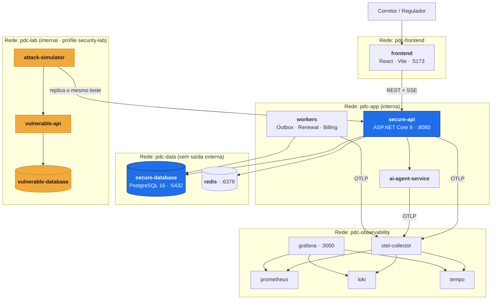
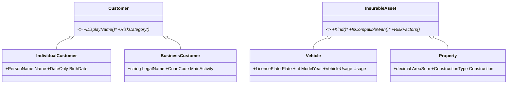
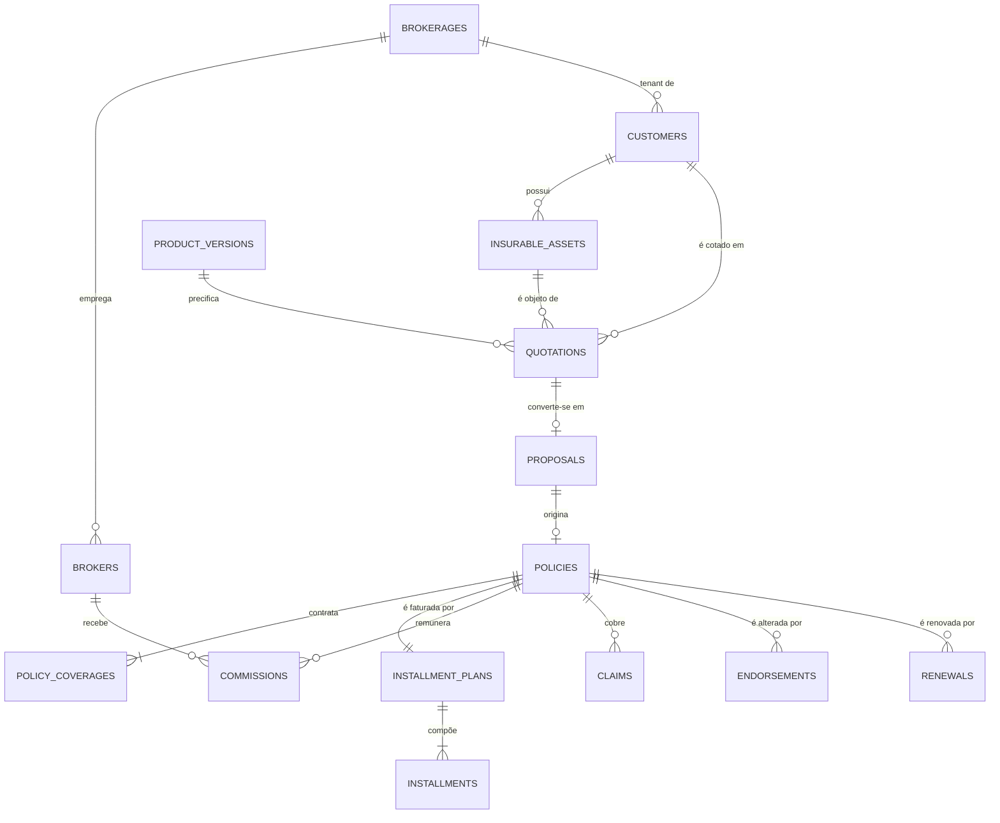
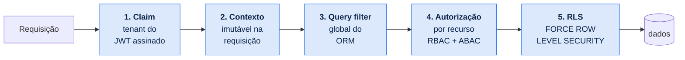

<div align="center">

# Portal do Corretor

**Plataforma de gestão para corretores de seguros**

Banco de dados objeto-relacional · Modelo de domínio rico · Arquitetura modular

[](https://dotnet.microsoft.com/)
[](https://www.postgresql.org/)
[](https://react.dev/)
[](https://docs.docker.com/compose/)
[](#9-testes)
[](LICENSE)

</div>

---

## Índice

| | Seção | | Seção |
|---|---|---|---|
| 1 | [Visão geral](#1-visão-geral) | 7 | [Segurança de aplicação](#7-segurança-de-aplicação) |
| 2 | [**Subindo o ambiente**](#2-subindo-o-ambiente) | 8 | [Observabilidade](#8-observabilidade) |
| 3 | [Estrutura do repositório](#3-estrutura-do-repositório) | 9 | [Testes](#9-testes) |
| 4 | [Arquitetura](#4-arquitetura) | 10 | [Ferramentas de engenharia](#10-ferramentas-de-engenharia) |
| 5 | [Modelo de domínio](#5-modelo-de-domínio) | 11 | [Estado do projeto](#11-estado-do-projeto) |
| 6 | [Banco objeto-relacional](#6-banco-objeto-relacional) | 12 | [Decisões arquiteturais](#12-decisões-arquiteturais-adrs) |

---

## 1. Visão geral

O Portal do Corretor cobre o ciclo de vida comercial da corretagem de seguros —
**cliente → bem segurável → cotação → proposta → apólice → parcelas → comissão → renovação →
sinistro** — implementado como um monólito modular com Clean Architecture, DDD tático e
PostgreSQL usado como banco objeto-relacional de verdade.

### Capacidades técnicas

| Área | Implementação |
|---|---|
| **Persistência** | PostgreSQL 16 com tipos compostos, domains, enums, `daterange`, constraints de exclusão, índices parciais e GIN, particionamento mensal |
| **Domínio** | Rich Domain Model — agregados com invariantes, 19 Value Objects imutáveis, eventos de domínio, specifications, serviços de domínio |
| **Concorrência** | Optimistic locking com `xmin` nativo, chaves de idempotência, `SELECT ... FOR UPDATE SKIP LOCKED` |
| **Multi-tenancy** | Isolamento em 5 camadas independentes, terminando em Row-Level Security com `FORCE` |
| **Assincronismo** | Outbox transacional — evento e estado confirmados na mesma transação |
| **Auditoria** | Trilha append-only imposta por `REVOKE` no banco, particionada por mês |
| **Observabilidade** | OpenTelemetry ponta a ponta, correlation ID propagado até o banco, métricas de negócio, performance e integridade |
| **Qualidade** | 187 testes (unitários, propriedade, arquiteturais), `TreatWarningsAsErrors`, fronteiras de módulo verificadas por NetArchTest |

### Perfis de acesso

- **Corretor** — usuário operacional, opera dentro do tenant da sua corretora.
- **Regulatório** — perfil de supervisão somente-leitura, multi-tenant por escopo autorizado,
  com finalidade de acesso obrigatória e dados minimizados.

Funções de segurança, auditoria e administração são **capacidades internas** exercidas por contas
técnicas (`Outbox Dispatcher`, `Renewal Scanner`, `Billing Scheduler`, `Integrity Checker`), não
por perfis de usuário.

---

## 2. Subindo o ambiente

### 2.1 Pré-requisitos

| Ferramenta | Versão | Verificar |
|---|---|---|
| [.NET SDK](https://dotnet.microsoft.com/download/dotnet/9.0) | 9.0+ | `dotnet --version` |
| [Docker Desktop](https://www.docker.com/products/docker-desktop/) | 24+ | `docker --version` |
| Docker Compose | v2 | `docker compose version` |
| [Node.js](https://nodejs.org/) | 20+ | `node --version` |
| [Git](https://git-scm.com/) | 2.40+ | `git --version` |

> **Windows** — o Docker Desktop precisa estar com WSL 2 habilitado e **em execução**. Os comandos
> funcionam em PowerShell, Git Bash ou WSL.

### 2.2 Clonar o repositório

```bash
git clone https://github.com/volksec/0009098.git
```

```bash
cd 0009098
```

### 2.3 Configurar variáveis e segredos locais

Nenhuma credencial é versionada. Crie os arquivos locais a partir dos exemplos:

```bash
cp .env.example .env
```

```bash
cp infrastructure/secrets/db_password.txt.example infrastructure/secrets/db_password.txt
```

Edite os dois arquivos com valores próprios:

```ini
# .env
POSTGRES_APP_USER_PASSWORD=defina_um_valor
POSTGRES_APP_REGULATOR_PASSWORD=defina_um_valor
POSTGRES_APP_WORKER_PASSWORD=defina_um_valor
```

O Compose **falha explicitamente** se alguma variável estiver ausente, em vez de subir com um
padrão inseguro.

### 2.4 Subir banco e cache

```bash
docker compose up -d secure-database redis
```

Confirme que os contêineres estão saudáveis:

```bash
docker compose ps
```

Esperado: `pdc-secure-db` e `pdc-redis` com status `healthy`. Em caso de falha:

```bash
docker compose logs secure-database
```

O PostgreSQL sobe com `pg_stat_statements`, `log_statement=all` e `log_lock_waits=on` — a
instrumentação que alimenta o Query Inspector com planos e estatísticas reais.

### 2.5 Aplicar migrations

```bash
dotnet run --project tools/PortalDoCorretor.DbMigrator -- migrate
```

Aplica as 9 migrations em ordem: tipos e domains → identidade e corretoras → clientes e bens →
produtos e cotações → propostas e apólices → faturamento, comissões e sinistros → auditoria,
Outbox e partições → RLS e privilégios → views regulatórias e verificações de integridade.

Para reverter toda a cadeia:

```bash
dotnet run --project tools/PortalDoCorretor.DbMigrator -- rollback
```

### 2.6 Carregar a massa de dados

```bash
dotnet run --project tools/PortalDoCorretor.DbMigrator -- seed
```

Geração **determinística** (seed fixa): a mesma base é reproduzida em qualquer máquina, o que
torna os benchmarks comparáveis entre execuções.

| Tabela | Volume |
|---|---|
| Corretoras (tenants) | 8 |
| Corretores | 40 |
| Clientes | 25.000 |
| Bens seguráveis | 38.000 |
| Cotações | 60.000 |
| Propostas | 22.000 |
| Apólices | 14.000 |
| Parcelas | 84.000 |
| Comissões | 14.000 |
| Sinistros | 1.800 |
| Eventos de auditoria | 400.000 |

O volume é dimensionado para que a diferença entre "com índice" e "sem índice" seja mensurável.
Com poucas centenas de linhas, qualquer plano de execução é rápido e a comparação não informa nada.

Para recriar a base do zero:

```bash
dotnet run --project tools/PortalDoCorretor.DbMigrator -- reset
```

### 2.7 Subir o backend

```bash
dotnet run --project apps/secure-api
```

API disponível em **http://localhost:8080**.

| Endereço | Conteúdo |
|---|---|
| http://localhost:8080/swagger | Documentação interativa da API |
| http://localhost:8080/health/live | Liveness |
| http://localhost:8080/health/ready | Readiness — verifica banco, cache e migrations aplicadas |
| http://localhost:8080/api/events/stream | Stream SSE do Live Processing Console |

Em outro terminal, suba os workers:

```bash
dotnet run --project apps/workers
```

Os workers processam a Outbox, detectam renovações, avançam parcelas e executam as verificações
de integridade. Sem eles a API continua funcionando, mas as mensagens da Outbox acumulam — o que,
aliás, é uma forma direta de observar o padrão em ação no Transaction Inspector.

### 2.8 Subir o frontend

Em outro terminal:

```bash
cd apps/frontend
```

```bash
npm install
```

```bash
npm run dev
```

Frontend em **http://localhost:5173**, apontando para `http://localhost:8080` via
`apps/frontend/.env.development`. Se o backend estiver em outra porta, ajuste `VITE_API_BASE_URL`.

### 2.9 Usuários de acesso

Criados pelo `seed`, existentes apenas no ambiente local:

| Perfil | E-mail | Senha |
|---|---|---|
| Corretor (tenant A) | `ana.souza@corretoraalfa.test` | `Demo@2026!` |
| Corretor (tenant A) | `bruno.lima@corretoraalfa.test` | `Demo@2026!` |
| Corretor (tenant B) | `carla.dias@corretorabeta.test` | `Demo@2026!` |
| Regulatório | `regulador@susep.test` | `Demo@2026!` |

O perfil regulatório exige MFA; o código TOTP é impresso no log do `seed`.

### 2.10 Observabilidade (opcional)

```bash
docker compose --profile observability up -d
```

| Serviço | Endereço |
|---|---|
| Grafana | http://localhost:3000 |
| Prometheus | http://localhost:9090 |
| Tempo (traces) | via Grafana |
| Loki (logs) | via Grafana |

### 2.11 Laboratório de segurança

```bash
docker compose --profile security-lab up --build
```

Sobe uma segunda API e um segundo banco, deliberadamente sem constraints, índices, RLS e
auditoria, para comparação lado a lado com a implementação segura. Roda em rede Docker
`internal: true`, sem rota externa, com limites de CPU e memória e reset automático.

Disponível em http://localhost:5173/labs/security quando o profile está ativo.

### 2.12 Tudo em contêiner

```bash
docker compose up --build
```

Sobe banco, cache, API, workers e frontend. Mais próximo de produção; durante o desenvolvimento,
`dotnet run` + `npm run dev` é preferível pelo *hot reload*.

### 2.13 Verificação rápida

1. Entre como `ana.souza` e cadastre um cliente — observe a validação dos Value Objects.
2. Abra o **Live Processing Console** em outra aba.
3. Crie uma cotação, converta em proposta e emita a apólice.
4. Percorra os **24 passos** da emissão no console; clique em qualquer um para ver camada, classe,
   método, estado anterior e posterior, query, índice e duração.
5. Abra o **Query Inspector** e veja o `EXPLAIN (ANALYZE, BUFFERS)` real da consulta que carregou
   o agregado.
6. Copie o ID da apólice, entre como `carla.dias` (outro tenant) e tente acessá-la — `404`, com
   evento de segurança registrado.

### 2.14 Problemas comuns

| Sintoma | Causa | Solução |
|---|---|---|
| Compose falha com variável não definida | `.env` ausente | Refaça o passo [2.3](#23-configurar-variáveis-e-segredos-locais) |
| Porta 5432 ocupada | PostgreSQL instalado na máquina | Pare o serviço local ou altere a porta no `docker-compose.yml` |
| `/health/ready` retorna 503 | Migrations não aplicadas | Execute o passo [2.5](#25-aplicar-migrations) |
| Erro de CORS no frontend | Backend em porta diferente | Ajuste `VITE_API_BASE_URL` |
| Consulta retorna vazio sem erro | RLS ativa sem contexto de tenant | Comportamento correto — sem `SET LOCAL app.tenant_id` a política nega. Visível no Live Processing Console |
| Testes de integração falham | Docker parado | Testcontainers exige Docker em execução |

---

## 3. Estrutura do repositório

```
0009098/
├── apps/
│   ├── frontend/                 React · TypeScript · Vite · design system próprio
│   ├── secure-api/               Host ASP.NET Core do monólito modular
│   ├── vulnerable-api/           Contraparte para comparação (profile security-lab)
│   ├── attack-simulator/         18 cenários executados contra as duas APIs
│   ├── ai-agent-service/         Runtime dos agentes, com guardrails
│   └── workers/                  Outbox Dispatcher · Renewal Scanner · Billing Scheduler
│
├── modules/                      Um projeto por bounded context
│   ├── identity/    brokers/     customers/    products/
│   ├── quotations/  proposals/   policies/     billing/
│   ├── commissions/ claims/      documents/    notifications/
│   ├── regulatory/  auditing/    observability/  ai/
│   │
│   └── <módulo>/
│       ├── Domain/               Sem dependência de framework
│       ├── Application/          Casos de uso (vertical slices)
│       ├── Infrastructure/       EF Core, Dapper, adaptadores
│       └── Contracts/            Único assembly referenciável por outros módulos
│
├── shared/
│   ├── PortalDoCorretor.SharedKernel/   Entity, AggregateRoot, Value Objects, eventos
│   ├── PortalDoCorretor.Persistence/    DbContext base, interceptors, conversores, RLS
│   └── PortalDoCorretor.Web/            Middlewares, problem details, rate limit, headers
│
├── database/
│   ├── secure/
│   │   ├── migrations/           9 migrations versionadas
│   │   ├── rollback/             Script de reversão por migration
│   │   ├── scripts/              Init de papéis, extensões, contexto de tenant
│   │   └── seeds/                Massa determinística
│   └── vulnerable/               Mesmo domínio sem constraints, índices e RLS
│
├── tests/
│   ├── unit/          integration/   architecture/
│   ├── contract/      e2e/           performance/     security/
│
├── docs/
│   ├── architecture/  adr/       c4/       uml/
│   ├── domain/        database/  plan/     threat-model/
│
├── infrastructure/
│   ├── docker/        compose/   monitoring/   ci/   scripts/
│
├── Directory.Build.props         TreatWarningsAsErrors, nullable, .NET 9
├── docker-compose.yml
└── PortalDoCorretor.sln
```

### Regras de dependência

Verificadas automaticamente por NetArchTest — violação falha o build, não vira observação em
code review.

| # | Regra |
|---|---|
| 1 | `*.Domain` não referencia EF Core, ASP.NET, Serilog ou qualquer framework |
| 2 | `*.Domain` não referencia `*.Application` nem `*.Infrastructure` |
| 3 | Um módulo só referencia `<Outro>.Contracts` |
| 4 | Não existem ciclos entre módulos |
| 5 | O módulo `regulatory` não contém nenhum command handler |
| 6 | Toda entidade `ITenantScoped` tem query filter configurado |
| 7 | Nenhum agregado expõe coleção mutável pública |
| 8 | Nenhum projeto de produção referencia a API vulnerável |

---

## 4. Arquitetura

**Monólito modular** com Clean Architecture por módulo, portas e adaptadores na fronteira, DDD
tático no núcleo, *vertical slices* na camada de aplicação e CQRS seletivo.

### Por que não microserviços

16 bounded contexts, mantidos por uma pessoa. As invariantes mais críticas — emissão de apólice
com coberturas, parcelas, comissão, evento e auditoria — exigem atomicidade. Distribuí-las
trocaria consistência forte por sagas, compensações e estados intermediários visíveis:
complexidade real em troca de escalabilidade que este sistema não precisa.

O monólito modular preserva as fronteiras lógicas sem o custo operacional, e as fronteiras são
verificadas por teste. ([ADR-0002](docs/adr/0002-monolito-modular.md))

### Contêineres



### Camadas dentro de um módulo

```
Infrastructure  →  Application  →  Domain
      │                                ▲
      └──────── implementa portas ─────┘
```

A regra de dependência aponta para dentro. O domínio não conhece ninguém — é o que permite testar
toda a lógica de negócio sem banco, sem HTTP e sem mock de framework.

### Bounded Contexts

| Classe | Contextos |
|---|---|
| **Core** | Quotations · Proposals · Policies · Commissions |
| **Supporting** | Customer Management · Broker Management · Product Catalog · Claims · Billing · Regulatory Supervision |
| **Generic** | Identity and Access · Documents · Notifications · Audit and Compliance · Observability · AI |

[Mapa de contexto completo](docs/architecture/bounded-contexts.md)

### Stack

| Camada | Escolha | Racional |
|---|---|---|
| **Backend** | .NET 9, ASP.NET Core (Minimal API), EF Core, Dapper, FluentValidation, Serilog, OpenTelemetry, Polly | Tipos fortes o bastante para expressar Value Objects e agregados; EF Core fornece *owned types*, query filters globais e `xmin` nativo; Dapper entra em leitura analítica, onde o ORM não agrega |
| **Frontend** | React, TypeScript, Vite, Tailwind, shadcn/ui, TanStack Query, React Hook Form + Zod, Storybook, Cytoscape.js, Monaco | Tipagem ponta a ponta; componentes shadcn ficam no repositório, então o design system é próprio; Cytoscape para o grafo do Database Explorer; Monaco para SQL e planos de execução |
| **Dados** | PostgreSQL 16, Redis | Detalhado na [seção 6](#6-banco-objeto-relacional) |
| **Mensageria** | Nenhuma — Outbox no PostgreSQL | Broker externo não oferece garantia transacional sem 2PC ([ADR-0007](docs/adr/0007-sem-message-broker.md)) |
| **Testes** | xUnit, FluentAssertions, FsCheck, Testcontainers, Respawn, NetArchTest | PostgreSQL real nos testes de integração: RLS, `EXCLUDE`, tipos compostos e `xmin` não existem em banco em memória |
| **Infra** | Docker Compose, GitHub Actions, Prometheus, Grafana, Loki, Tempo | Ambiente completo em um comando |

[Alternativas descartadas e trade-offs](docs/architecture/overview.md)

---

## 5. Modelo de domínio

Rich Domain Model: as regras vivem na entidade, no agregado ou em serviços de domínio — não no
controller nem no repositório.

### Agregados

```
Customer (root, abstrato)              Quotation (root)
 ├── Contacts                           ├── Items (um por plano)
 ├── Addresses                          ├── RiskProfile
 ├── Consents      [append-only]        ├── SelectedCoverages
 └── InsurableAssets [polimórfica]      └── CalculationSnapshots [imutáveis]

Proposal (root)                        Policy (root)
 ├── Documents                          ├── Coverages [congeladas na emissão]
 ├── Pendencies                         ├── Endorsements [versionamento]
 ├── UnderwritingDecision [imutável]    ├── Renewals
 └── StatusHistory [append-only]        └── → InstallmentPlanId, CommissionId

Claim (root)
 ├── Events [append-only]     ├── Documents
 ├── Damages                  └── StatusHistory [append-only]
```

### Herança e polimorfismo



O motor de precificação consome `asset.RiskFactors()` sem conhecer o tipo concreto. Adicionar um
novo tipo de bem exige uma subclasse e um valor de enum — nenhum `switch` existente muda.

**Persistência da herança:** TPH para `Customer` (atributos compartilhados, consultas
polimórficas frequentes) e TPT para `InsurableAsset` (atributos divergentes, `NOT NULL` por tipo).
([ADR-0005](docs/adr/0005-estrategia-de-heranca-tph-e-tpt.md))

### Value Objects

19 implementados, todos imutáveis, autovalidados, com igualdade por valor e testes próprios:

`Money` · `Percentage` · `CommissionRate` · `DocumentNumber` · `EmailAddress` · `PhoneNumber` ·
`PostalCode` · `StateCode` · `PostalAddress` · `DateRange` · `PolicyNumber` · `ProposalNumber` ·
`QuotationNumber` · `RiskScore` · `CoverageLimit` · `Deductible` · `TenantId` · `CorrelationId` ·
`IdempotencyKey`

```csharp
public sealed class Policy : AggregateRoot<PolicyId> {
    private readonly List<PolicyCoverage> _coverages = [];

    public PolicyStatus Status { get; private set; }        // enum, setter privado
    public Money TotalPremium { get; private set; }         // Value Object validado
    public IReadOnlyCollection<PolicyCoverage> Coverages => _coverages.AsReadOnly();

    private Policy() { }                                    // materialização pelo ORM

    public static Policy Issue(Proposal proposal, UnderwritingDecision decision,
                               PolicyNumber number, DateRange period, IClock clock) {
        if (proposal.Status is not ProposalStatus.Approved)
            throw new DomainException(ErrorCodes.ProposalNotApproved, ...);
        if (proposal.HasOpenPendencies)
            throw new DomainException(ErrorCodes.ProposalHasPendencies, ...);
        // único caminho de criação de apólice no sistema
    }
}
```

Não existe caminho de código que produza uma apólice com prêmio negativo ou status inválido.

[Modelo completo](docs/domain/domain-model.md) · [Agregados e invariantes](docs/domain/aggregates.md) ·
[Value Objects](docs/domain/value-objects.md)

---

## 6. Banco objeto-relacional

### Recursos do PostgreSQL utilizados

| Recurso | Uso |
|---|---|
| **Tipos compostos** | `money_amount`, `postal_address`, `deductible` — Value Objects persistidos como unidade coesa |
| **Domains** | `cpf_digits`, `cnpj_digits`, `uf_code`, `postal_code` — validação reutilizável por tipo |
| **Enums** | 16 tipos para conjuntos fechados pelo código |
| **`daterange` + `btree_gist`** | `EXCLUDE` impede sobreposição de vigência — invariante que `UNIQUE` não expressa |
| **RLS com `FORCE`** | Isolamento por tenant aplicado inclusive ao dono da tabela |
| **Índices parciais** | A Outbox mantém índice pequeno mesmo com milhões de linhas processadas |
| **GIN + `pg_trgm` + FTS** | Busca textual com tolerância a erro de digitação |
| **Colunas geradas** | `risk_band` derivada do escore; `search_vector` para full-text |
| **Particionamento** | `audit_events`, `security_events`, `outbox_messages` por mês |
| **`xmin`** | Optimistic locking nativo, sem coluna extra que possa ser esquecida em um `UPDATE` |
| **`SKIP LOCKED`** | Outbox consumida por múltiplos workers sem contenção |
| **`pg_stat_statements`** | Planos e estatísticas reais para o Query Inspector |

[Justificativa da escolha e alternativas](docs/adr/0003-postgresql-como-banco-objeto-relacional.md)

### Critério de modelagem

| Camada | Conteúdo | Exemplo |
|---|---|---|
| Relacional normalizado | Entidade com identidade, ciclo de vida ou integridade referencial | `policies`, `policy_coverages`, `installments` |
| Tipo composto | Value Object multi-campo reutilizado | `money_amount` |
| Domain | Value Object de campo único com validação reutilizável | `cpf_digits` |
| Conversor de valor | Value Object de campo único do agregado | `policy_number` |
| JSONB | Estrutura genuinamente variável, sem integridade referencial | `risk_profiles.answers` |
| Coluna gerada | Derivação determinística que precisa de índice | `risk_band` |

**JSONB** é permitido apenas quando: o esquema varia legitimamente entre instâncias, o dado não
participa de FK, e as consultas são por chave em vez de junções frequentes. Um teste arquitetural
exige o comentário `-- JSONB-JUSTIFICATION:` na migration. Coberturas, parcelas e comissões **não**
são JSONB — têm identidade, FK e agregação.

### Invariantes do domínio replicadas no banco

| Invariante | Mecanismo | Nome |
|---|---|---|
| Uma apólice ativa por proposta | Índice único parcial | `ux_policies_proposal` |
| Uma proposta ativa por cotação | Índice único parcial | `ux_proposals_quotation_active` |
| Vigências não se sobrepõem | Constraint de exclusão GiST | `ex_policies_no_overlap` |
| Σ parcelas = prêmio total | Constraint trigger deferida | `tg_installments_sum` |
| Documento único por tenant | Índice único parcial | `ux_customers_tenant_document` |
| Campos coerentes com o tipo (TPH) | Check constraint | `ck_customers_individual_fields` |
| Herança consistente (TPT) | FK composta `(id, kind)` | `ux_assets_kind` |
| Perfil regulatório sem tenant | Check constraint | `ck_users_tenant_by_profile` |
| MFA obrigatório na supervisão | Check constraint | `ck_users_regulator_requires_mfa` |
| Auditoria imutável | `REVOKE UPDATE, DELETE` + trigger | `tg_audit_immutable` |
| Isolamento por tenant | RLS com `FORCE` | `p_*_tenant_isolation` |
| Concorrência na emissão | Optimistic lock nativo | `xmin` |

O domínio impede que a aplicação crie estado inválido. O banco impede que **qualquer coisa** crie
— inclusive um script manual ou uma migration mal escrita.

```sql
-- Duas apólices ativas para o mesmo bem, no mesmo produto, com vigências que se
-- cruzam é um estado impossível. UNIQUE não alcança: sobreposição não é igualdade.
ALTER TABLE policies ADD CONSTRAINT ex_policies_no_overlap
    EXCLUDE USING gist (
        tenant_id          WITH =,
        asset_id           WITH =,
        product_version_id WITH =,
        coverage_period    WITH &&
    ) WHERE (status = 'ACTIVE');
```

### Modelo entidade-relacionamento



[Modelo físico detalhado](docs/database/physical-model.md) · [ER completo](docs/database/er-diagram.md)

### Emissão de apólice — transação e observabilidade

```
[01] Requisição recebida              [13] PolicyCoverages congeladas do snapshot
[02] Correlation ID criado            [14] Commission apurada (regra versionada)
[03] Token validado                   [15] Domain Event produzido
[04] Perfil identificado              [16] OutboxMessage persistida (mesma transação)
[05] Tenant resolvido do claim        [17] AuditEvent registrado
[06] SET LOCAL app.tenant_id          [18] Proposta → ISSUED
[07] Autorização por recurso          [19] COMMIT
[08] Idempotency-Key verificada       [20] Cache invalidado
[09] Proposal carregada com xmin      [21] Outbox Dispatcher publicou
[10] Invariantes verificadas          [22] Notificação criada
[11] UnderwritingDecision validada    [23] Métricas atualizadas
[12] Policy criada · PolicyNumber     [24] Trace concluído
```

Cada passo é inspecionável no Live Processing Console, com camada, classe, método, estado
anterior e posterior, query, índice e duração.

### Controle de concorrência

Duas requisições simultâneas de emissão para a mesma proposta encontram três camadas
independentes: o **optimistic lock** (`xmin` divergente faz o `UPDATE` afetar zero linhas), o
**índice único** `ux_policies_proposal`, e a **chave de idempotência**, que devolve a resposta
original em caso de replay. Resultado: exatamente uma apólice.

---

## 7. Segurança de aplicação

### Isolamento multi-tenant em cinco camadas



A camada 1 é garantida pelo **sistema de tipos**: o Value Object `TenantId` não tem construtor
público que aceite entrada de usuário.

```csharp
public readonly record struct TenantId {
    public Guid Value { get; }
    private TenantId(Guid value) => Value = value;

    // Única origem: claim autenticado ou leitura do banco.
    public static TenantId FromTrustedSource(Guid value) => ...;
}
```

Um DTO de requisição não consegue produzir um `TenantId` válido — a manipulação via payload é
impedida por tipagem, não por validação que pode ser esquecida. Há teste arquitetural que falha o
build se um overload público for adicionado.

A camada 5 usa `FORCE ROW LEVEL SECURITY`: sem ele, o usuário dono da tabela ignora as políticas.

```sql
ALTER TABLE customers ENABLE ROW LEVEL SECURITY;
ALTER TABLE customers FORCE  ROW LEVEL SECURITY;
```

Além do tenant, `commissions` tem política **restritiva** por `broker_id`: um corretor não acessa
a comissão de outro, mesmo dentro do próprio tenant.

[ADR-0004](docs/adr/0004-defesa-em-profundidade-multitenant.md)

### Tratamento de dados sensíveis

```csharp
// ToString() retorna a forma mascarada — interpolação acidental em log não expõe o dado
DocumentNumber.Parse("52998224725").ToString()   // "***.***.247-**"

// A exceção não ecoa o valor recebido
DocumentNumber.Parse("12345678901")   // DomainException: "Documento inválido."

// Busca por HMAC com pepper mantido fora do banco
document.SearchHash(pepper)
```

O documento é cifrado em repouso com chave fornecida por contexto de sessão a partir de um segredo
externo — a função de decifragem falha fechado quando a chave não está presente.

### Privilégios de banco

| Papel | Permissões |
|---|---|
| `nexus_migrator` | DDL, usado apenas pelas migrations |
| `app_user` | DML no tenant; sem DDL, sem `DELETE`, sem `BYPASSRLS` |
| `app_worker` | Outbox e jobs, escopo restrito |
| `app_regulator` | `SELECT` apenas nas views mascaradas; sem acesso às tabelas base |

`DELETE` físico é revogado da aplicação — a exclusão é lógica, com motivo obrigatório e cascata
aplicada pelo agregado.

### Superfície de teste de segurança

O `attack-simulator` executa 18 cenários (SQL Injection, IDOR, broken access control, manipulação
de tenant, mass assignment, race condition, emissão duplicada, upload inseguro, entre outros)
contra a API vulnerável e replica cada um contra a segura, registrando o controle que atuou, o
`SecurityEvent` gerado e o mapeamento para CWE, OWASP e ASVS.

O ambiente vulnerável é isolado por profile Docker, em rede `internal: true`, com reset automático
e limites de recurso. ([ADR-0009](docs/adr/0009-laboratorio-vulneravel-isolado.md))

---

## 8. Observabilidade

OpenTelemetry ponta a ponta (traces, métricas, logs) via OTel Collector para Prometheus, Loki e
Tempo, visualizados no Grafana. Correlation ID propagado do frontend até o banco.

| Categoria | Métricas |
|---|---|
| **Negócio** | Apólices emitidas, propostas aprovadas, comissões calculadas, eventos de domínio |
| **Performance** | Latência de query (média, p95, p99), queries por operação, N+1 detectadas, sequential scans, cache hit/miss, tempo de transação, locks, deadlocks, throughput |
| **Integridade** | `constraint_violations_total`, `optimistic_lock_conflicts_total`, `outbox_pending_age_seconds`, `audit_coverage_ratio`, `tenant_violation_attempts_total`, `integrity_check_failures_total` |

A função `app.run_integrity_checks()` executa 10 asserções SQL sobre a base — soma de parcelas,
apólice sem cobertura, prêmio divergente, apólice duplicada por proposta, comissão sem regra,
bem sem subtipo, sinistro fora da vigência, cliente sem contato, Outbox travada e emissão sem
auditoria correspondente. Se o modelo estiver correto, todas retornam zero.

---

## 9. Testes

```bash
dotnet test
```

```bash
dotnet test tests/unit          # sem dependência de Docker
```

```bash
dotnet test tests/integration   # requer Docker (Testcontainers)
```

```bash
dotnet test tests/architecture  # fronteiras de módulo e regras de modelagem
```

| Tipo | Escopo |
|---|---|
| Unitários | Value Objects, agregados, invariantes, serviços de domínio, máquinas de estado |
| Propriedade | FsCheck sobre invariantes financeiras e de alocação |
| Integração | Testcontainers com PostgreSQL 16 real + Respawn |
| RLS e isolamento | Cada camada derrubada isoladamente, verificando que as demais bloqueiam |
| Autorização | RBAC, ABAC, escopo, finalidade |
| Concorrência | Emissão simultânea, optimistic lock, `SKIP LOCKED` |
| Idempotência e Outbox | Replay, entrega ao menos uma vez, consumo idempotente |
| Rollback | Falha injetada em cada etapa da transação |
| Arquiteturais | NetArchTest |
| Performance | BenchmarkDotNet + k6 |
| E2E | Playwright |
| Segurança | Os 18 cenários automatizados |

Banco em memória não é usado em testes de integração: RLS, constraints de exclusão, tipos
compostos, índices parciais e `xmin` não existem em SQLite.

### Nota de engenharia — bug encontrado por teste de propriedade

A primeira implementação de `Money.Allocate` somava todo o resíduo do arredondamento à primeira
parcela. A soma ficava correta e os testes de exemplo (`R$ 1.000,00 ÷ 3`) passavam. Para
`R$ 0,05 ÷ 12`, porém, o resultado era uma parcela de `R$ 0,05` e onze de `R$ 0,00`.

A propriedade *"para qualquer valor e qualquer número de parcelas, a soma é exata e a dispersão é
≤ 1 centavo"* reprovou em menos de um segundo sobre 500 casos gerados. Corrigido com distribuição
de um centavo por parcela (método do maior resto).

---

## 10. Ferramentas de engenharia

| Ferramenta | Função |
|---|---|
| **Live Processing Console** | Eventos em tempo real via SSE, 14 filtros e 16 categorias, com redação automática de dados sensíveis |
| **Database Explorer** | Grafo navegável lido do catálogo real: tabelas, relações, cardinalidades, mapeamento ORM, índices, constraints, políticas de RLS, partições |
| **Query Inspector** | SQL executado, parâmetros mascarados, tempo, linhas, `EXPLAIN (ANALYZE, BUFFERS)`, índice utilizado, tipo de scan, origem no código |
| **Transaction Inspector** | Duração, nível de isolamento, locks, `COMMIT`/`ROLLBACK`, eventos, Outbox, auditoria |
| **Data Browser** | Consulta interativa aos dados com filtros tipados e navegação por FK. Sem SQL livre: o filtro é traduzido pelo servidor em consulta parametrizada a partir de whitelist |
| **Engineering Lab** | Comparativos medidos: ORM vs Dapper, com/sem índice, N+1 vs projeção, lazy vs eager, paginado vs não paginado |
| **Security Lab** | Os 18 cenários executados contra as duas implementações |

Os números de performance exibidos vêm de `EXPLAIN (ANALYZE, BUFFERS)` e de medição no ambiente
local, publicados com a especificação da máquina, versão do PostgreSQL e volume de dados.

---

## 11. Decisões arquiteturais (ADRs)

| ADR | Decisão |
|---|---|
| [0001](docs/adr/0001-nome-e-identidade-do-produto.md) | Nome e identidade visual |
| [0002](docs/adr/0002-monolito-modular.md) | Monólito modular em vez de microserviços |
| [0003](docs/adr/0003-postgresql-como-banco-objeto-relacional.md) | PostgreSQL como banco objeto-relacional |
| [0004](docs/adr/0004-defesa-em-profundidade-multitenant.md) | Isolamento multi-tenant em cinco camadas |
| [0005](docs/adr/0005-estrategia-de-heranca-tph-e-tpt.md) | TPH para `Customer`, TPT para `InsurableAsset` |
| [0006](docs/adr/0006-outbox-transacional.md) | Outbox transacional no PostgreSQL |
| [0007](docs/adr/0007-sem-message-broker.md) | Sem message broker externo |
| [0008](docs/adr/0008-cqrs-seletivo.md) | CQRS seletivo, sem event sourcing |
| [0009](docs/adr/0009-laboratorio-vulneravel-isolado.md) | Ambiente de comparação isolado por profile |
| [0010](docs/adr/0010-governanca-de-agentes-de-ia.md) | Agentes de IA com privilégio mínimo |

### Documentação técnica

| Documento | Conteúdo |
|---|---|
| [Requisitos](docs/architecture/requirements.md) | Requisitos funcionais e não funcionais com critérios de aceite |
| [Casos de uso](docs/architecture/use-cases.md) | Fluxos principais e alternativos por perfil |
| [Bounded Contexts](docs/architecture/bounded-contexts.md) | 16 contextos e mapa de contexto |
| [Arquitetura](docs/architecture/overview.md) | Estilo, C4, stack, trade-offs |
| [Modelo de domínio](docs/domain/domain-model.md) | Classes, herança, polimorfismo, specifications |
| [Agregados](docs/domain/aggregates.md) | Invariantes, limites transacionais, concorrência |
| [Value Objects](docs/domain/value-objects.md) | Regras de validação e estratégia de persistência |
| [Modelo físico](docs/database/physical-model.md) | Tabelas, constraints, índices, RLS, particionamento |
| [Diagrama ER](docs/database/er-diagram.md) | ER completo e mapa invariante → constraint |
| [Estrutura do repositório](docs/plan/repository-structure.md) | Layout e regras de dependência |
| [Plano de implementação](docs/plan/implementation-plan.md) | Fases, riscos, mitigações |
| [Relatório da Fase 2](docs/plan/phase-02-report.md) | Entregas e verificações |

---

<div align="center">

[Documentação](docs/) · [ADRs](docs/adr/) · [Licença MIT](LICENSE)

</div>
