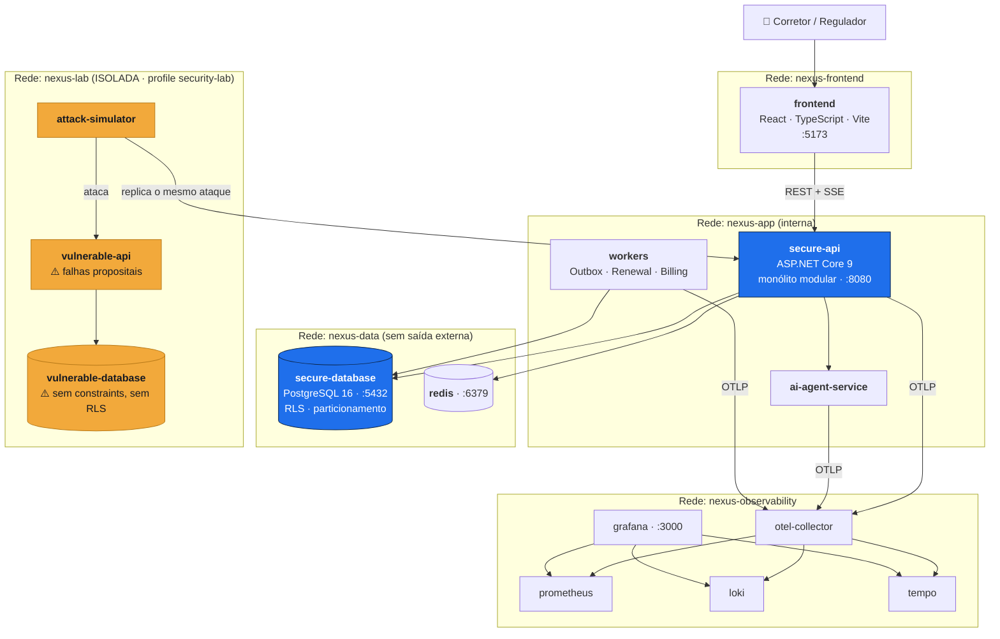
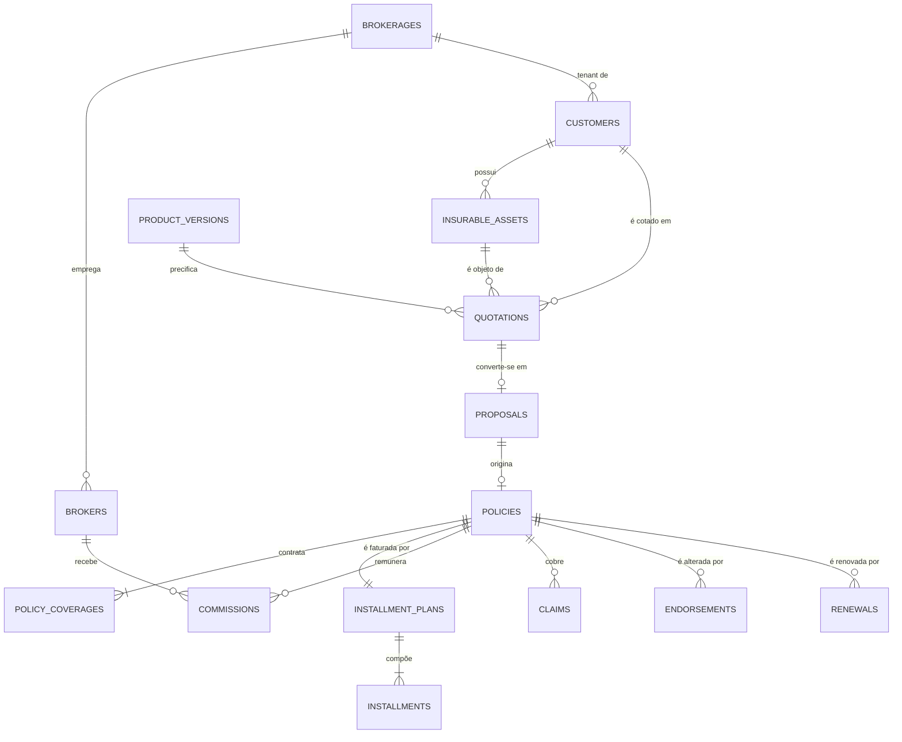
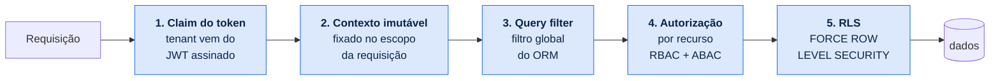

<div align="center">

# NexusBroker

**Plataforma de gestão para corretores de seguros**

*Case técnico de Engenharia de Software — banco de dados objeto-relacional,
modelo de domínio rico e segurança desde a concepção*

[](https://dotnet.microsoft.com/)
[](https://www.postgresql.org/)
[](https://react.dev/)
[](#13-estratégia-de-testes)
[](LICENSE)

</div>

---

> ### ⚠️ Aviso de escopo e conformidade
>
> Projeto **independente de demonstração técnica**, inspirado *conceitualmente* em portais
> corporativos do segmento de corretagem de seguros. **Não** possui vínculo, integração, dado,
> credencial, endpoint, fluxo interno ou elemento de marca de nenhuma seguradora real.
>
> O perfil regulatório é uma **simulação** criada para demonstrar controles de supervisão,
> minimização de dados e auditoria — **não** representa integração oficial com a SUSEP.
>
> **Todos os dados de negócio são sintéticos.** A aplicação, o banco, as transações, as queries,
> os controles de segurança e os processamentos são **reais**.

---

## Índice

| | Seção | | Seção |
|---|---|---|---|
| 1 | [A tese do case](#1-a-tese-do-case) | 9 | [Segurança](#9-segurança) |
| 2 | [O produto](#2-o-produto) | 10 | [Telas e laboratórios](#10-telas-e-laboratórios) |
| 3 | [O problema de negócio](#3-o-problema-de-negócio) | 11 | [Observabilidade](#11-observabilidade) |
| 4 | [Usuários](#4-usuários) | 12 | [**Como executar localmente**](#12-como-executar-localmente) |
| 5 | [Arquitetura](#5-arquitetura) | 13 | [Estratégia de testes](#13-estratégia-de-testes) |
| 6 | [Modelo de domínio](#6-modelo-de-domínio) | 14 | [Estado do projeto](#14-estado-do-projeto) |
| 7 | [Banco objeto-relacional](#7-banco-objeto-relacional) | 15 | [Decisões arquiteturais](#15-decisões-arquiteturais-adrs) |
| 8 | [Fluxos de negócio](#8-fluxos-de-negócio) | 16 | [Guia de apresentação](#16-guia-de-apresentação) |

---

## 1. A tese do case

Este projeto não é uma vitrine de interface. É a demonstração de uma afirmação específica,
verificável em tempo real:

> **O banco de dados, os objetos de domínio, as regras, as transações, os controles de segurança
> e os processamentos são reais e podem ser acompanhados ao vivo. Os dados são sintéticos
> exclusivamente para preservar privacidade, conformidade e segurança.**

O avaliador dispara uma operação de negócio real — emitir uma apólice — e assiste, passo a passo:

```
Value Object validando  →  agregado carregado com optimistic lock  →  invariante rejeitando
estado inválido  →  query parametrizada com plano de execução e índice  →  RLS do PostgreSQL
filtrando por tenant  →  evento de domínio  →  linha da Outbox  →  AuditEvent  →  COMMIT  →
worker publicando  →  notificação  →  métrica subindo  →  trace fechando
```

E, em seguida, vê **o mesmo ataque** rodar contra a versão vulnerável (que falha) e contra a
versão segura (que bloqueia, registra `SecurityEvent` e **nomeia o controle** que atuou).

### A tese profissional

O autor é **Pentester Sênior em transição para Engenharia e Arquitetura de Software Sênior**.

A tese é que conhecimento ofensivo aplicado **na fase de concepção** produz software corporativo
mais seguro do que revisão tardia. Cada controle da versão segura existe porque o ataque
correspondente está implementado, executável e demonstrável no Security Lab — não porque um
checklist mandou.

---

## 2. O produto

### Seleção do nome

Cinco candidatos avaliados contra cinco critérios: ausência de colisão com marcas do setor,
clareza para público de negócio, pronunciabilidade em pt-BR e inglês, capacidade de gerar
submarcas e disponibilidade de namespace técnico.

| # | Candidato | Força | Fraqueza | Veredito |
|---|-----------|-------|----------|----------|
| 1 | **NexusBroker** | "Nexus" traduz o papel de *hub* que liga corretor ↔ cliente ↔ produto ↔ regulador; permite submarcas (`Regulatory`, `Copilot`, `Labs`) | Levemente anglófono | ✅ **Escolhido** |
| 2 | Corretor 360 | Imediatamente compreensível no mercado brasileiro | "360" é sufixo saturado em produtos financeiros; baixa distintividade | ❌ |
| 3 | SecureBroker | Reforça o eixo AppSec do case | Faz parecer ferramenta de cibersegurança, não plataforma de gestão de carteira | ❌ |
| 4 | BrokerCore | Bom nome de plataforma | "Core" genérico; sugere componente interno, não produto de ponta a ponta | ❌ |
| 5 | Aegis Corretores | Simbolicamente forte (proteção) | Referência erudita, baixa clareza; mistura idiomas | ❌ |

Registro em [ADR-0001](docs/adr/0001-nome-e-identidade-do-produto.md).

### Identidade visual própria

Identidade **autoral**, sem tipografia, logotipo, iconografia ou paleta de terceiros.

**Logotipo** — monograma `NB` inscrito em hexágono **aberto** no vértice superior direito,
representando o nó de rede que conecta os atores do ecossistema. Sem escudos, brasões, gotas ou
guarda-chuvas — nenhum arquétipo visual tradicional de seguradora.

| Token | Hex | Uso |
|---|---|---|
| `nexus-navy-900` | `#0B2447` | Superfícies institucionais, header, sidebar |
| `nexus-blue-600` | `#1F6FEB` | Ação primária, links, foco |
| `nexus-blue-100` | `#DCE9FD` | Estados selecionados, badges informativos |
| `nexus-slate-900` | `#141821` | Texto primário / fundo do modo escuro |
| `nexus-slate-50` | `#F4F6F8` | Fundo da aplicação (modo claro) |
| `nexus-amber-500` | `#F2A93B` | Pendências, atenção, avisos de laboratório |
| `nexus-red-600` | `#D93F3F` | Erros, bloqueios de autorização, `SecurityEvent` |
| `nexus-green-600` | `#1F9D63` | Sucesso, apólice emitida, controle que bloqueou ataque |

**Tipografia** — `Inter` (interface) e `JetBrains Mono` (telas técnicas), ambas de licença livre.

**Design system próprio** sobre Tailwind + shadcn/ui — escolha deliberada, porque os componentes
shadcn são **copiados para o repositório** em vez de consumidos como dependência. O design system
é de fato autoral e customizável, não uma casca sobre o visual de terceiros.

**Modo laboratório** — quando a aplicação vulnerável está ativa, a UI recebe faixa diagonal âmbar
com o rótulo `LAB VULNERÁVEL — DADOS SINTÉTICOS — REDE ISOLADA`.

---

## 3. O problema de negócio

O corretor de seguros brasileiro opera fragmentado entre planilhas, portais distintos por
seguradora, e-mail e WhatsApp. Isso produz quatro custos concretos:

| # | Custo | Consequência |
|---|---|---|
| 1 | **Perda de receita** | Cotações expiram sem conversão; renovações se perdem por falta de alerta antecipado — e a renovação é a receita mais barata da carteira |
| 2 | **Risco operacional** | Divergência entre comissão esperada e apurada, sem rastro da regra aplicada nem do valor-base que a originou |
| 3 | **Risco de conformidade** | Dados pessoais manipulados sem registro de consentimento, sem finalidade declarada e sem trilha de quem acessou o quê (LGPD) |
| 4 | **Opacidade regulatória** | A supervisão exige rastreabilidade ponta a ponta; sem auditoria estruturada, responder a um questionamento vira exportação manual de banco — lenta e, por si só, um incidente de privacidade |

O NexusBroker ataca os quatro com **modelo de domínio rico**, **invariantes no agregado**,
**isolamento multi-tenant com defesa em profundidade** e **auditoria como cidadã de primeira classe**.

---

## 4. Usuários

Dois perfis, e apenas dois.

### 4.1 Corretor

Usuário operacional. Opera exclusivamente dentro do tenant da sua corretora.

Consulta e gere a carteira · cadastra e atualiza clientes · cadastra bens seguráveis · cria
cotações · compara produtos e coberturas · converte cotações em propostas · anexa documentos ·
acompanha propostas · consulta apólices · solicita endossos · acompanha renovações · consulta
parcelas · consulta **as próprias** comissões · registra e acompanha sinistros · recebe
notificações · consulta seu histórico · utiliza assistentes de IA.

### 4.2 Usuário regulatório (simulação SUSEP)

Supervisão **estritamente somente-leitura**, multi-tenant por escopo autorizado.

Dados consolidados das corretoras · produtos e coberturas · propostas e apólices · indicadores
operacionais e de conformidade · histórico de alterações · eventos de auditoria e de segurança ·
rastreabilidade · consentimentos · indicadores de risco · verificação de isolamento entre
corretoras · trilhas de auditoria · exportação de relatórios sintéticos · ciclo completo de uma
proposta.

**Toda operação obedece a:** RBAC · ABAC · escopo regulatório · finalidade de acesso · minimização
de dados · registro de auditoria · mascaramento · controle por tenant · autorização por recurso ·
menor privilégio.

O perfil regulatório **não pode**: alterar apólice, comissão, proposta ou cliente; executar SQL;
desabilitar auditoria; visualizar segredos; acessar dados fora do escopo. Cada proibição tem teste
automatizado correspondente.

### 4.3 Contas técnicas

Funções de segurança, auditoria e administração existem como **capacidades internas**, não como
personas: `Outbox Dispatcher`, `Renewal Scanner`, `Billing Scheduler`, `Quotation Expirer`,
`Integrity Checker`, `AI Agent Runtime`. Toda ação de conta técnica é auditada com o mesmo rigor
das ações humanas.

---

## 5. Arquitetura

**Monólito modular** com Clean Architecture dentro de cada módulo, portas e adaptadores na
fronteira, DDD tático no núcleo, *vertical slices* na aplicação e CQRS **seletivo**.

### Por que não microserviços

O sistema tem 16 bounded contexts e a restrição declarada de ser **construído e mantido por uma
pessoa**. As invariantes mais críticas (emissão de apólice com coberturas, parcelas, comissão,
evento e auditoria) exigem atomicidade. Distribuí-las trocaria consistência forte por sagas,
compensações e estados intermediários visíveis — complexidade real em troca de escalabilidade que
este sistema não precisa.

O monólito modular preserva as **fronteiras lógicas** de microserviços sem o custo operacional. E
as fronteiras são verificadas por **teste arquitetural**, então não erodem — é a diferença entre um
monólito modular e uma bola de lama. ([ADR-0002](docs/adr/0002-monolito-modular.md))

### C4 nível 2 — contêineres



O `attack-simulator` é o único componente com rota para as duas redes — por construção, executa o
cenário contra a versão vulnerável e **replica automaticamente** contra a segura. A rede
`nexus-lab` é `internal: true`: o laboratório não alcança a internet.

### Camadas dentro de um módulo

```
modules/policies/
├── Domain/          ← entidades, VOs, eventos, specifications, portas
│                      SEM EF Core · SEM ASP.NET · SEM Serilog
├── Application/     ← casos de uso (vertical slices), DTOs, validators
├── Infrastructure/  ← EF Core, Dapper, repositórios, adaptadores
└── Contracts/       ← único assembly referenciável por outros módulos
```

A regra de dependência aponta **para dentro**. O domínio não conhece ninguém — é o que permite
testar toda a lógica de negócio sem banco, sem HTTP e sem mock de framework.

### 16 Bounded Contexts

| Classe | Contextos |
|---|---|
| **Core Domain** | Quotations · Proposals · Policies · Commissions |
| **Supporting** | Customer Management · Broker Management · Product Catalog · Claims · Billing · Regulatory Supervision |
| **Generic** | Identity and Access · Documents · Notifications · Audit and Compliance · Observability · Artificial Intelligence |

Mapa completo em [bounded-contexts.md](docs/architecture/bounded-contexts.md).

### Stack e trade-offs

| Camada | Escolha | Racional |
|---|---|---|
| **Backend** | C# / .NET 9, ASP.NET Core (Minimal API), EF Core + Dapper, FluentValidation, Serilog, OpenTelemetry, Polly | Tipos fortes o bastante para expressar VOs e agregados; EF Core dá *owned types*, query filters globais e `xmin` nativo; Dapper entra onde o ORM não agrega (leitura analítica) |
| **Frontend** | React, TypeScript, Vite, Tailwind, shadcn/ui, TanStack Query, React Hook Form + Zod, Storybook, Cytoscape.js, Mermaid, Monaco | Tipagem ponta a ponta; design system próprio no repositório; Cytoscape para o grafo do Database Explorer; Monaco para SQL e planos |
| **Dados** | PostgreSQL 16, Redis | Justificado na [seção 7](#7-banco-objeto-relacional) |
| **Mensageria** | **Nenhuma** — Outbox no PostgreSQL | Um broker externo não daria garantia transacional sem 2PC. Decisão registrada, não omissão ([ADR-0007](docs/adr/0007-sem-message-broker.md)) |
| **Testes** | xUnit, FluentAssertions, FsCheck, Testcontainers, Respawn, NetArchTest | PostgreSQL **real** nos testes de integração — RLS, `EXCLUDE`, tipos compostos e `xmin` não existem em banco em memória |
| **Infra** | Docker Compose, GitHub Actions, Prometheus, Grafana, Loki, Tempo | Ambiente completo em um comando; profile separado isola o laboratório |

Alternativas descartadas em [overview.md](docs/architecture/overview.md).

---

## 6. Modelo de domínio

**Princípio inegociável: modelo rico.** Não existe classe que seja apenas um saco de `get`/`set`.
Toda regra vive na entidade, no agregado ou em um serviço de domínio — nunca no controller, nunca
no repositório.

### Agregados

```
Customer (root, abstrato)              Quotation (root)
 ├── Contacts                           ├── Items (um por plano)
 ├── Addresses                          ├── RiskProfile
 ├── Consents      [append-only]        ├── SelectedCoverages
 └── InsurableAssets [polimórfica]      └── CalculationSnapshots [imutáveis]

Proposal (root)                        Policy (root)
 ├── Documents                          ├── Coverages [congeladas na emissão]
 ├── Pendencies                         ├── Endorsements [versionamento]
 ├── UnderwritingDecision [imutável]    ├── Renewals
 └── StatusHistory [append-only]        └── → InstallmentPlanId, CommissionId

Claim (root)
 ├── Events [append-only]     ├── Documents
 ├── Damages                  └── StatusHistory [append-only]
```

### Herança e polimorfismo — aplicados, não decorativos


O motor de precificação consome `asset.RiskFactors()` **sem conhecer o tipo concreto**.
Acrescentar um novo tipo de bem exige uma subclasse e um valor de enum — **nenhum `switch`
existente muda**. Open/Closed Principle sendo estrutural, não retórico.

### Value Objects — 19 implementados e testados

`Money` · `Percentage` · `CommissionRate` · `DocumentNumber` · `EmailAddress` · `PhoneNumber` ·
`PostalCode` · `StateCode` · `PostalAddress` · `DateRange` · `PolicyNumber` · `ProposalNumber` ·
`QuotationNumber` · `RiskScore` · `CoverageLimit` · `Deductible` · `TenantId` · `CorrelationId` ·
`IdempotencyKey`

Todos: imutáveis · autovalidados · igualdade por valor · sem *primitive obsession* · persistidos
corretamente · conversões explícitas · testados.

### O contraste que o case demonstra

**❌ Modelo anêmico** (`vulnerable-api`) — cada chamador precisa lembrar de validar:

```csharp
public class Policy {
    public Guid TenantId { get; set; }     // alterável de fora → cross-tenant
    public string Status { get; set; }     // qualquer string vira status
    public decimal Premium { get; set; }   // pode ser negativo
    public List<Coverage> Coverages { get; set; }   // mutável por qualquer um
}

[HttpPost("issue")]
public IActionResult Issue(IssueDto dto) {
    var p = new Policy { TenantId = dto.TenantId, Status = "ACTIVE", Premium = dto.Premium };
    _db.Policies.Add(p);      // sem invariante, sem lock, sem auditoria
    _db.SaveChanges();
    return Ok(p);             // expõe a entidade diretamente
}
```

**✅ Modelo rico** (`secure-api`) — o estado inválido é **inalcançável**:

```csharp
public sealed class Policy : AggregateRoot<PolicyId> {
    private readonly List<PolicyCoverage> _coverages = [];

    public PolicyStatus Status { get; private set; }          // enum, setter privado
    public Money TotalPremium { get; private set; }           // VO validado
    public IReadOnlyCollection<PolicyCoverage> Coverages => _coverages.AsReadOnly();

    private Policy() { }                                      // só para o ORM

    public static Policy Issue(Proposal proposal, UnderwritingDecision decision,
                               PolicyNumber number, DateRange period, IClock clock) {
        if (proposal.Status is not ProposalStatus.Approved)
            throw new DomainException(ErrorCodes.ProposalNotApproved, ...);
        if (proposal.HasOpenPendencies)
            throw new DomainException(ErrorCodes.ProposalHasPendencies, ...);
        // ... único caminho de criação de apólice no sistema
    }
}
```

📄 [Modelo de domínio](docs/domain/domain-model.md) · [Agregados](docs/domain/aggregates.md) ·
[Value Objects](docs/domain/value-objects.md)

---

## 7. Banco objeto-relacional

**O entregável central do case.**

### Por que PostgreSQL

| Recurso | Uso concreto |
|---|---|
| **ACID** | Emissão confirma proposta, apólice, coberturas, parcelas, comissão, evento e auditoria em **uma** transação |
| **Tipos compostos** | `money_amount`, `postal_address`, `deductible` — VOs persistidos como unidade coesa |
| **Domains** | `cpf_digits`, `cnpj_digits`, `uf_code`, `postal_code` — validação reutilizável por tipo |
| **`daterange` + `btree_gist`** | `EXCLUDE` impede sobreposição de vigência — invariante **impossível** de expressar com `UNIQUE` |
| **RLS com `FORCE`** | Isolamento multi-tenant na camada mais profunda, aplicado inclusive ao dono da tabela |
| **Índices parciais** | A Outbox pode ter milhões de linhas processadas e um índice de centenas |
| **GIN + `pg_trgm` + FTS** | Busca de cliente por nome, com tolerância a erro de digitação |
| **Particionamento** | `audit_events`, `security_events`, `outbox_messages` por mês |
| **`xmin`** | Optimistic locking nativo, sem coluna extra que alguém possa esquecer de atualizar |
| **`SKIP LOCKED`** | Outbox consumida por múltiplos workers sem contenção |
| **`EXPLAIN (ANALYZE, BUFFERS)`** | Alimenta o Query Inspector com plano **real**, nunca estimado |

**Alternativas descartadas:** MySQL (sem RLS, sem tipos compostos, sem `EXCLUDE` — metade das
demonstrações seria impossível); SQL Server (licenciamento atrapalha um case aberto em containers);
MongoDB (o domínio é intensamente relacional e transacional).
([ADR-0003](docs/adr/0003-postgresql-como-banco-objeto-relacional.md))

### O que vai onde

| Camada | Conteúdo | Exemplo |
|---|---|---|
| **Relacional normalizado** | Toda entidade com identidade, ciclo de vida ou integridade referencial | `policies`, `policy_coverages`, `installments` |
| **Tipo composto** | VO multi-campo reutilizado em várias tabelas | `money_amount` |
| **Domain** | VO de campo único com validação reutilizável | `cpf_digits` |
| **Coluna com conversor** | VO de campo único específico do agregado | `policy_number` |
| **JSONB** | Estrutura **genuinamente variável**, sem integridade referencial | `risk_profiles.answers` |
| **Coluna gerada** | Derivação determinística que precisa de índice | `risk_band`, `search_vector` |

**Critério para JSONB** — permitido apenas quando as três valem: (1) o esquema varia legitimamente
entre instâncias; (2) o dado não participa de integridade referencial; (3) as consultas são por
chave, não junções frequentes. Um teste arquitetural exige o comentário
`-- JSONB-JUSTIFICATION:` na migration. **Coberturas, parcelas e comissões não são JSONB** — têm
identidade, FK e agregação.

### Cada invariante do domínio tem um par no banco

**Este é o argumento central do case.**

| Invariante | Mecanismo | Nome |
|---|---|---|
| Uma apólice ativa por proposta | Índice único parcial | `ux_policies_proposal` |
| Uma proposta ativa por cotação | Índice único parcial | `ux_proposals_quotation_active` |
| Vigências não se sobrepõem | Constraint de exclusão GiST | `ex_policies_no_overlap` |
| Σ parcelas = prêmio total | Constraint trigger deferida | `tg_installments_sum` |
| Documento único por tenant | Índice único parcial | `ux_customers_tenant_document` |
| Campos coerentes com o tipo (TPH) | Check constraint | `ck_customers_individual_fields` |
| Herança consistente (TPT) | FK composta `(id, kind)` | `ux_assets_kind` |
| Regulador nunca tem tenant | Check constraint | `ck_users_tenant_by_profile` |
| MFA obrigatório para regulador | Check constraint | `ck_users_regulator_requires_mfa` |
| Auditoria imutável | `REVOKE UPDATE, DELETE` + trigger | `tg_audit_immutable` |
| Isolamento entre corretoras | RLS com `FORCE` | `p_*_tenant_isolation` |
| Concorrência na emissão | Optimistic lock nativo | `xmin` |

O domínio impede que a **aplicação** crie estado inválido. O banco impede que **qualquer coisa**
crie — inclusive um script manual, uma migration errada ou a API vulnerável do laboratório.

### A invariante que só o PostgreSQL expressa

```sql
-- Duas apólices ativas para o mesmo bem, no mesmo produto, com vigências que se cruzam,
-- é um estado impossível no negócio. UNIQUE não alcança: sobreposição não é igualdade.
ALTER TABLE policies ADD CONSTRAINT ex_policies_no_overlap
    EXCLUDE USING gist (
        tenant_id          WITH =,
        asset_id           WITH =,
        product_version_id WITH =,
        coverage_period    WITH &&
    ) WHERE (status = 'ACTIVE');
```

É a mesma regra do método `DateRange.Overlaps()` do domínio — agora também garantida pelo banco.

### Diagrama ER



📄 [Modelo físico](docs/database/physical-model.md) · [ER detalhado](docs/database/er-diagram.md)

---

## 8. Fluxos de negócio

### Emissão de apólice — os 24 passos observáveis

Cada passo é clicável no Live Processing Console, revelando camada, classe, método, estado
anterior e posterior, query, índice, duração, controle de segurança, teste relacionado e ADR.

```
[01] Requisição recebida              [13] PolicyCoverages congeladas do snapshot
[02] Correlation ID criado            [14] Commission apurada (regra versionada)
[03] Token validado                   [15] Domain Event produzido
[04] Perfil identificado              [16] OutboxMessage persistida (MESMA transação)
[05] Tenant resolvido do claim        [17] AuditEvent registrado
[06] SET LOCAL app.tenant_id → RLS    [18] Proposta → ISSUED
[07] Autorização por recurso          [19] ✅ COMMIT — atômico
[08] Idempotency-Key verificada       [20] Cache invalidado
[09] Proposal carregada com xmin      [21] Outbox Dispatcher publicou
[10] Invariantes verificadas          [22] Notificação criada
[11] UnderwritingDecision validada    [23] Métricas atualizadas
[12] Policy criada · PolicyNumber     [24] Trace concluído
```

### O cenário obrigatório: emissão concorrente

Dois processos tentam emitir apólice para a mesma proposta, simultaneamente.

| | Versão vulnerável | Versão segura |
|---|---|---|
| **Resultado** | ❌ Duas apólices, comissão duplicada | ✅ Exatamente uma apólice |
| **Por quê** | Sem lock, sem constraint, sem idempotência | Três camadas independentes |

Na versão segura o perdedor falha no **optimistic lock** (`xmin` divergente); se passasse,
esbarraria no **índice único** `ux_policies_proposal`; se a requisição fosse repetida, a
**`Idempotency-Key`** devolveria a resposta original. O Security Lab **derruba uma camada de cada
vez** e mostra a seguinte segurando.

### Demais fluxos

**Cliente** — pesquisa · cadastro PF/PJ · atualização · contatos · endereços · consentimentos LGPD
(*append-only*) · bens seguráveis · histórico · linha do tempo.

**Cotação** — cliente → produto → bem → questionário de risco → coberturas → elegibilidade
(Specifications) → cálculo simulado de 3 planos → comparação → `CalculationSnapshot` imutável →
evento → auditoria.

**Proposta** — conversão → validação → documentos (validação por *magic bytes*) → pendências →
underwriting simulado → decisão imutável → auditoria.

**Comissão** — prevista → liberada → paga (simulada) → estornada. Registra `rule_id`,
`rule_version`, `rate_applied` e `base_amount`: a pergunta *"por que essa comissão é esse valor?"*
permanece respondível anos depois. Estorno é lançamento inverso, nunca `UPDATE` destrutivo.

**Renovação** — detecção automática (índice parcial) → notificação → nova cotação vinculada →
diff de coberturas → aceite ou recusa registrados.

**Sinistro** — aviso (data dentro da vigência, invariante) → eventos *append-only* → documentos →
pendências → decisão e valores **simulados**, rotulados como tal.

📄 [Casos de uso completos](docs/architecture/use-cases.md)

---

## 9. Segurança

### Defesa em profundidade multi-tenant — 5 camadas



**A camada 1 começa no sistema de tipos.** O VO `TenantId` não tem construtor público que aceite
entrada de usuário:

```csharp
public readonly record struct TenantId {
    public Guid Value { get; }
    private TenantId(Guid value) => Value = value;

    // ÚNICA origem: claim autenticado ou leitura do banco.
    // Não existe overload público que aceite string vinda de requisição.
    public static TenantId FromTrustedSource(Guid value) => ...;
}
```

Um DTO de requisição **não consegue** produzir um `TenantId` válido. Manipulação de tenant via
payload fica impedida por **tipagem**, não por validação que alguém pode esquecer de chamar. Há
teste arquitetural que quebra o build se surgir um overload público.

**A camada 5 usa `FORCE`.** Sem ele, o dono da tabela ignora as políticas — é o detalhe que
transforma "temos RLS" em falsa sensação de segurança.

```sql
ALTER TABLE customers ENABLE ROW LEVEL SECURITY;
ALTER TABLE customers FORCE  ROW LEVEL SECURITY;   -- ← aplica inclusive ao dono
```

**A prova:** o teste de isolamento desativa a camada 3 e demonstra que a 5 bloqueia; depois
desativa a 5 e mostra a 3 e a 4 bloqueando.
([ADR-0004](docs/adr/0004-defesa-em-profundidade-multitenant.md))

### Segurança por padrão nos Value Objects

```csharp
// ToString() retorna a forma MASCARADA — interpolação acidental em log não vaza o dado.
DocumentNumber.Parse("52998224725").ToString()   // "***.***.247-**"

// A exceção NUNCA ecoa o valor recebido — mensagens que imprimem o dado
// são vetor clássico de vazamento de dado pessoal em log agregado.
DocumentNumber.Parse("12345678901")   // DomainException: "Documento inválido."

// Busca por hash com pepper fora do banco: o dump vazado não permite
// força bruta sobre o espaço (pequeno) de CPFs.
document.SearchHash(pepper)
```

### Attack Simulator — 18 cenários

SQL Injection · IDOR · Broken Access Control · Manipulação de TenantId · Mass Assignment ·
Enumeração de clientes · Acesso a apólice de outra corretora · Comissão de outro corretor ·
Exposição excessiva · Falta de rate limiting · Stored XSS · CSRF · Upload inseguro · Race
condition · Emissão duplicada · Alteração indevida de comissão · Acesso indevido a documento ·
Manipulação de status de proposta.

Cada execução apresenta: requisição · endpoint · parâmetro · payload laboratorial · usuário ·
perfil · tenant · query · resposta · resultado · **controle que falhou** · **controle que
bloqueou** · log · trace · `SecurityEvent` · auditoria · **CWE** · **OWASP** · **ASVS** · teste
automatizado relacionado.

Após rodar contra a versão vulnerável, o mesmo cenário é **replicado automaticamente** contra a
segura:

```
Cenário: corretor tenta consultar apólice de outra corretora

Vulnerável:  GET /api/policies/1002  →  200 OK  ❌ dados retornados indevidamente
Segura:      GET /api/policies/1002  →  404 Not Found  ✅

Controles que atuaram: autorização por recurso · tenant isolation · query filter ·
                       Row-Level Security · auditoria · SecurityEvent
```

> **404, não 403** — deliberado. Responder `403` confirmaria que o recurso existe, o que
> transforma o controle de acesso em oráculo de enumeração.

### Isolamento do laboratório vulnerável

Profile Docker dedicado · rede `internal: true` (sem rota externa) · banco separado · limites de
CPU e memória · reset automático · aviso visual permanente · **ausente do GitHub Pages** · teste
arquitetural que falha o build se um projeto de produção referenciar a API vulnerável ·
verificação no CI. ([ADR-0009](docs/adr/0009-laboratorio-vulneravel-isolado.md))

### Governança dos agentes de IA

Todo agente executa **sob a identidade e o tenant do usuário**, nunca com conta de serviço
privilegiada. Conteúdo recuperado do banco entra no contexto como **dado delimitado, nunca como
instrução** — defesa contra prompt injection, com cenário no Attack Simulator que injeta payload
em campo sintético e verifica que o agente não obedece.
([ADR-0010](docs/adr/0010-governanca-de-agentes-de-ia.md))

---

## 10. Telas e laboratórios

### Operação

**Autenticação** (login, MFA TOTP, sessões ativas, histórico) · **Dashboard do corretor** ·
**Dashboard regulatório** · **Clientes** (listagem, busca, perfil, contatos, endereços,
consentimentos, bens, linha do tempo) · **Cotações** (questionário, coberturas, comparação de
planos) · **Propostas** (documentos, pendências, análise) · **Apólices** (vigência, coberturas,
parcelas, endossos, renovação) · **Comissões** (extrato, consolidação mensal) · **Sinistros**.

### Laboratórios técnicos

| Tela | O que demonstra |
|---|---|
| **Live Processing Console** | Eventos em tempo real via SSE, 14 filtros e 16 categorias. Mascaramento e redação automáticos — senha, token, cookie, documento e segredo nunca aparecem |
| **Database Explorer** | Grafo navegável lido do **catálogo real**: tabelas, relações, cardinalidades, agregados, mapeamento ORM, índices, constraints, RLS, partições, views |
| **Query Inspector** | SQL real, parâmetros mascarados, tempo, linhas, `EXPLAIN (ANALYZE, BUFFERS)`, índice utilizado, tipo de scan, origem no código, correlation ID |
| **Transaction Inspector** | Ciclo de vida das transações: duração, isolamento, locks, `COMMIT`/`ROLLBACK`, eventos, Outbox, auditoria |
| **Data Browser** | Consulta interativa aos dados reais — filtros tipados, ordenação, navegação por FK. **Sem SQL livre**: o filtro vira consulta parametrizada gerada pelo servidor a partir de whitelist |
| **Engineering Lab** | Comparativos medidos: ORM vs Dapper · com/sem índice · N+1 vs projeção · lazy vs eager · paginado vs não paginado |
| **Security Lab** | Os 18 cenários contra as duas versões, com o controle nomeado |
| **Recruiter Mode** | Jornada guiada de 10–15 minutos, 20 passos, focada no **banco** |

> **Nenhum número de performance é inventado.** Todos vêm de `EXPLAIN (ANALYZE, BUFFERS)` e de
> medição real do ambiente local, publicados junto com a especificação da máquina, a versão do
> PostgreSQL e a massa de dados utilizada.

**Por que o Data Browser não tem campo de SQL livre:** seria a forma mais rápida de demonstrar o
banco e a mais irresponsável de construir a aplicação — transformaria a tela em execução remota
contra o banco. SQL livre existe **apenas** na `vulnerable-api`, como cenário de SQL Injection.

---

## 11. Observabilidade

OpenTelemetry ponta a ponta (traces, métricas, logs) via OTel Collector → Prometheus, Loki, Tempo,
Grafana. Correlation ID propagado do frontend até o banco.

**Métricas de negócio** — apólices emitidas · propostas aprovadas · comissões calculadas ·
eventos de domínio · operações regulatórias.

**Métricas de performance** — latência de query (média, p95, p99) · queries por operação ·
N+1 detectadas · sequential scans · cache hit/miss · tempo de transação · locks · deadlocks ·
taxa de erro · throughput.

**Métricas de integridade** — a categoria que costuma faltar:

| Métrica | O que revela |
|---|---|
| `constraint_violations_total{constraint,table}` | Qual invariante o banco precisou barrar — e se a aplicação está deixando passar |
| `optimistic_lock_conflicts_total{aggregate}` | Contenção real por agregado |
| `outbox_pending_age_seconds` | Atraso do processamento assíncrono (alerta > 60 s) |
| `audit_coverage_ratio` | Proporção de escritas com `AuditEvent` correspondente — **meta: 1.0** |
| `tenant_violation_attempts_total` | Tentativas de acesso cross-tenant |
| `integrity_check_failures_total` | Falhas da verificação diária (órfãos, Σ parcelas ≠ prêmio, apólice sem cobertura) |

Um worker diário roda asserções SQL sobre a base inteira. **A integridade deixa de ser presumida e
passa a ser medida.**

---

## 12. Como executar localmente

### 12.1 Pré-requisitos

| Ferramenta | Versão | Verificar | Obter |
|---|---|---|---|
| **.NET SDK** | 9.0+ | `dotnet --version` | [download](https://dotnet.microsoft.com/download/dotnet/9.0) |
| **Docker Desktop** | 24+ | `docker --version` | [download](https://www.docker.com/products/docker-desktop/) |
| **Docker Compose** | v2 | `docker compose version` | incluído no Docker Desktop |
| **Node.js** | 20+ | `node --version` | [download](https://nodejs.org/) |
| **Git** | 2.40+ | `git --version` | [download](https://git-scm.com/) |

> **Windows:** o Docker Desktop precisa estar com o WSL 2 habilitado e **em execução** antes dos
> comandos abaixo. Os comandos funcionam em PowerShell, Git Bash ou WSL.

### 12.2 Clonar e configurar segredos

```bash
git clone https://github.com/volksec/0009098.git && cd 0009098
```

Nenhuma credencial é versionada — nem de desenvolvimento. Crie os arquivos locais a partir dos
exemplos:

```bash
cp .env.example .env
```

```bash
cp infrastructure/secrets/db_password.txt.example infrastructure/secrets/db_password.txt
```

Edite os dois arquivos com valores próprios. O Compose **falha explicitamente** se as variáveis
não estiverem definidas — falha fechado, em vez de subir com um padrão inseguro.

### 12.3 Subir a infraestrutura (PostgreSQL + Redis)

```bash
docker compose up -d secure-database redis
```

Aguarde o healthcheck ficar saudável:

```bash
docker compose ps
```

Você deve ver `nexus-secure-db` e `nexus-redis` com status `healthy`. Se o banco não subir,
verifique o log:

```bash
docker compose logs secure-database
```

### 12.4 Aplicar migrations e carregar a massa sintética

```bash
dotnet run --project tools/NexusBroker.DbMigrator -- migrate
```

```bash
dotnet run --project tools/NexusBroker.DbMigrator -- seed
```

O `seed` gera a massa de referência de forma **determinística** (seed fixa), então qualquer
avaliador reproduz exatamente a mesma base — o que torna os benchmarks comparáveis:

| Tabela | Volume |
|---|---|
| Corretoras (tenants) | 8 |
| Corretores | 40 |
| Clientes | 25.000 |
| Bens seguráveis | 38.000 |
| Cotações | 60.000 |
| Propostas | 22.000 |
| Apólices | 14.000 |
| Parcelas | 84.000 |
| Comissões | 14.000 |
| Sinistros | 1.800 |
| Eventos de auditoria | 400.000 |

> O volume é deliberado: com 500 linhas, tudo é rápido e a comparação "com índice × sem índice"
> não prova nada. Todos os CPFs e CNPJs têm dígito verificador válido e vêm de faixas reservadas
> para teste, sem colisão com documentos reais.

Para recomeçar do zero:

```bash
dotnet run --project tools/NexusBroker.DbMigrator -- reset
```

### 12.5 Subir o backend

```bash
dotnet run --project apps/secure-api
```

A API sobe em **http://localhost:8080**.

| Endereço | Conteúdo |
|---|---|
| http://localhost:8080/swagger | Documentação interativa da API |
| http://localhost:8080/health/live | Liveness |
| http://localhost:8080/health/ready | Readiness (verifica banco, cache e migrations) |
| http://localhost:8080/api/events/stream | Stream SSE do Live Processing Console |

Em outro terminal, suba os workers (Outbox Dispatcher, Renewal Scanner, Billing Scheduler):

```bash
dotnet run --project apps/workers
```

> Sem os workers a aplicação continua funcionando, mas a Outbox não é despachada — notificações
> não chegam e o passo [21] da timeline de emissão fica pendente. É, aliás, uma boa forma de
> **ver a Outbox acumulando** no Transaction Inspector.

### 12.6 Subir o frontend

Em outro terminal:

```bash
cd apps/frontend && npm install
```

```bash
npm run dev
```

O frontend sobe em **http://localhost:5173** e já aponta para `http://localhost:8080` via
`apps/frontend/.env.development`. Se o backend estiver em outra porta, ajuste `VITE_API_BASE_URL`.

### 12.7 Credenciais de demonstração

Usuários **sintéticos**, criados pelo `seed`, existentes apenas no ambiente local:

| Perfil | E-mail | Senha | Observação |
|---|---|---|---|
| Corretor (tenant A) | `ana.souza@corretoraalfa.test` | `Demo@2026!` | Carteira própria |
| Corretor (tenant A) | `bruno.lima@corretoraalfa.test` | `Demo@2026!` | Usado para provar que um corretor não vê a comissão do outro |
| Corretor (tenant B) | `carla.dias@corretorabeta.test` | `Demo@2026!` | Usado nos cenários cross-tenant |
| Regulatório | `regulador@susep.test` | `Demo@2026!` | **Exige MFA** — o código TOTP é impresso no log do seed |

### 12.8 Roteiro de verificação em 5 minutos

1. Entre como `ana.souza`, abra **Clientes** e cadastre um cliente — observe a validação do VO.
2. Abra o **Live Processing Console** em outra aba e deixe rodando.
3. Crie uma cotação, converta em proposta e **emita a apólice**.
4. Volte ao console e percorra os **24 passos** da emissão; clique em um deles.
5. Abra o **Query Inspector** e veja o `EXPLAIN` real da consulta que carregou o agregado.
6. Copie o ID de uma apólice. Entre como `carla.dias` (outro tenant) e tente acessá-la — `404`,
   com `SecurityEvent` registrado.

### 12.9 Observabilidade (opcional)

```bash
docker compose --profile observability up -d
```

| Serviço | Endereço |
|---|---|
| Grafana | http://localhost:3000 (`admin` / definido no `.env`) |
| Prometheus | http://localhost:9090 |
| Tempo (traces) | via Grafana |
| Loki (logs) | via Grafana |

### 12.10 Laboratório vulnerável ⚠️

```bash
docker compose --profile security-lab up --build
```

> **O laboratório nunca sobe no comando padrão.** Roda em rede `internal: true` (sem rota
> externa), com banco e dados sintéticos próprios, limites de CPU e memória, reset automático e
> aviso visual permanente. Há verificação no CI garantindo isso. Nunca exponha essas portas fora
> da sua máquina.

Com o profile ativo, o **Security Lab** fica disponível em http://localhost:5173/labs/security,
e o Attack Simulator executa os 18 cenários contra as duas versões.

### 12.11 Tudo de uma vez

```bash
docker compose up --build
```

Sobe banco, cache, API, workers e frontend em containers. Mais próximo de produção; o modo
`dotnet run` + `npm run dev` é preferível durante o desenvolvimento por causa do *hot reload*.

### 12.12 Problemas comuns

| Sintoma | Causa provável | Solução |
|---|---|---|
| `docker compose up` falha com variável não definida | `.env` não criado | Refaça o passo [12.2](#122-clonar-e-configurar-segredos) |
| Porta 5432 já em uso | PostgreSQL local instalado | Pare o serviço local ou mude a porta no `docker-compose.yml` |
| API responde 503 em `/health/ready` | Migrations não aplicadas | Rode o passo [12.4](#124-aplicar-migrations-e-carregar-a-massa-sintética) |
| Frontend com erro de CORS | Backend em porta diferente | Ajuste `VITE_API_BASE_URL` em `apps/frontend/.env.development` |
| Consulta retorna vazio sem erro | RLS ativa e sem contexto de tenant | Comportamento **correto** — sem `SET LOCAL app.tenant_id`, a política nega. Visível no Live Processing Console |
| Testes de integração falham | Docker não está rodando | Testcontainers exige Docker ativo |

---

## 13. Estratégia de testes

```bash
dotnet test
```

```bash
dotnet test tests/unit          # rápidos, sem Docker
```

```bash
dotnet test tests/integration   # exige Docker (Testcontainers)
```

```bash
dotnet test tests/architecture  # fronteiras e regras de segurança da modelagem
```

| Tipo | Escopo |
|---|---|
| **Unitários** | Value Objects, agregados, invariantes, serviços de domínio, máquinas de estado |
| **Propriedade** | FsCheck sobre invariantes financeiras e de alocação |
| **Integração** | **Testcontainers com PostgreSQL 16 real** + Respawn — migrations, constraints, repositórios |
| **RLS e isolamento** | Cada camada derrubada isoladamente, provando que as demais seguram |
| **Autorização** | RBAC, ABAC, escopo regulatório, finalidade |
| **Concorrência** | Emissão simultânea, optimistic lock, `SKIP LOCKED` |
| **Idempotência e Outbox** | Replay, entrega ao menos uma vez, consumo idempotente |
| **Rollback** | Falha injetada em cada etapa da transação |
| **Arquiteturais** | NetArchTest — fronteiras de módulo e regras de segurança |
| **Performance e carga** | BenchmarkDotNet + k6, resultados versionados |
| **E2E** | Playwright |
| **Segurança** | Os 18 cenários, automatizados |

**Banco em memória é proibido** nos testes de integração. RLS, constraints de exclusão, tipos
compostos, índices parciais e `xmin` **não existem** em SQLite — testar contra ele daria confiança
falsa exatamente nos pontos que este case afirma provar.

### Um bug real encontrado por teste de propriedade

A primeira implementação de `Money.Allocate` somava todo o resíduo do arredondamento à primeira
parcela. A soma ficava correta, e os testes de exemplo escritos por intuição (`R$ 1.000,00 ÷ 3`)
passavam. Mas para `R$ 0,05 ÷ 12` o resultado era uma parcela de `R$ 0,05` e onze de `R$ 0,00` —
soma exata, resultado comercialmente absurdo.

A propriedade *"para qualquer valor e qualquer número de parcelas, a soma é exata e a dispersão é
≤ 1 centavo"* derrubou isso em menos de um segundo, sobre 500 casos gerados. Corrigido com
distribuição de um centavo por parcela (método do maior resto).

Fica registrado porque é evidência melhor do que qualquer afirmação sobre qualidade de testes.

---

## 14. Estado do projeto

Entrega **incremental** em 10 fases.

| Fase | Escopo | Status |
|---|---|---|
| **1** | Nome, conceito, requisitos, casos de uso, bounded contexts, modelo de domínio, agregados, VOs, modelo físico, ER, arquitetura, ADRs, plano | ✅ **Concluída** |
| **2** | Fundação: solução .NET, SharedKernel, 19 VOs com testes, Compose, init do PostgreSQL, CI | ✅ **Concluída** |
| **3** | Banco: migrations, tipos compostos, constraints, índices, RLS, particionamento, Outbox, seeds | 🔄 **Em andamento** |
| **4** | Domínio + API do núcleo: Identity, Customers, Products, Quotations, Proposals, Policies | ⏳ |
| **5** | Billing, Commissions, Claims, Documents, Notifications, workers | ⏳ |
| **6** | Frontend: design system, telas de operação, Data Browser | ⏳ |
| **7** | Observabilidade e laboratórios técnicos | ⏳ |
| **8** | Security Lab, API vulnerável, Attack Simulator | ⏳ |
| **9** | Regulatory e agentes de IA | ⏳ |
| **10** | DevSecOps, GitHub Pages, Recruiter Mode | ⏳ |

**Verificado:** 95 testes passando (89 unitários + 6 arquiteturais), build Release sem avisos,
`TreatWarningsAsErrors` ativo.

> **Transparência sobre o estado:** as seções [12.4](#124-aplicar-migrations-e-carregar-a-massa-sintética)
> a [12.11](#1211-tudo-de-uma-vez) descrevem o fluxo de execução alvo. Os componentes das fases
> marcadas com ⏳ ainda não existem no repositório — a documentação de execução está publicada
> antecipadamente porque define o contrato que as fases seguintes implementam, mas **não afirme que
> já funcionam**. O que roda hoje é: infraestrutura Docker, `dotnet build` e `dotnet test`.

---

## 15. Decisões arquiteturais (ADRs)

Cada decisão registra contexto, alternativas consideradas, trade-offs e consequências.

| ADR | Decisão |
|---|---|
| [0001](docs/adr/0001-nome-e-identidade-do-produto.md) | Nome e identidade visual próprios |
| [0002](docs/adr/0002-monolito-modular.md) | Monólito modular em vez de microserviços |
| [0003](docs/adr/0003-postgresql-como-banco-objeto-relacional.md) | PostgreSQL como banco objeto-relacional |
| [0004](docs/adr/0004-defesa-em-profundidade-multitenant.md) | Isolamento multi-tenant em cinco camadas |
| [0005](docs/adr/0005-estrategia-de-heranca-tph-e-tpt.md) | TPH para `Customer`, TPT para `InsurableAsset` |
| [0006](docs/adr/0006-outbox-transacional.md) | Outbox transacional no PostgreSQL |
| [0007](docs/adr/0007-sem-message-broker.md) | Sem RabbitMQ — decisão, não omissão |
| [0008](docs/adr/0008-cqrs-seletivo.md) | CQRS seletivo, sem event sourcing |
| [0009](docs/adr/0009-laboratorio-vulneravel-isolado.md) | Laboratório vulnerável isolado por profile |
| [0010](docs/adr/0010-governanca-de-agentes-de-ia.md) | Agentes de IA com privilégio mínimo e guardrails |

### Documentação completa

| Documento | Conteúdo |
|---|---|
| [Requisitos](docs/architecture/requirements.md) | RF e RNF com critérios de aceite |
| [Revisão dos requisitos](docs/architecture/requirements-review.md) | Auditoria contra os 12 critérios de avaliação, com as lacunas encontradas |
| [Casos de uso](docs/architecture/use-cases.md) | UC por perfil, fluxos principais e alternativos |
| [Bounded Contexts](docs/architecture/bounded-contexts.md) | 16 contextos e mapa de contexto |
| [Arquitetura](docs/architecture/overview.md) | Estilo, C4, stack e trade-offs |
| [Modelo de domínio](docs/domain/domain-model.md) | Classes, herança, polimorfismo, specifications |
| [Agregados](docs/domain/aggregates.md) | Invariantes, limites transacionais, concorrência |
| [Value Objects](docs/domain/value-objects.md) | 19 VOs e estratégia de persistência |
| [Modelo físico](docs/database/physical-model.md) | Tabelas, constraints, índices, RLS, particionamento |
| [Diagrama ER](docs/database/er-diagram.md) | ER completo e mapa invariante → constraint |
| [Estrutura do repositório](docs/plan/repository-structure.md) | Layout e regras de dependência |
| [Plano de implementação](docs/plan/implementation-plan.md) | Fases, riscos e mitigações |
| [Relatório da Fase 2](docs/plan/phase-02-report.md) | O que foi entregue e verificado |

---

## 16. Guia de apresentação

**Recruiter Mode** — jornada guiada de 10 a 15 minutos. O foco é o **banco de dados**, não a
aparência da interface.

1. Problema de negócio → 2. Os dois perfis → 3. Arquitetura → 4. Modelo orientado a objetos →
5. Modelo objeto-relacional → 6. Cadastro de cliente → 7. Cotação → 8. Proposta →
9. **Emissão de apólice** → 10. Persistência → 11. **Live Processing Console** →
12. **Query Inspector** → 13. **Concorrência** → 14. Ataque contra a versão vulnerável →
15. **Réplica contra a versão segura** → 16. Logs → 17. Métricas → 18. DevSecOps →
19. Agentes de IA → 20. Trade-offs

### Como verificar cada afirmação deste README

| Afirmação | Verificação |
|---|---|
| "As fronteiras entre módulos são reais" | `dotnet test tests/architecture` |
| "O domínio não depende de framework" | Teste arquitetural que proíbe EF Core em `*.Domain` |
| "RLS está ativa" | Query Inspector mostra `SET LOCAL app.tenant_id`; Database Explorer lista as políticas do catálogo |
| "Não há N+1" | Métrica de queries por operação no Live Processing Console |
| "As invariantes seguram" | Security Lab derruba um controle por vez e mostra o próximo bloqueando |
| "Os benchmarks são reais" | `EXPLAIN (ANALYZE, BUFFERS)` no Query Inspector, com a especificação da máquina |
| "Nenhuma credencial versionada" | `git log -p` e o job de gitleaks no CI |

---

<div align="center">

**NexusBroker** — case técnico de Engenharia de Software

Dados sintéticos · Aplicação, banco, transações e controles reais

[Documentação](docs/) · [ADRs](docs/adr/) · [Licença MIT](LICENSE)

</div>
