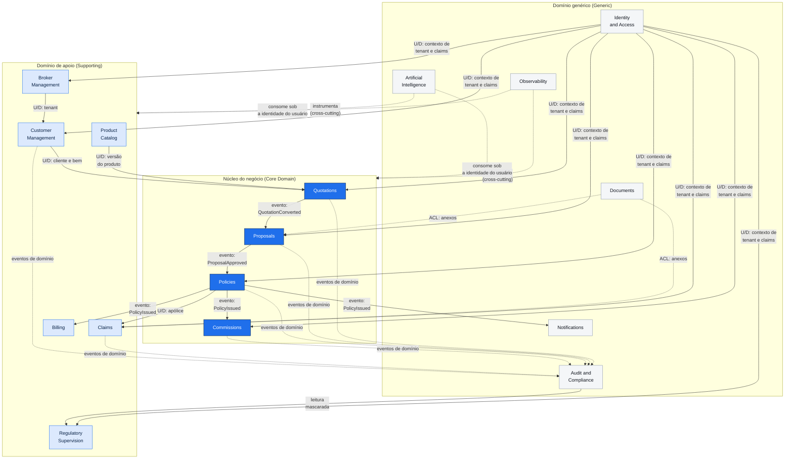

# Bounded Contexts — PortalDoCorretor

16 contextos delimitados, implementados como **módulos de um monólito modular**. Cada módulo tem
domínio, aplicação e infraestrutura próprios, e comunica-se com os demais **apenas** por
contratos públicos (interfaces de aplicação) ou por eventos de integração via Outbox — nunca por
acesso direto a entidades ou tabelas alheias.

## Mapa de contextos

**Legenda de relacionamento** — `U/D` = Upstream/Downstream (Customer-Supplier);
`ACL` = Anti-Corruption Layer; setas tracejadas = comunicação assíncrona por evento.

## Classificação estratégica

| Classe | Contextos | Racional |
|---|---|---|
| **Core Domain** | Quotations, Proposals, Policies, Commissions | É onde está a complexidade e a diferenciação: precificação simulada, máquina de estados de underwriting, invariantes de emissão e apuração de comissão. Recebe o modelo mais rico e a maior densidade de testes. |
| **Supporting** | Customer Management, Broker Management, Product Catalog, Claims, Billing, Regulatory Supervision | Necessários e específicos do domínio, mas com regras mais estáveis. Modelo rico, porém mais enxuto. |
| **Generic** | Identity and Access, Documents, Notifications, Audit and Compliance, Observability, AI | Resolvidos com padrões conhecidos e bibliotecas maduras. Investimento em corretude e segurança, não em modelagem. |

---

## Detalhamento dos contextos

### 1. Identity and Access

| | |
|---|---|
| **Responsabilidade** | Autenticar, emitir e revogar sessões, resolver tenant e avaliar autorização (RBAC + ABAC). |
| **Aggregate Roots** | `User` (com `Session` e credenciais), `Role` |
| **Entidades** | `Session`, `Permission`, `MfaEnrollment`, `AuthenticationAttempt` |
| **Value Objects** | `TenantId`, `EmailAddress`, `PasswordHash`, `TotpSecret` |
| **Linguagem ubíqua** | *Claim*, *escopo*, *sessão*, *papel*, *permissão*, *finalidade* |
| **Publica** | `UserAuthenticated`, `SessionRevoked`, `AuthorizationDenied` |
| **Relação** | Upstream de todos. Fornece `ITenantContext` e `IAuthorizationService` como contratos públicos. |
| **Regra crítica** | O `TenantId` é derivado **exclusivamente** do claim do token e é imutável durante a requisição. Nenhum outro módulo pode construí-lo a partir de entrada do usuário. |

### 2. Broker Management

| | |
|---|---|
| **Responsabilidade** | Corretora (tenant) e corretores, com carteira e registro SUSEP fictício. |
| **Aggregate Roots** | `Brokerage`, `Broker` |
| **Value Objects** | `DocumentNumber` (CNPJ), `SusepRegistration`, `TenantId` |
| **Linguagem ubíqua** | *Corretora*, *corretor*, *carteira*, *tenant* |
| **Publica** | `BrokerageActivated`, `BrokerJoined` |
| **Nota de modelagem** | `Brokerage` **é** o tenant. Um `Broker` pertence a exatamente uma corretora — decisão deliberada que simplifica a autorização; multi-vínculo fica registrado como evolução futura em ADR. |

### 3. Customer Management

| | |
|---|---|
| **Responsabilidade** | Clientes PF/PJ, contatos, endereços, consentimentos LGPD e bens seguráveis. |
| **Aggregate Root** | `Customer` (abstrato) → `IndividualCustomer` / `BusinessCustomer` |
| **Entidades internas** | `Contact`, `Address`, `Consent`, `InsurableAsset` → `Vehicle` / `Property` |
| **Value Objects** | `DocumentNumber`, `EmailAddress`, `PhoneNumber`, `PostalAddress`, `LicensePlate`, `Vin` |
| **Publica** | `CustomerRegistered`, `CustomerUpdated`, `ConsentGranted`, `ConsentRevoked`, `AssetRegistered` |
| **Relação** | Upstream de Quotations (fornece cliente e bem). |
| **Regra crítica** | Consentimento é *append-only*: revogar cria novo registro. Nenhum consentimento é fisicamente apagado. |

### 4. Product Catalog

| | |
|---|---|
| **Responsabilidade** | Produtos genéricos versionados, coberturas, assistências e regras de elegibilidade. |
| **Aggregate Root** | `InsuranceProduct` (com `ProductVersion`) |
| **Entidades** | `Coverage`, `Assistance`, `EligibilityRule` |
| **Value Objects** | `CoverageLimit`, `Deductible`, `Percentage`, `ProductCode` |
| **Publica** | `ProductVersionPublished` |
| **Regra crítica** | Cotação e apólice referenciam a **versão** do produto, não o produto. Alterar o catálogo nunca reescreve o passado — requisito de rastreabilidade regulatória. |
| **Leitura** | Cacheado em Redis (dado quase estático, alta taxa de leitura), invalidado por `ProductVersionPublished`. |

### 5. Quotations (Core)

| | |
|---|---|
| **Responsabilidade** | Cotação multiplano, perfil de risco, elegibilidade e cálculo simulado. |
| **Aggregate Root** | `Quotation` |
| **Entidades internas** | `QuotationItem`, `RiskProfile`, `SelectedCoverage`, `CalculationSnapshot` |
| **Value Objects** | `QuotationNumber`, `Money`, `RiskScore`, `Percentage`, `DateRange` |
| **Serviços de domínio** | `PremiumCalculationService`, `EligibilityEvaluator` |
| **Publica** | `QuotationCreated`, `QuotationRejected`, `QuotationConverted`, `QuotationExpired` |
| **Consome** | Cliente/bem (Customer Management), versão do produto (Product Catalog) — por **referência de ID**, não por objeto compartilhado. |
| **Regra crítica** | O cálculo é determinístico e o `CalculationSnapshot` é imutável, permitindo reproduzir meses depois exatamente o que foi ofertado. |

### 6. Proposals (Core)

| | |
|---|---|
| **Responsabilidade** | Formalização da cotação, documentação, pendências e decisão de underwriting simulada. |
| **Aggregate Root** | `Proposal` |
| **Entidades internas** | `ProposalDocument` (referência), `Pendency`, `UnderwritingDecision`, `ProposalStatusHistory` |
| **Value Objects** | `ProposalNumber`, `Money`, `IdempotencyKey` |
| **Serviços de domínio** | `UnderwritingService` (simulado) |
| **Publica** | `ProposalCreated`, `ProposalSubmitted`, `ProposalApproved`, `ProposalRejected`, `ProposalPending`, `ProposalIssued` |
| **Regra crítica** | Máquina de estados explícita; transições inválidas lançam exceção de domínio, não são silenciosamente ignoradas. `UnderwritingDecision` é imutável e versionada. |

### 7. Policies (Core)

| | |
|---|---|
| **Responsabilidade** | Emissão, coberturas contratadas, vigência, endossos e renovações. |
| **Aggregate Root** | `Policy` |
| **Entidades internas** | `PolicyCoverage`, `Endorsement`, `Renewal` |
| **Value Objects** | `PolicyNumber`, `DateRange`, `Money`, `CoverageLimit`, `Deductible` |
| **Serviços de domínio** | `PolicyIssuanceService`, `EndorsementService` |
| **Publica** | `PolicyIssued`, `PolicyEndorsed`, `PolicyRenewed`, `PolicyCancelled` |
| **Regra crítica** | Uma apólice ativa por proposta, garantida em três camadas: invariante de domínio, índice único e chave de idempotência. Vigências não se sobrepõem para o mesmo bem/produto (constraint de exclusão `btree_gist`). |
| **Nota de fronteira** | `Installment` pertence a **Billing**, não a Policies. A apólice publica `PolicyIssued` e Billing gera as parcelas — mas **na mesma transação**, via handler in-process, porque a invariante "soma das parcelas = prêmio" precisa ser garantida na emissão. Trade-off documentado em ADR-0006. |

### 8. Billing

| | |
|---|---|
| **Responsabilidade** | Parcelas e pagamentos **simulados**. |
| **Aggregate Root** | `InstallmentPlan` (com `Installment`s) |
| **Entidades** | `Installment`, `Payment` |
| **Value Objects** | `Money`, `DueDate` |
| **Publica** | `InstallmentsGenerated`, `InstallmentPaid`, `InstallmentOverdue` |
| **Regra crítica** | Invariante financeira: `Σ parcelas = prêmio total`, verificada ao centavo. Distribuição de arredondamento documentada e testada (o resíduo vai para a primeira parcela). |

### 9. Commissions (Core)

| | |
|---|---|
| **Responsabilidade** | Apuração de comissão por regra versionada, com ciclo prevista → liberada → paga → estornada. |
| **Aggregate Root** | `Commission` |
| **Entidades** | `CommissionRule` (versionada), `CommissionEntry` |
| **Value Objects** | `CommissionRate`, `Money`, `Percentage` |
| **Serviços de domínio** | `CommissionEngine` |
| **Publica** | `CommissionCalculated`, `CommissionReleased`, `CommissionReversed` |
| **Regra crítica** | A comissão registra a **referência à versão da regra**, o percentual aplicado e o valor-base. Isso responde de forma auditável à pergunta "por que essa comissão é esse valor?". Estorno nunca apaga: cria lançamento inverso. |
| **Segurança** | Um corretor só enxerga as próprias comissões — ABAC por `broker_id`, além do RLS por tenant. |

### 10. Claims

| | |
|---|---|
| **Responsabilidade** | Aviso, acompanhamento, documentação e decisão simulada de sinistro. |
| **Aggregate Root** | `Claim` |
| **Entidades internas** | `ClaimEvent`, `Damage`, `ClaimStatusHistory`, referências a documentos |
| **Value Objects** | `ClaimNumber`, `Money`, `OccurrenceDate` |
| **Publica** | `ClaimReported`, `ClaimEventAdded`, `ClaimDecided` |
| **Regra crítica** | Data do evento deve estar dentro da vigência da apólice — invariante verificada na criação. Linha do tempo é *append-only*. |

### 11. Documents

| | |
|---|---|
| **Responsabilidade** | Armazenamento seguro, validação e recuperação controlada de anexos sintéticos. |
| **Aggregate Root** | `Document` |
| **Value Objects** | `ContentHash` (SHA-256), `MimeType`, `FileSize` |
| **Publica** | `DocumentStored`, `DocumentRejected` |
| **Relação** | Anti-Corruption Layer: Proposals e Claims referenciam documentos por ID e nunca manipulam o armazenamento diretamente. |
| **Regra crítica** | Validação por *magic bytes*, nome regerado, armazenamento fora da raiz web, download por URL assinada de curta duração e autorização por recurso a cada acesso. |

### 12. Notifications

| | |
|---|---|
| **Responsabilidade** | Produzir e entregar notificações in-app a partir de eventos de integração. |
| **Aggregate Root** | `Notification` |
| **Consome** | `PolicyIssued`, `ProposalApproved`, `RenewalDue`, `ClaimDecided`, `InstallmentOverdue` |
| **Regra crítica** | Consumo idempotente por `message_id`; a entrega é "ao menos uma vez", então o handler precisa ser idempotente por construção. |

### 13. Regulatory Supervision

| | |
|---|---|
| **Responsabilidade** | Supervisão simulada: indicadores consolidados, conformidade, rastreabilidade e acesso justificado. |
| **Aggregate Root** | `RegulatoryAccessSession` (finalidade, escopo, TTL) |
| **Entidades** | `SusepRegulatoryUser`, `RegulatoryScope`, `RegulatoryQueryLog` |
| **Value Objects** | `AccessPurpose`, `RegulatoryScope`, `MaskedDocument` |
| **Relação** | **Downstream puro e somente-leitura.** Lê projeções e views mascaradas; nunca acessa agregados transacionais para escrita. Implementa Anti-Corruption Layer sobre os dados operacionais. |
| **Regra crítica** | Nenhuma consulta sensível sem finalidade ativa. Supressão de células agregadas abaixo do limiar `k` para evitar reidentificação. |

### 14. Audit and Compliance

| | |
|---|---|
| **Responsabilidade** | Trilha imutável de auditoria, eventos de segurança e histórico de alterações. |
| **Aggregate Roots** | `AuditEvent`, `SecurityEvent` (ambos imutáveis) |
| **Regra crítica** | *Append-only* imposto no banco: `UPDATE` e `DELETE` revogados para o papel da aplicação. Particionamento mensal por `occurred_at`. A auditoria é gravada **na mesma transação** da operação auditada — não há operação de negócio confirmada sem auditoria correspondente. |

### 15. Observability

| | |
|---|---|
| **Responsabilidade** | Instrumentação transversal: traces, métricas, logs estruturados, correlation ID e o *stream* do Live Processing Console. |
| **Natureza** | Não possui domínio de negócio; é infraestrutura transversal com contrato explícito para não poluir os módulos de negócio. |
| **Regra crítica** | Redação automática de dados sensíveis antes de qualquer emissão. O pipeline de redação é testado com payloads que contêm senha, token e CPF. |

### 16. Artificial Intelligence

| | |
|---|---|
| **Responsabilidade** | Cinco agentes governados: Broker Copilot, Regulatory Assistant, Database Review, Architecture Review, AppSec Review. |
| **Aggregate Roots** | `Agent` (com `AgentSkill`s), `AgentExecution` |
| **Regra crítica** | O agente executa **sob a identidade e o tenant do usuário**, com permissão mínima e ferramentas declaradas em allowlist. Conteúdo recuperado (dado do banco, documento) é tratado como **dado, nunca como instrução** — defesa contra prompt injection. Toda execução é auditada, com entrada/saída redigidas e limite de uso por janela. |

---

## Regras de dependência entre módulos

Verificadas automaticamente por **NetArchTest** na suíte de testes arquiteturais:

1. **Nenhum módulo referencia o `Domain` ou o `Infrastructure` de outro módulo.** Integração
   ocorre por contratos em `<Modulo>.Contracts` ou por eventos.
2. **`Domain` não referencia `Application`, `Infrastructure` ou pacotes de framework** — sem EF Core,
   sem ASP.NET, sem Serilog dentro do domínio. Dependências apontam para dentro (Clean Architecture).
3. **Comunicação síncrona entre módulos é permitida apenas via interface pública**, e somente na
   direção definida no mapa de contextos. Ciclos são falha de build.
4. **Escrita cross-context é proibida.** Um módulo só escreve nas próprias tabelas; leituras
   cross-context usam views ou projeções dedicadas.
5. **Regulatory nunca escreve.** Verificado por teste que inspeciona os comandos registrados no módulo.

## Evolução futura

O monólito modular foi escolhido para ser construível e mantível por uma pessoa (ADR-0002). Se um
contexto precisar escalar de forma independente no futuro, a extração segue esta ordem de menor
atrito, já preparada pelas fronteiras atuais:

1. **AI** — já é um serviço separado (`ai-agent-service`), sem estado transacional compartilhado.
2. **Documents** — fronteira estreita, comunicação já assíncrona, candidato natural a *object storage*.
3. **Notifications** — puramente reativo a eventos; a Outbox já existe como ponte.
4. **Regulatory** — somente-leitura; poderia consumir uma réplica de leitura dedicada.

Core Domain (Quotations, Proposals, Policies, Commissions) **não** deve ser extraído: as
invariantes de emissão exigem transação única, e distribuí-las trocaria consistência forte por
complexidade de saga sem ganho correspondente.
