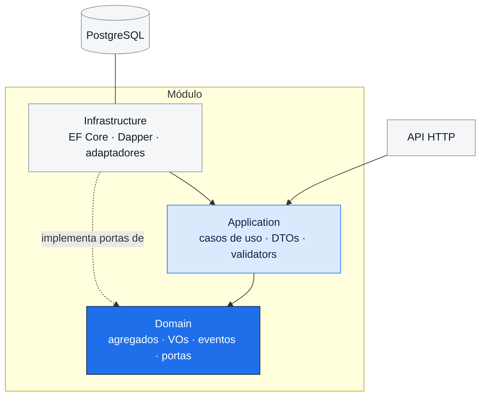
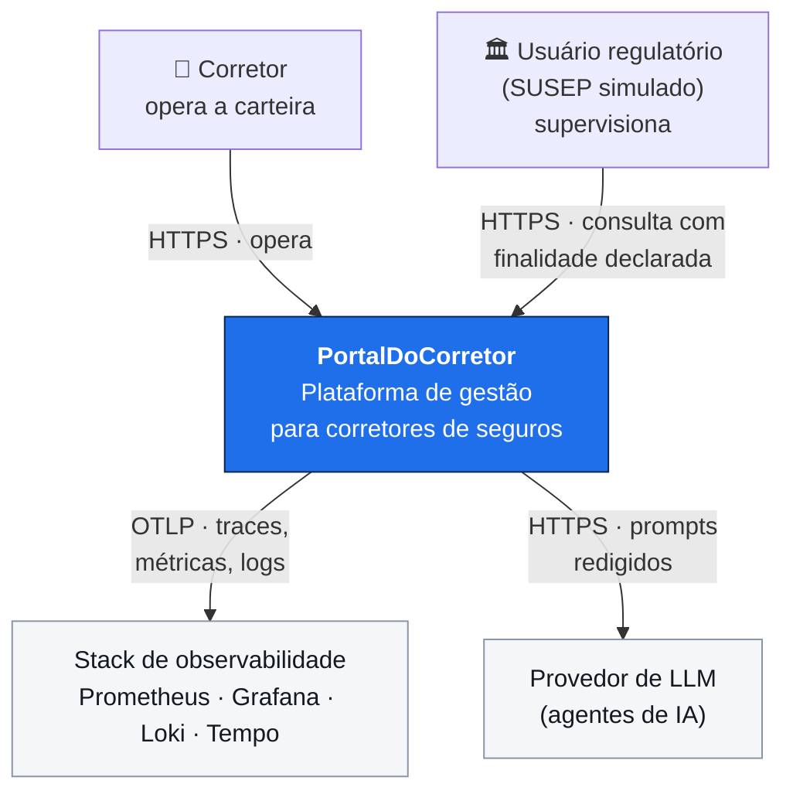
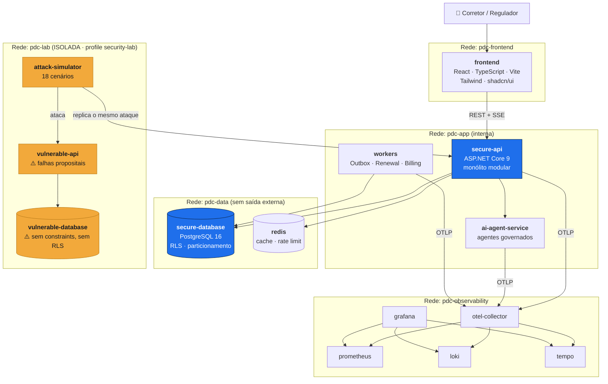
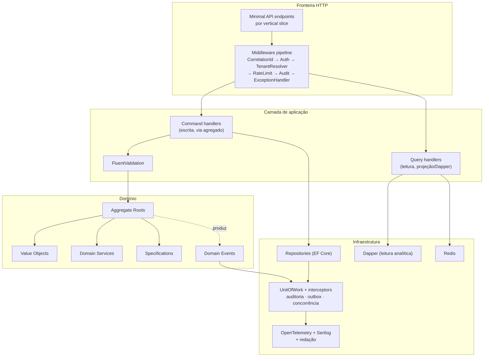
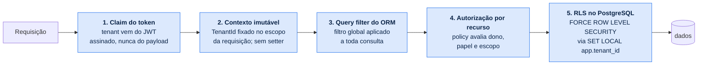

# Arquitetura — PortalDoCorretor

## 1. Estilo arquitetural

**Monólito modular** com Clean Architecture dentro de cada módulo, portas e adaptadores na
fronteira, DDD tático no núcleo, *vertical slices* na camada de aplicação e CQRS **seletivo**.

Decisão registrada em [ADR-0002](../adr/0002-monolito-modular.md).

### Por que não microserviços

O sistema tem uma restrição declarada: precisa ser **construído e mantido por uma pessoa**. Além
disso, as invariantes mais importantes (emissão de apólice com parcelas, comissão e auditoria
atômicas) exigem transação única. Distribuí-las trocaria consistência forte por sagas,
compensações e estados intermediários visíveis — complexidade real em troca de escalabilidade
que este sistema não precisa.

O monólito modular preserva as **fronteiras lógicas** de microserviços (módulos independentes,
comunicação por contrato, sem acesso cruzado a tabelas) sem pagar o custo operacional. As
fronteiras são verificadas por teste arquitetural, então não erodem com o tempo — é a diferença
entre um monólito modular e uma bola de lama.

### Camadas dentro de um módulo

```
Modules/Policies/
├── Domain/            ← entidades, VOs, eventos, specifications, portas (interfaces)
│                        SEM EF Core, SEM ASP.NET, SEM Serilog
├── Application/       ← casos de uso (vertical slices), DTOs, validators, orquestração
├── Infrastructure/    ← EF Core, Dapper, repositórios, adaptadores (implementa as portas)
└── Contracts/         ← o único assembly que outros módulos podem referenciar
```

A regra de dependência aponta **para dentro**: `Infrastructure → Application → Domain`. O domínio
não conhece ninguém. Isso é o que permite testar toda a lógica de negócio sem banco, sem HTTP e
sem mock de framework.



## 2. Diagramas C4

### Nível 1 — Contexto



Não há integração com seguradoras, SUSEP, bureaus ou meios de pagamento — o sistema é
deliberadamente fechado, e toda "integração" é simulada internamente.

### Nível 2 — Contêineres



O `attack-simulator` é o único contêiner com rota para as duas redes — por construção, ele executa
o cenário contra a versão vulnerável e **replica automaticamente** contra a segura. A
`vulnerable-api` nunca tem rota de saída para a internet nem para a rede de dados segura.

### Nível 3 — Componentes da `secure-api`



## 3. Defesa em profundidade multi-tenant — as 5 camadas

Este é o controle mais importante do sistema. Cada camada é independente: derrubar uma não
compromete o isolamento, e o Security Lab demonstra exatamente isso.



1. **Claim** — o `tenant_id` é derivado exclusivamente do token assinado. O tipo `TenantId` não tem
   construtor público que aceite entrada de usuário (ver [Value Objects](../domain/value-objects.md)),
   então um DTO **não consegue** produzir um tenant válido. O isolamento começa no sistema de tipos.
2. **Contexto imutável** — `ITenantContext` é resolvido uma vez por requisição e é somente-leitura.
3. **Query filter** — filtro global do EF Core em toda entidade `ITenantScoped`. Esquecer o `WHERE`
   não é possível.
4. **Autorização por recurso** — policies avaliam papel (RBAC) e atributos (ABAC: tenant, dono da
   carteira, escopo regulatório, finalidade declarada). Toda decisão emite `AuthorizationDecision`
   observável no Live Processing Console.
5. **RLS** — a conexão executa `SET LOCAL app.tenant_id` no início da transação. Mesmo um SQL cru
   e mal escrito só enxerga o tenant corrente. `FORCE ROW LEVEL SECURITY` garante que nem o dono
   da tabela escapa.

**A prova:** o teste de isolamento desativa a camada 3 e demonstra que a 5 ainda bloqueia; depois
desativa a 5 e mostra que a 3 e a 4 bloqueiam. É a diferença entre afirmar defesa em profundidade
e demonstrá-la.

## 4. Stack e trade-offs

### Backend

| Escolha | Por quê | Trade-off aceito | Alternativa descartada |
|---|---|---|---|
| **C# / .NET 9** | Sistema de tipos forte o bastante para expressar VOs e agregados; `record struct` dá imutabilidade barata; ecossistema maduro em domínios regulados | Verbosidade maior que linguagens dinâmicas | Node/TypeScript: tipos apagados em runtime, o que enfraquece a garantia dos VOs |
| **ASP.NET Core (Minimal API)** | Menos cerimônia que MVC, casa bem com vertical slices | Menos convenção pronta | Controllers: tendem a virar depósito de lógica, exatamente o antipadrão que o case combate |
| **EF Core** | *Owned types*, conversores de valor, query filters globais, `xmin` nativo, interceptors para auditoria/outbox | Abstração que pode gerar SQL ruim se usada sem atenção | Dapper puro: perderia query filter global e mapeamento de VO, ambos centrais aqui |
| **Dapper (junto)** | Leitura analítica e relatórios regulatórios, onde o ORM não agrega valor | Duas formas de acessar dados | ORM para tudo: consultas de agregação ficam lentas e ilegíveis |
| **FluentValidation** | Validação de entrada separada da invariante de domínio | Alguma duplicação aparente | Data annotations: insuficiente para regra composta |
| **Serilog + OpenTelemetry** | Log estruturado com *enricher* de redação; OTel é padrão aberto | Configuração inicial maior | Logging built-in: sem redação estruturada nem enrichment |
| **Polly** | Retry com jitter, timeout, circuit breaker | — | Retry manual: erra backoff e não tem circuit breaker |
| **xUnit + FluentAssertions + Testcontainers + Respawn + NetArchTest** | Testcontainers dá PostgreSQL **real** (RLS, constraints e tipos compostos não existem em banco em memória); NetArchTest transforma as regras de fronteira em build | Testes de integração mais lentos (~2 min) | SQLite em memória: não testaria nada do que o case afirma |

**Observação crítica sobre banco em memória:** RLS, constraints de exclusão, tipos compostos,
índices parciais e `xmin` simplesmente não existem em SQLite. Testar contra ele daria confiança
falsa exatamente nos pontos que este case precisa provar. Por isso Testcontainers com PostgreSQL
16 real, e por isso o RNF-051 proíbe a substituição.

### Frontend

| Escolha | Por quê | Trade-off |
|---|---|---|
| **React + TypeScript + Vite** | Ecossistema, tipagem ponta a ponta com Zod, build rápido | — |
| **Tailwind + shadcn/ui** | Design system **próprio** por composição; os componentes ficam no repositório e são customizáveis, não uma dependência de terceiros com visual alheio | Verbosidade de classes | 
| **TanStack Query** | Cache, revalidação e estados de servidor sem Redux | Curva inicial |
| **React Hook Form + Zod** | O mesmo schema valida no cliente e tipa o TS; espelha (não substitui) a validação do servidor | — |
| **Cytoscape.js** | Grafo interativo do Database Explorer (tabelas, FKs, agregados) | Peso da biblioteca |
| **Mermaid** | Diagramas renderizados a partir do texto versionado — a documentação não sai de sincronia | — |
| **Monaco Editor** | Exibição de SQL e planos de execução com realce no Query Inspector | Peso; carregado sob demanda |
| **Storybook** | Documenta o design system próprio e publica no GitHub Pages | Manutenção |

### Infraestrutura

| Escolha | Por quê | Trade-off |
|---|---|---|
| **PostgreSQL 16** | Justificado em detalhe no [modelo físico](../database/physical-model.md) | — |
| **Redis** | Cache de catálogo e de agregações regulatórias; contador de rate limit distribuído | Mais um componente para operar |
| **RabbitMQ** | **Não usado.** A Outbox no PostgreSQL com `SKIP LOCKED` atende o volume deste sistema com uma dependência a menos e com a garantia transacional que um broker externo não daria sem 2PC. Registrado em ADR-0007 | Se o volume crescer muito, o broker vira necessário — a Outbox já é a ponte natural |
| **Docker Compose** | Ambiente completo em um comando; profile separado isola o laboratório vulnerável | Não é orquestração de produção |
| **GitHub Actions** | CI/CD integrado ao repositório do case | — |
| **Prometheus + Grafana + Loki + Tempo** | Métricas, logs e traces com correlação por `correlation_id`; tudo self-hosted em containers | Consumo de recursos local |

## 5. CQRS seletivo

CQRS é aplicado **apenas onde paga**, não como dogma:

| Operação | Abordagem | Motivo |
|---|---|---|
| Comandos (criar, emitir, aprovar) | Agregado + EF Core | Precisam de invariante e transação |
| Consultas simples | Projeção EF Core direto para DTO | Evita materializar o agregado só para exibir colunas |
| Relatórios regulatórios | Dapper + materialized view | Agregação pesada; ORM não ajuda |
| Dashboards | Projeção cacheada, invalidada por evento | Alta leitura, tolerante a segundos de defasagem |

**Sem** *event sourcing* e **sem** banco de leitura separado: ambos adicionariam complexidade sem
resolver um problema que este sistema tenha. Registrado em ADR-0008.

## 6. Evolução futura

O desenho atual é o mínimo viável **correto**, não o mínimo viável. Caminhos de evolução já
preparados pelas fronteiras existentes:

| Gatilho | Evolução | Já preparado por |
|---|---|---|
| Volume de leitura regulatória cresce | Réplica de leitura dedicada | Regulatory é somente-leitura e usa views próprias |
| Volume de eventos cresce | Trocar Outbox→in-process por Outbox→RabbitMQ/Kafka | Outbox já é o ponto de publicação; muda só o dispatcher |
| Documentos crescem | Mover para object storage (S3/MinIO) | Documents já é ACL com interface própria |
| Um tenant fica muito grande | Particionar tabelas quentes por `tenant_id` | `tenant_id` já é o prefixo de todos os índices |
| Necessidade real de escala independente | Extrair AI → Documents → Notifications → Regulatory, nessa ordem | Fronteiras verificadas por NetArchTest |

O Core Domain (Quotations, Proposals, Policies, Commissions) **não** deve ser extraído — as
invariantes de emissão exigem transação única.

## 7. Como o avaliador verifica cada afirmação

| Afirmação | Como verificar |
|---|---|
| "As fronteiras entre módulos são reais" | `dotnet test tests/architecture` — NetArchTest falha se houver referência cruzada |
| "O domínio não depende de framework" | Teste arquitetural que proíbe `Microsoft.EntityFrameworkCore` em `*.Domain` |
| "RLS está ativa" | Query Inspector mostra `SET LOCAL app.tenant_id`; Database Explorer lista as políticas do catálogo |
| "Não há N+1" | Métrica de queries por operação no Live Processing Console |
| "As invariantes seguram" | Security Lab derruba um controle por vez e mostra o próximo bloqueando |
| "Os benchmarks são reais" | `EXPLAIN (ANALYZE, BUFFERS)` exibido no Query Inspector, com a especificação da máquina |
