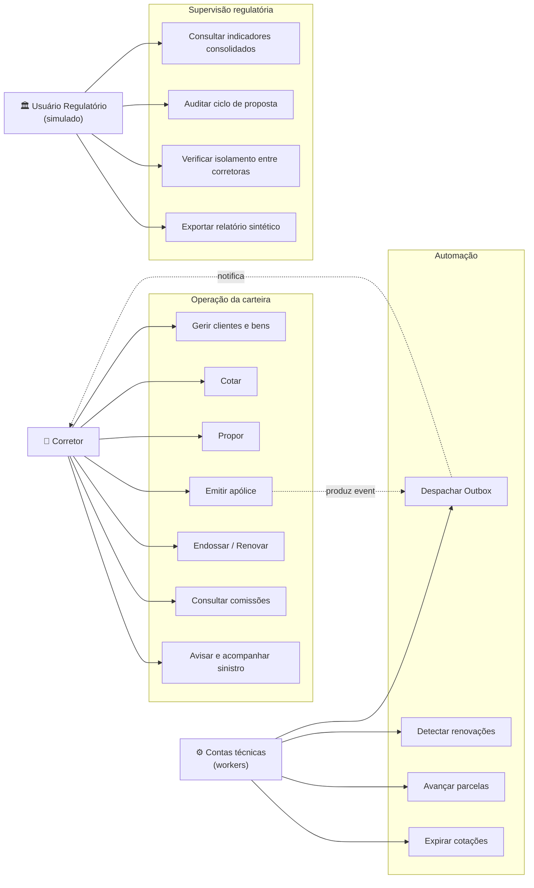

# Casos de uso — NexusBroker

Notação: `UC-<contexto>-<n>`. Cada caso indica ator, pré-condições, fluxo principal, fluxos
alternativos, invariantes verificadas, eventos produzidos e evidência observável no Live
Processing Console.

## Diagrama de casos de uso

---

## 1. Corretor — Customer Management

### UC-CUS-01 — Cadastrar cliente

| | |
|---|---|
| **Ator** | Corretor |
| **Pré-condição** | Sessão autenticada; tenant resolvido a partir do token |
| **Módulo** | `Customers` |

**Fluxo principal**

1. Corretor informa tipo (PF/PJ), documento, nome/razão social, contato e endereço principais.
2. Sistema valida o documento no VO `DocumentNumber` (dígito verificador de CPF/CNPJ).
3. Sistema verifica unicidade do documento **dentro do tenant**.
4. Sistema instancia `IndividualCustomer` ou `BusinessCustomer` (polimorfismo).
5. Agregado valida invariantes: ao menos um contato, no máximo um endereço principal.
6. Persiste em transação; emite `CustomerRegistered`; grava `AuditEvent` e `OutboxMessage`.
7. Retorna o cliente criado (DTO, nunca a entidade).

**Fluxos alternativos**

- **A1** — Documento inválido: `422` com código `DOCUMENT_INVALID`; nenhuma escrita; sem vazamento do valor no log.
- **A2** — Documento já existente no tenant: `409 CUSTOMER_DUPLICATE`. *Não* revela existência em outro tenant (evita enumeração cross-tenant).
- **A3** — Payload contém `tenantId` ou `id`: campos ignorados pelo DTO; tentativa registra `SecurityEvent MASS_ASSIGNMENT_ATTEMPT`.

**Invariantes** — documento válido e único por tenant; um endereço principal por tipo; PJ exige CNPJ, PF exige CPF.

**Eventos** — `CustomerRegistered`.

**Evidência ao vivo** — validação do VO → `INSERT` parametrizado → índice único `ux_customers_tenant_document` → `AuditEvent` → commit.

---

### UC-CUS-02 — Registrar consentimento LGPD

**Fluxo principal**

1. Corretor seleciona finalidade (lista fechada: contato comercial, cotação, emissão, renovação, sinistro).
2. Informa base legal, canal de coleta e versão do termo.
3. Sistema cria `Consent` **imutável** (append-only) com `granted_at`.
4. Emite `ConsentGranted`; auditoria registrada.

**Alternativo A1 — revogação:** cria novo registro com `revoked_at`; o original nunca é alterado nem apagado. Consultas de consentimento vigente leem a última versão por finalidade.

**Invariante** — não existe consentimento sem finalidade e base legal; revogação exige consentimento vigente.

---

### UC-CUS-03 — Cadastrar bem segurável

**Fluxo principal**

1. Corretor escolhe o tipo (`Vehicle` ou `Property`).
2. `Vehicle`: placa (formato Mercosul/antigo), chassi, ano, marca/modelo, uso, CEP de pernoite.
   `Property`: tipo de imóvel, área, ano de construção, tipo de construção, CEP, uso.
3. Sistema valida via VO específico (placa e chassi sintéticos, com formato verificado).
4. Adiciona ao agregado `Customer` (composição); persiste com discriminador de herança.

**Invariante** — placa/chassi únicos por tenant; imóvel exige endereço válido.

---

### UC-CUS-04 — Pesquisar cliente

**Fluxo principal** — busca por nome (full-text `tsvector`), documento (hash determinístico, nunca o valor em claro no índice de busca) ou e-mail; paginação por cursor; ordenação estável.

**Alternativo A1** — corretor tenta acessar cliente de outro tenant por ID direto: RLS + *query filter* retornam vazio; resposta `404` (não `403`, para não confirmar a existência do recurso); `SecurityEvent TENANT_VIOLATION_ATTEMPT` registrado.

**Evidência ao vivo** — este é o UC usado no cenário IDOR do Attack Simulator.

---

## 2. Corretor — Quotations

### UC-QUO-01 — Criar cotação

| | |
|---|---|
| **Ator** | Corretor |
| **Pré-condição** | Cliente do tenant; bem segurável compatível com o produto; produto ativo |

**Fluxo principal**

1. Seleciona cliente → produto (versão vigente) → bem segurável.
2. Preenche questionário de risco; respostas validadas contra o JSON Schema da versão do produto.
3. Sistema calcula `RiskScore` a partir do `RiskProfile` (função determinística documentada).
4. Seleciona coberturas; obrigatórias vêm marcadas e bloqueadas.
5. Sistema avalia `EligibilityRule` via *Specifications* compostas.
6. Motor de cálculo **simulado** gera 3 planos e um `CalculationSnapshot` imutável por plano.
7. Persiste `Quotation` + `QuotationItem`s + `RiskProfile` + snapshot em transação única.
8. Emite `QuotationCreated`; auditoria registrada.

**Fluxos alternativos**

- **A1** — inelegível: cotação persistida com status `REJECTED` e motivo estruturado (a recusa também é informação de negócio e precisa ser auditável).
- **A2** — bem incompatível com o produto (ex.: imóvel em produto auto): `422 ASSET_PRODUCT_MISMATCH`, validado por Specification antes do cálculo.
- **A3** — cobertura obrigatória removida: rejeitada pela invariante do agregado.

**Invariantes** — cotação pertence ao mesmo tenant do cliente e do bem; todas as coberturas obrigatórias presentes; soma de limites ≤ teto do produto; `expires_at = created_at + 30 dias`.

**Eventos** — `QuotationCreated`, `QuotationRejected`.

**Evidência ao vivo** — validação de VO (`Money`, `CoverageLimit`, `RiskScore`) → Specification aprovada/reprovada → snapshot gravado → transação confirmada.

---

### UC-QUO-02 — Comparar planos

Exibe os 3 planos lado a lado: coberturas, limites, franquias, assistências, prêmio simulado e
diferenças destacadas. Leitura pura (CQRS: projeção otimizada, sem carregar o agregado completo).

---

## 3. Corretor — Proposals

### UC-PRO-01 — Converter cotação em proposta

**Fluxo principal**

1. Corretor escolhe um plano da cotação vigente.
2. Sistema verifica: cotação não expirada, não convertida, do mesmo tenant.
3. Cria `Proposal` com `ProposalNumber`, congelando o snapshot de cálculo escolhido.
4. Marca a cotação como `CONVERTED` (transição de estado válida).
5. Emite `ProposalCreated`; auditoria.

**Alternativos**

- **A1** — cotação expirada: `409 QUOTATION_EXPIRED`.
- **A2** — cotação já convertida: `409`, garantido por índice único parcial `ux_proposals_quotation_active`.

**Invariante** — uma cotação gera no máximo uma proposta ativa.

---

### UC-PRO-02 — Anexar documento

**Fluxo principal** — upload multipart → validação de *magic bytes* (não confiar em extensão nem em `Content-Type`) → limite de tamanho → varredura simulada → hash SHA-256 → nome sanitizado e regerado (UUID) → armazenamento fora da raiz web → registro em `documents` com vínculo polimórfico.

**Alternativos**

- **A1** — tipo real divergente do declarado (ex.: `.pdf` que é HTML): rejeitado; `SecurityEvent UNSAFE_UPLOAD_BLOCKED`.
- **A2** — duplicata por hash no tenant: retorna o documento existente (idempotência natural).

**Evidência ao vivo** — cenário "upload inseguro" do Attack Simulator.

---

### UC-PRO-03 — Analisar proposta (underwriting simulado)

**Ator** — conta técnica `Underwriting Engine` (disparada por evento), sem persona humana.

**Fluxo principal**

1. Consome `ProposalSubmitted` da Outbox.
2. Avalia regras: `RiskScore`, histórico de sinistros do cliente, valor do bem, pendências abertas.
3. Produz `UnderwritingDecision` **imutável**: `APPROVED`, `REJECTED` ou `PENDING` + motivos.
4. Se `PENDING`, cria pendências acionáveis pelo corretor.
5. Emite `ProposalApproved` / `ProposalRejected` / `ProposalPending`.

**Invariantes** — proposta com pendência aberta não é aprovada; decisão nunca é sobrescrita (nova análise gera nova decisão versionada).

---

## 4. Corretor — Policies

### UC-POL-01 — Emitir apólice ⭐ *caso de uso central do case*

| | |
|---|---|
| **Ator** | Corretor |
| **Pré-condição** | Proposta `APPROVED`, sem pendência aberta, do tenant do corretor |
| **Requisito** | Header `Idempotency-Key` obrigatório |

**Fluxo principal — os 24 passos observáveis**

1. Requisição recebida; `CorrelationId` criado e propagado.
2. Token validado; perfil e claims extraídos.
3. Tenant resolvido a partir do claim (**nunca** do payload) e fixado imutável no escopo da requisição.
4. `SET LOCAL app.tenant_id` aplicado na conexão → RLS ativa.
5. Autorização por recurso: `PolicyIssuePolicy` avalia papel + tenant + propriedade da carteira.
6. Chave de idempotência verificada; replay retorna a resposta original armazenada.
7. `Proposal` carregada com `xmin` (optimistic lock).
8. Invariantes verificadas: status aprovado, sem pendências, cotação não expirada.
9. `UnderwritingDecision` validada.
10. `Policy` criada pelo factory do agregado; `PolicyNumber` gerado.
11. Vigência (`DateRange`) validada contra sobreposição (constraint de exclusão).
12. `PolicyCoverage`s congeladas a partir do snapshot.
13. `Installment`s geradas; invariante: soma = prêmio total, ao centavo.
14. `Commission` apurada pelo `CommissionEngine` com a `CommissionRule` vigente.
15. `PolicyIssued` (evento de domínio) produzido.
16. `OutboxMessage` persistida **na mesma transação**.
17. `AuditEvent` gravado.
18. Proposta transiciona para `ISSUED`.
19. `COMMIT` — atômico.
20. Cache invalidado (dashboard e carteira do corretor).
21. Outbox Dispatcher publica a mensagem.
22. Notificação criada e entregue.
23. Métricas atualizadas (`policies_issued_total`, latência, contagem de queries).
24. Trace concluído e exportado.

**Fluxos alternativos**

- **A1 — emissão concorrente (cenário obrigatório):** dois processos emitem para a mesma proposta.
  Na versão segura, o perdedor falha por *optimistic lock* (`xmin` divergente); se passar,
  esbarra no índice único `ux_policies_proposal`; se repetir a requisição, a `idempotency_key`
  devolve a resposta original. Resultado: **exatamente uma apólice**. Na versão vulnerável,
  duas apólices são criadas e a comissão é duplicada.
- **A2 — falha após o passo 14:** rollback total; nenhuma apólice, parcela, comissão ou evento
  permanece. Demonstrado com falha injetada.
- **A3 — proposta de outro tenant:** RLS retorna vazio antes mesmo da lógica; `404` + `SecurityEvent`.

**Invariantes** — proposta aprovada e sem pendência; uma apólice ativa por proposta; vigência sem
sobreposição para o mesmo bem/produto; soma das parcelas = prêmio; comissão referencia regra versionada.

**Eventos** — `PolicyIssued`, `InstallmentsGenerated`, `CommissionCalculated`.

---

### UC-POL-02 — Solicitar endosso

Altera cobertura, vigência ou prêmio criando `Endorsement` versionado. A apólice **não** é
sobrescrita: o histórico anterior permanece consultável. Diferença de prêmio gera ajuste de
comissão (complementar ou estorno parcial). Invariante: endosso só em apólice vigente.

### UC-POL-03 — Acompanhar renovação

O worker `Renewal Scanner` identifica apólices vencendo em ≤ 45 dias (índice parcial), cria
`Renewal` e notifica. O corretor gera nova cotação vinculada (`previous_policy_id`), e o sistema
apresenta o diff de coberturas em relação à apólice anterior. Aceite ou recusa é registrado com autoria.

---

## 5. Corretor — Commissions e Claims

### UC-COM-01 — Consultar extrato de comissões

Lista comissões do **próprio** corretor com estado (prevista, liberada, paga simulada, estornada),
apólice de origem, regra aplicada, percentual, valor-base e histórico. Consolidação mensal via
projeção.

**Alternativo A1** — corretor tenta consultar comissão de colega do mesmo tenant: bloqueado por
ABAC (`broker_id` do claim ≠ dono do recurso) **e** por RLS de segunda camada. `SecurityEvent`
registrado. Este é o cenário "consulta de comissão de outro corretor" do Attack Simulator.

### UC-CLM-01 — Registrar aviso de sinistro

Corretor informa apólice, data e descrição do evento, e anexa documentos. Sistema valida que a
data do evento está **dentro da vigência** (invariante), cria `Claim` + primeiro `ClaimEvent`,
emite `ClaimReported`. Linha do tempo é *append-only*. Decisão e valores são **simulados** e
rotulados como tal.

---

## 6. Usuário regulatório (simulado)

> Todos os casos abaixo são **somente-leitura**, exigem finalidade declarada e produzem
> `AuditEvent` com os 12 campos do RF-099. Dados pessoais são sempre mascarados.

### UC-REG-01 — Acesso justificado

**Fluxo principal**

1. Ao iniciar uma consulta sensível, o sistema exige finalidade de uma lista fechada:
   supervisão regulatória, verificação de conformidade, investigação de inconsistência, análise de indicador.
2. Usuário informa finalidade + justificativa textual (mínimo de caracteres) + escopo (corretora, período).
3. Sistema valida a finalidade contra o escopo autorizado do usuário e abre uma **sessão de acesso**
   com prazo (TTL) e limite de recursos.
4. Toda consulta subsequente carrega a referência dessa sessão na auditoria.

**Alternativo A1** — consulta sensível sem finalidade ativa: `403 PURPOSE_REQUIRED`; nenhum dado retornado; auditado.
**Alternativo A2** — consulta fora do escopo declarado: `403 OUT_OF_SCOPE`; `SecurityEvent`.

### UC-REG-02 — Consultar indicadores consolidados

Indicadores por corretora, produto e período, servidos por *materialized view*. Apenas agregados;
nenhuma célula com contagem abaixo do limiar `k` é exibida (mitigação de reidentificação por
diferenciação) — exibe `< k` no lugar.

### UC-REG-03 — Acompanhar ciclo completo de uma proposta

Visão cronológica: cotação → proposta → documentos (metadados, não conteúdo) → decisão →
apólice → parcelas → comissão (valor agregado, sem identificar o corretor por nome completo) →
sinistro. Cada nó exibe o `AuditEvent` e o `CorrelationId` correspondentes.

### UC-REG-04 — Verificar isolamento entre corretoras

Relatório que demonstra: políticas RLS ativas por tabela, contagem de tentativas de violação de
tenant no período, resultado dos testes de isolamento da última execução de CI e configuração de
`FORCE ROW LEVEL SECURITY`. É a resposta objetiva à pergunta "como você garante que uma corretora
não vê a outra?".

### UC-REG-05 — Consultar trilhas de auditoria e eventos de segurança

Filtros por período, corretora, tipo de evento e resultado. Somente dentro do escopo autorizado.
A própria consulta é auditada (auditoria da auditoria).

### UC-REG-06 — Exportar relatório sintético

Gera CSV/JSON com cabeçalho contendo finalidade, escopo, usuário mascarado, timestamp e hash do
conteúdo. A exportação é registrada e o hash permite provar posteriormente o que foi entregue.

### Restrições negativas verificadas por teste

O perfil regulatório **não** pode: alterar apólice, comissão, proposta ou cliente; executar SQL
arbitrário; desabilitar auditoria; visualizar segredos; acessar dados fora do escopo; ver dado
pessoal em claro. Cada proibição tem teste automatizado correspondente.

---

## 7. Automação (contas técnicas)

| UC | Processo | Gatilho | Garantia |
|---|---|---|---|
| UC-SYS-01 | Outbox Dispatcher | Polling com `FOR UPDATE SKIP LOCKED` | Entrega ao menos uma vez; consumo idempotente por `message_id`; retry exponencial; DLQ após N tentativas |
| UC-SYS-02 | Renewal Scanner | Diário | Índice parcial em `end_date`; idempotente por apólice e ciclo |
| UC-SYS-03 | Billing Scheduler | Diário | Avança parcelas simuladas; auditado |
| UC-SYS-04 | Quotation Expirer | Horário | Expira cotações vencidas; emite evento |
| UC-SYS-05 | Materialized View Refresher | Agendado | `REFRESH CONCURRENTLY` para não bloquear leitura |

Todo worker executa sob **conta técnica identificada**, com permissão mínima, e suas ações são
auditadas com o mesmo rigor das ações humanas.

---

## 8. Casos de uso dos laboratórios

| UC | Descrição |
|---|---|
| UC-LAB-01 | Executar operação de negócio e acompanhar os 24 passos no Live Processing Console |
| UC-LAB-02 | Inspecionar a query real de uma operação, com plano de execução e índice utilizado |
| UC-LAB-03 | Comparar ORM vs Dapper, com e sem índice, N+1 vs projeção — com medição real |
| UC-LAB-04 | Executar um dos 18 cenários de ataque contra a versão vulnerável |
| UC-LAB-05 | Replicar automaticamente o mesmo ataque contra a versão segura e ver o controle que bloqueou |
| UC-LAB-06 | Disparar o cenário de emissão concorrente e observar o optimistic lock atuando |
| UC-LAB-07 | Navegar do objeto de domínio até a tabela física no Database Explorer |
| UC-LAB-08 | Percorrer o Recruiter Mode (20 passos, 10–15 min) |
