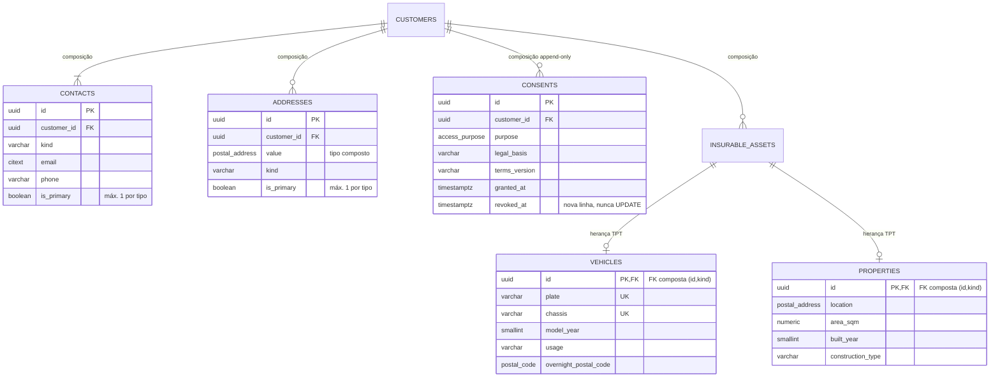
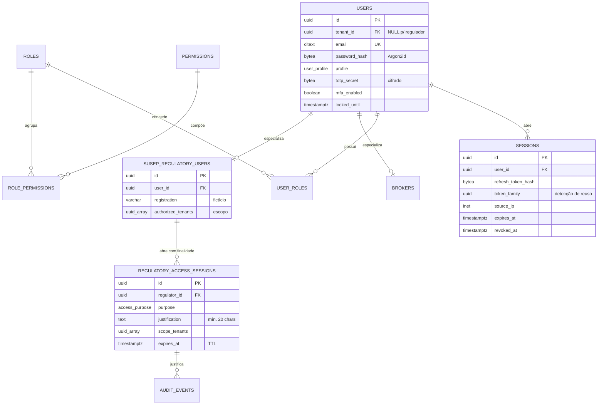
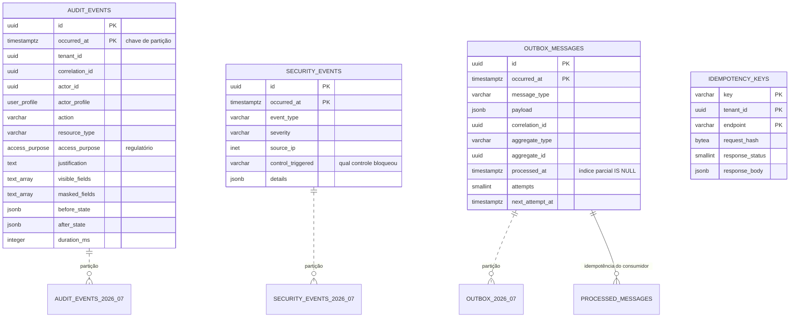

# Diagrama entidade-relacionamento — PortalDoCorretor

## 1. Visão geral (fluxo principal do negócio)

```mermaid
erDiagram
    BROKERAGES  ||--o{ BROKERS          : "emprega"
    BROKERAGES  ||--o{ CUSTOMERS        : "tenant de"
    CUSTOMERS   ||--o{ INSURABLE_ASSETS : "possui"
    CUSTOMERS   ||--o{ QUOTATIONS       : "é cotado em"
    INSURABLE_ASSETS ||--o{ QUOTATIONS  : "é objeto de"
    PRODUCT_VERSIONS ||--o{ QUOTATIONS  : "precifica"
    QUOTATIONS  ||--o| PROPOSALS        : "converte-se em"
    PROPOSALS   ||--o| POLICIES         : "origina"
    POLICIES    ||--|{ POLICY_COVERAGES : "contrata"
    POLICIES    ||--|| INSTALLMENT_PLANS: "é faturada por"
    INSTALLMENT_PLANS ||--|{ INSTALLMENTS : "compõe"
    POLICIES    ||--o{ COMMISSIONS      : "remunera"
    POLICIES    ||--o{ CLAIMS           : "cobre"
    POLICIES    ||--o{ ENDORSEMENTS     : "é alterada por"
    POLICIES    ||--o{ RENEWALS         : "é renovada por"
    BROKERS     ||--o{ COMMISSIONS      : "recebe"

    BROKERAGES {
        uuid id PK
        cnpj_digits document UK
        varchar trade_name
        varchar susep_registration
        varchar status
        timestamptz deleted_at
    }
    BROKERS {
        uuid id PK
        uuid tenant_id FK
        uuid user_id FK
        varchar susep_registration
        varchar status
    }
    CUSTOMERS {
        uuid id PK
        uuid tenant_id FK
        customer_kind kind "discriminador TPH"
        varchar document "cifrado"
        bytea document_hash UK "por tenant"
        varchar first_name "PF"
        varchar legal_name "PJ"
        tsvector search_vector "gerada"
        timestamptz deleted_at
    }
    INSURABLE_ASSETS {
        uuid id PK
        uuid tenant_id FK
        uuid customer_id FK
        asset_kind kind "discriminador TPT"
        money_amount declared_value
    }
    PRODUCT_VERSIONS {
        uuid id PK
        uuid product_id FK
        integer version
        varchar branch
        numeric base_rate
        smallint max_risk_score
    }
    QUOTATIONS {
        uuid id PK
        uuid tenant_id FK
        uuid customer_id FK
        uuid asset_id FK
        uuid product_version_id FK
        uuid previous_policy_id FK "renovação"
        varchar number UK
        quotation_status status
        smallint risk_score
        varchar risk_band "gerada"
        timestamptz expires_at
    }
    PROPOSALS {
        uuid id PK
        uuid tenant_id FK
        uuid quotation_id FK "UK parcial: 1 ativa"
        varchar number UK
        proposal_status status
        money_amount total_premium
        varchar idempotency_key
    }
    POLICIES {
        uuid id PK
        uuid tenant_id FK
        uuid proposal_id FK "UK parcial: 1 ativa"
        uuid customer_id FK
        uuid asset_id FK
        varchar number UK
        policy_status status
        daterange coverage_period "EXCLUDE: sem sobreposição"
        money_amount total_premium
        xid xmin "optimistic lock"
    }
    POLICY_COVERAGES {
        uuid id PK
        uuid policy_id FK
        uuid coverage_id FK
        money_amount limit_amount
        deductible deductible
        money_amount premium
    }
    INSTALLMENT_PLANS {
        uuid id PK
        uuid policy_id FK UK
        money_amount total_amount
        smallint installment_count
    }
    INSTALLMENTS {
        uuid id PK
        uuid plan_id FK
        smallint sequence UK
        money_amount amount
        date due_date
        installment_status status
    }
    COMMISSIONS {
        uuid id PK
        uuid policy_id FK
        uuid broker_id FK
        uuid rule_id FK
        integer rule_version
        numeric rate_applied
        money_amount base_amount
        money_amount amount
        commission_status status
        uuid reversed_from_id FK
    }
    CLAIMS {
        uuid id PK
        uuid tenant_id FK
        uuid policy_id FK
        varchar number UK
        claim_status status
        date occurrence_date
        money_amount estimated_amount "simulado"
    }
    ENDORSEMENTS {
        uuid id PK
        uuid policy_id FK
        integer sequence
        varchar kind
        money_amount premium_delta
    }
    RENEWALS {
        uuid id PK
        uuid policy_id FK
        uuid new_quotation_id FK
        varchar outcome
    }
```

## 2. Cliente e satélites (agregado `Customer`)



A FK composta `(id, kind)` das tabelas filhas é o que impede um bem marcado como `VEHICLE` de
ter registro em `properties` — a hierarquia de classes fica garantida por integridade referencial,
não por convenção.

## 3. Identidade, autorização e supervisão



## 4. Trilhas técnicas (particionadas por mês)



## 5. Cardinalidades e regras de exclusão

| Relação | Cardinalidade | Regra de exclusão | Motivo |
|---|---|---|---|
| `brokerages → customers` | 1:N | `RESTRICT` | Não se apaga um tenant com dados |
| `customers → contacts/addresses/consents/assets` | 1:N | `CASCADE` | Composição: o filho não existe sem o pai |
| `customers → quotations` | 1:N | `RESTRICT` | Cotação é registro histórico |
| `quotations → proposals` | 1:0..1 | `RESTRICT` | Unique parcial garante no máximo uma ativa |
| `proposals → policies` | 1:0..1 | `RESTRICT` | Unique parcial impede emissão duplicada |
| `policies → policy_coverages` | 1:N | `CASCADE` | Composição dentro do agregado |
| `policies → installment_plans` | 1:1 | `CASCADE` | Plano não existe sem apólice |
| `policies → commissions` | 1:N | `RESTRICT` | Registro financeiro é preservado |
| `policies → claims` | 1:N | `RESTRICT` | Sinistro sobrevive ao vencimento da apólice |
| `commissions → commissions` | auto-relação | `RESTRICT` | Estorno referencia o lançamento original |

## 6. Onde cada invariante do domínio é reforçada no banco

| Invariante | Mecanismo | Nome |
|---|---|---|
| Uma apólice ativa por proposta | Índice único parcial | `ux_policies_proposal` |
| Uma proposta ativa por cotação | Índice único parcial | `ux_proposals_quotation_active` |
| Vigências não se sobrepõem | Constraint de exclusão GiST | `ex_policies_no_overlap` |
| Soma das parcelas = prêmio | Constraint trigger deferida | `tg_installments_sum` |
| Documento único por tenant | Índice único parcial | `ux_customers_tenant_document` |
| Campos coerentes com o tipo (TPH) | Check constraint | `ck_customers_individual_fields` |
| Herança consistente (TPT) | FK composta `(id, kind)` | `ux_assets_kind` |
| Prêmio positivo, moeda BRL | Check constraint | `ck_policies_premium_*` |
| Auditoria imutável | `REVOKE UPDATE, DELETE` + trigger | `tg_audit_immutable` |
| Isolamento entre corretoras | RLS com `FORCE` | `p_*_tenant_isolation` |
| Regra de comissão sem sobreposição | Constraint de exclusão | `commission_rules EXCLUDE` |
| Concorrência na emissão | Optimistic lock nativo | `xmin` |

Esta tabela é o resumo do argumento central do case: **cada invariante do modelo de objetos tem
um par no banco**. O domínio impede que a aplicação crie estado inválido; o banco impede que
*qualquer coisa* crie — inclusive um script manual, um `psql` aberto ou uma migration errada.
