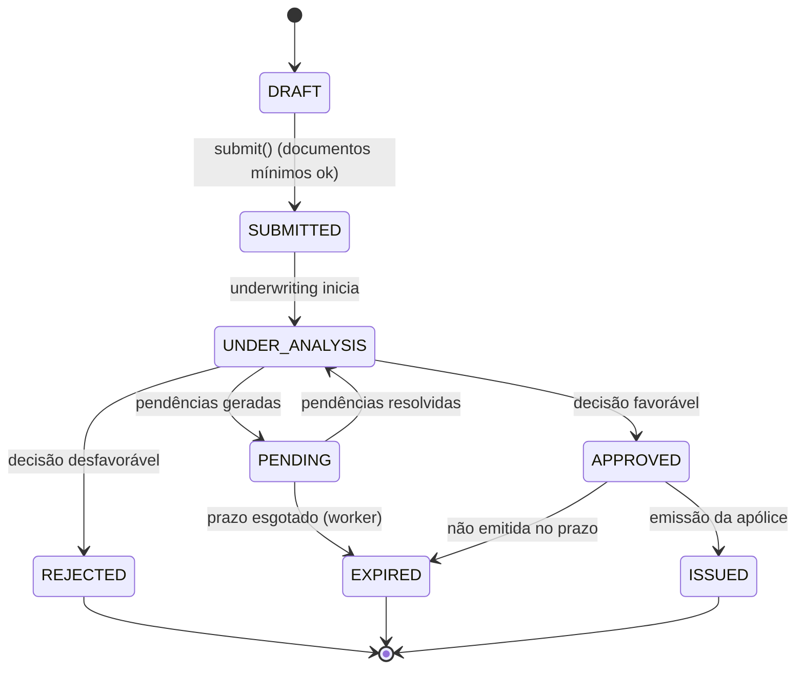

# Agregados — NexusBroker

Um agregado é a **fronteira de consistência transacional**: tudo dentro dele é confirmado junto e
obedece às invariantes do *Aggregate Root*; tudo fora é referenciado por **identidade**, nunca por
objeto, e converge de forma eventual por eventos.

## Regras aplicadas a todos os agregados

1. **Um agregado por transação**, como padrão. As exceções são explícitas e justificadas (ver §7).
2. **Referência entre agregados sempre por ID tipado** (`CustomerId`, `PolicyId`) — nunca por
   navegação de objeto. Isso impede carregamento acidental de meio banco e mantém a fronteira honesta.
3. **Coleções internas expostas como `IReadOnlyCollection<T>`**; a mutação ocorre exclusivamente
   por métodos de intenção do root (`AddCoverage`, `Approve`, `Issue`).
4. **Construtores privados + factory estático** — não existe agregado meio construído.
5. **Optimistic locking obrigatório** via `xmin` do PostgreSQL mapeado como token de concorrência.
6. **Eventos de domínio acumulados no root** e despachados após o `SaveChanges`, dentro da mesma
   transação que grava a Outbox.
7. **Todo agregado carrega `TenantId`** e é filtrado por *global query filter* e por RLS.

---

## 1. Customer Aggregate

```
Customer (root, abstrato)
 ├── Contacts        : IReadOnlyCollection<Contact>       [composição]
 ├── Addresses       : IReadOnlyCollection<Address>       [composição]
 ├── Consents        : IReadOnlyCollection<Consent>       [composição, append-only]
 └── InsurableAssets : IReadOnlyCollection<InsurableAsset> [composição, polimórfica]
```

**Especializações:** `IndividualCustomer` (CPF, data de nascimento, gênero opcional, profissão) e
`BusinessCustomer` (CNPJ, razão social, nome fantasia, CNAE, porte).

**Invariantes**

- Documento válido e único dentro do tenant.
- No máximo um endereço principal **por tipo** (residencial, comercial, cobrança).
- Ao menos um contato ativo enquanto o cliente estiver ativo.
- Consentimento nunca é alterado nem removido; revogação cria novo registro.
- Cliente com apólice vigente não pode ser desativado (verificada por serviço de domínio, pois
  cruza a fronteira com Policies — ver §7).
- PF exige CPF; PJ exige CNPJ (garantido pelo tipo e por check constraint com o discriminador).

**Limite transacional** — cadastrar cliente com contato, endereço, consentimento e bem inicial é
**uma** transação. Criar uma cotação para esse cliente é **outra**.

**Carregamento** — `Include` seletivo por caso de uso: a listagem carrega apenas a projeção
(CQRS de leitura, sem materializar o agregado); a edição carrega o root com a coleção que será
alterada. Lazy loading está **desabilitado globalmente** — é a origem mais comum de N+1, e o
Engineering Lab demonstra exatamente esse contraste.

**Concorrência** — dois corretores editando o mesmo cliente: o segundo `SaveChanges` falha com
`DbUpdateConcurrencyException`, a API responde `409` com o estado atual, e a UI oferece merge.

**Eventos** — `CustomerRegistered`, `CustomerUpdated`, `ConsentGranted`, `ConsentRevoked`, `AssetRegistered`.

```csharp
public abstract class Customer : AggregateRoot<CustomerId>
{
    private readonly List<Contact> _contacts = [];
    private readonly List<Address> _addresses = [];
    private readonly List<Consent> _consents = [];
    private readonly List<InsurableAsset> _assets = [];

    public TenantId TenantId { get; private set; }
    public DocumentNumber Document { get; private set; }
    public CustomerStatus Status { get; private set; }
    public abstract string DisplayName { get; }          // polimorfismo

    public IReadOnlyCollection<Contact> Contacts => _contacts.AsReadOnly();
    public IReadOnlyCollection<Consent> Consents => _consents.AsReadOnly();
    public IReadOnlyCollection<InsurableAsset> Assets => _assets.AsReadOnly();

    public void AddAddress(Address address)
    {
        if (address.IsPrimary && _addresses.Any(a => a.IsPrimary && a.Kind == address.Kind))
            throw new DomainException(ErrorCodes.DuplicatePrimaryAddress,
                $"Já existe endereço principal do tipo {address.Kind}.");

        _addresses.Add(address);
        Raise(new CustomerUpdated(Id, TenantId, nameof(Addresses)));
    }

    public void GrantConsent(AccessPurpose purpose, LegalBasis basis, string termsVersion)
    {
        // append-only: nunca sobrescreve o consentimento anterior
        _consents.Add(Consent.Grant(Id, purpose, basis, termsVersion));
        Raise(new ConsentGranted(Id, TenantId, purpose));
    }

    public void RevokeConsent(AccessPurpose purpose)
    {
        var current = CurrentConsentFor(purpose)
            ?? throw new DomainException(ErrorCodes.ConsentNotFound,
                   "Não há consentimento vigente para esta finalidade.");

        _consents.Add(current.RevokeAsNewRecord());
        Raise(new ConsentRevoked(Id, TenantId, purpose));
    }

    public Consent? CurrentConsentFor(AccessPurpose purpose) =>
        _consents.Where(c => c.Purpose == purpose)
                 .MaxBy(c => c.RecordedAt) is { IsActive: true } c ? c : null;
}
```

---

## 2. Quotation Aggregate

```
Quotation (root)
 ├── Items                : IReadOnlyCollection<QuotationItem>  [um por plano]
 ├── RiskProfile          : RiskProfile                          [composição 1:1]
 ├── SelectedCoverages    : IReadOnlyCollection<SelectedCoverage>
 └── CalculationSnapshots : IReadOnlyCollection<CalculationSnapshot> [imutável]
```

**Referências externas (por ID):** `CustomerId`, `InsurableAssetId`, `ProductVersionId`, `BrokerId`, `PreviousPolicyId?`.

**Invariantes**

- Cliente, bem e cotação pertencem ao mesmo tenant.
- O bem é compatível com o produto (auto ⇔ `Vehicle`, residencial ⇔ `Property`).
- Todas as coberturas obrigatórias da versão do produto estão selecionadas.
- Soma dos limites ≤ teto da versão do produto.
- `RiskScore` dentro do aceitável, senão a cotação nasce `REJECTED` com motivo.
- `expires_at = created_at + 30 dias`; cotação expirada não converte.
- Exatamente um `CalculationSnapshot` por plano, imutável após a criação.

**Limite transacional** — criar cotação, calcular os 3 planos e gravar snapshots é uma transação
única. O cálculo é **puro e determinístico** (sem I/O), o que o torna trivialmente testável e
reproduzível.

**Concorrência** — baixa contenção (cotação pertence a um corretor), mas o token de concorrência
existe para impedir que a conversão em proposta ocorra duas vezes em paralelo.

**Eventos** — `QuotationCreated`, `QuotationRejected`, `QuotationConverted`, `QuotationExpired`.

```csharp
public sealed class Quotation : AggregateRoot<QuotationId>
{
    public QuotationNumber Number   { get; private set; }
    public QuotationStatus Status   { get; private set; }
    public DateTimeOffset  ExpiresAt { get; private set; }
    public RiskProfile     RiskProfile { get; private set; }

    public static Quotation Create(
        TenantId tenant, BrokerId broker, CustomerId customer,
        InsurableAsset asset, ProductVersion product,
        RiskQuestionnaire answers, IReadOnlyList<CoverageSelection> coverages,
        IPremiumCalculator calculator, IClock clock)
    {
        // Specifications compostas — a elegibilidade é regra de domínio, não if espalhado
        var spec = new AssetMatchesProductSpec(product)
             .And(new MandatoryCoveragesSelectedSpec(product, coverages))
             .And(new CoverageLimitsWithinCapSpec(product, coverages));

        var evaluation = spec.Evaluate(asset);

        var profile = RiskProfile.From(answers, product);
        var quotation = new Quotation(tenant, broker, customer, asset.Id, product.Id, profile, clock);

        if (!evaluation.IsSatisfied || !profile.Score.IsAcceptableFor(product))
        {
            quotation.Reject(evaluation.Reasons);
            return quotation;                         // recusa também é informação auditável
        }

        foreach (var plan in PlanTier.All)
        {
            var snapshot = calculator.Calculate(product, asset, profile, coverages, plan);
            quotation.AddItem(QuotationItem.From(plan, snapshot));
        }

        quotation.Raise(new QuotationCreated(quotation.Id, tenant, customer, quotation.Number));
        return quotation;
    }

    public Proposal ConvertTo(PlanTier chosenPlan, IClock clock)
    {
        if (Status is not QuotationStatus.Calculated)
            throw new DomainException(ErrorCodes.QuotationNotConvertible,
                $"Cotação em status {Status} não pode ser convertida.");

        if (clock.UtcNow >= ExpiresAt)
            throw new DomainException(ErrorCodes.QuotationExpired,
                "Cotação expirada.");

        var item = _items.SingleOrDefault(i => i.Plan == chosenPlan)
            ?? throw new DomainException(ErrorCodes.PlanNotFound, "Plano inexistente na cotação.");

        Status = QuotationStatus.Converted;
        Raise(new QuotationConverted(Id, TenantId, chosenPlan));

        return Proposal.FromQuotation(this, item);    // factory cross-aggregate controlado
    }
}
```

---

## 3. Proposal Aggregate

```
Proposal (root)
 ├── Documents           : IReadOnlyCollection<ProposalDocument>  [referências a Documents]
 ├── Pendencies          : IReadOnlyCollection<Pendency>
 ├── UnderwritingDecision: UnderwritingDecision?  [imutável, versionada]
 └── StatusHistory       : IReadOnlyCollection<ProposalStatusChange> [append-only]
```

**Máquina de estados**



Transições **não** listadas lançam `InvalidStateTransitionException`. A tabela de transições é
declarada uma vez e testada exaustivamente (todo par origem→destino, válido ou não).

**Invariantes**

- Uma proposta ativa por cotação (índice único parcial).
- Não aprova com pendência aberta.
- `UnderwritingDecision` é imutável; reanálise cria nova versão, não sobrescreve.
- Emissão exige `APPROVED` **e** chave de idempotência.
- Toda mudança de status registra autor, motivo e timestamp.

**Concorrência** — ponto crítico do case. Emissão concorrente é resolvida por optimistic lock
(`xmin`) + índice único + `Idempotency-Key`. Ver `docs/architecture/concurrency.md` (Fase 4).

**Eventos** — `ProposalCreated`, `ProposalSubmitted`, `ProposalApproved`, `ProposalRejected`,
`ProposalPending`, `ProposalIssued`.

---

## 4. Policy Aggregate

```
Policy (root)
 ├── Coverages   : IReadOnlyCollection<PolicyCoverage>  [congeladas na emissão]
 ├── Endorsements: IReadOnlyCollection<Endorsement>     [versionamento]
 ├── Renewals    : IReadOnlyCollection<Renewal>
 └── (referência) CommissionId, InstallmentPlanId
```

> **Decisão de fronteira:** `Installment` **não** faz parte do agregado `Policy` — pertence a
> Billing. `Policy` guarda apenas `InstallmentPlanId`. O motivo está em §7.

**Invariantes**

- Uma apólice ativa por proposta.
- Vigência sem sobreposição para o mesmo (tenant, bem, produto) entre apólices ativas —
  garantida por constraint de exclusão `btree_gist`.
- Coberturas congeladas na emissão; alteração apenas por endosso.
- Prêmio total > 0 e igual à soma dos prêmios de cobertura.
- Endosso só em apólice `ACTIVE`.
- Cancelamento define data de efeito ≥ início da vigência.

```csharp
public sealed class Policy : AggregateRoot<PolicyId>
{
    private readonly List<PolicyCoverage> _coverages = [];

    public PolicyNumber Number  { get; private set; }
    public DateRange   Period   { get; private set; }
    public PolicyStatus Status  { get; private set; }
    public Money       TotalPremium { get; private set; }
    public ProposalId  ProposalId   { get; private set; }   // referência por ID

    /// <summary>
    /// Único caminho de criação de apólice no sistema. Concentra as invariantes
    /// de emissão em um lugar auditável — não há como emitir por outra via.
    /// </summary>
    public static Policy Issue(
        Proposal proposal, UnderwritingDecision decision,
        PolicyNumber number, DateRange period, IClock clock)
    {
        if (proposal.Status is not ProposalStatus.Approved)
            throw new DomainException(ErrorCodes.ProposalNotApproved,
                $"Proposta em status {proposal.Status} não pode ser emitida.");

        if (proposal.HasOpenPendencies)
            throw new DomainException(ErrorCodes.ProposalHasPendencies,
                "Proposta possui pendências em aberto.");

        if (!decision.IsFavorable)
            throw new DomainException(ErrorCodes.UnfavorableDecision,
                "Decisão de underwriting não permite emissão.");

        var policy = new Policy(proposal.TenantId, proposal.Id, number, period, clock);

        foreach (var selected in proposal.SelectedCoverages)
            policy._coverages.Add(PolicyCoverage.Freeze(selected));   // congela limite e franquia

        policy.TotalPremium = policy._coverages
            .Select(c => c.Premium)
            .Aggregate(Money.Zero(), (a, b) => a.Add(b));

        if (!policy.TotalPremium.IsPositive)
            throw new DomainException(ErrorCodes.PremiumInvalid, "Prêmio total deve ser positivo.");

        policy.Raise(new PolicyIssued(
            policy.Id, policy.TenantId, proposal.Id, policy.Number,
            policy.TotalPremium, policy.Period, proposal.BrokerId));

        return policy;
    }
}
```

**Eventos** — `PolicyIssued`, `PolicyEndorsed`, `PolicyRenewed`, `PolicyCancelled`.

---

## 5. Claim Aggregate

```
Claim (root)
 ├── Events       : IReadOnlyCollection<ClaimEvent>          [append-only]
 ├── Documents    : IReadOnlyCollection<ClaimDocument>
 ├── Damages      : IReadOnlyCollection<Damage>
 └── StatusHistory: IReadOnlyCollection<ClaimStatusChange>   [append-only]
```

**Invariantes** — data do evento dentro da vigência da apólice; linha do tempo somente-inserção;
decisão e valores explicitamente marcados como **simulados**; sinistro só em apólice `ACTIVE` ou
`EXPIRED` cuja vigência cobria a data do evento.

**Eventos** — `ClaimReported`, `ClaimEventAdded`, `ClaimDecided`.

---

## 6. Agregados de apoio

| Agregado | Root | Observação |
|---|---|---|
| **Commission** | `Commission` | Referencia `CommissionRule` versionada; estorno é lançamento inverso, nunca `UPDATE` destrutivo |
| **InstallmentPlan** | `InstallmentPlan` | Invariante `Σ parcelas = prêmio`; usa `Money.Allocate` |
| **User** | `User` | Contém `Session`s e credenciais; senha nunca deixa o agregado |
| **Document** | `Document` | Hash, tipo validado, vínculo polimórfico |
| **Agent** | `Agent` | `AgentSkill`s e allowlist de ferramentas; `AgentExecution` é agregado separado (volume alto, ciclo de vida próprio) |
| **RegulatoryAccessSession** | — | Finalidade, escopo e TTL; toda consulta regulatória referencia uma sessão ativa |
| **AuditEvent / SecurityEvent** | — | Imutáveis, particionados por mês, sem `UPDATE`/`DELETE` |

---

## 7. Exceções à regra "um agregado por transação"

Três casos rompem a regra deliberadamente. Cada um tem justificativa e teste.

**(a) Emissão de apólice** — `Proposal` (transição para `ISSUED`), `Policy` (criação),
`InstallmentPlan` (geração) e `Commission` (apuração) são confirmados **na mesma transação**.

*Por quê:* consistência eventual aqui seria observável pelo usuário e financeiramente incorreta —
uma apólice sem parcelas ou sem comissão, ainda que por segundos, é um estado que o negócio não
aceita e que geraria compensação manual. O custo é uma transação mais longa (mensurada em ~40 ms
no ambiente local); o benefício é consistência forte no fluxo mais crítico do sistema.

*Alternativa descartada:* saga com compensação. Adiciona estados intermediários visíveis, exige
lógica de reversão e triplicaria a complexidade do fluxo mais importante do case — sem ganho real,
já que tudo está no mesmo banco.

**(b) Conversão cotação → proposta** — a `Quotation` transiciona para `CONVERTED` e a `Proposal`
nasce, juntas. Motivo: sem isso, uma falha entre as duas escritas permitiria converter a mesma
cotação duas vezes.

**(c) Operação + auditoria** — todo `AuditEvent` é gravado na transação da operação auditada.
Motivo: "operação confirmada sem auditoria" é inaceitável em contexto regulado. Consequência
deliberada: se a auditoria falhar, a operação de negócio falha junto.

Nos demais casos vale consistência eventual via Outbox: notificação, atualização de projeções,
refresh de materialized view, indexação de busca e execução de agentes.

---

## 8. Estratégia de carregamento

| Cenário | Estratégia | Motivo |
|---|---|---|
| Comando que altera o agregado | Carregar o root com as coleções afetadas (`Include` explícito) | Invariantes exigem o estado completo daquilo que muda |
| Listagem / dashboard | Projeção direta para DTO (`Select`), sem materializar entidade | Evita carregar dezenas de campos e coleções para exibir cinco colunas |
| Relatório regulatório | Materialized view + Dapper | Agregação pesada; o ORM não agrega valor em leitura analítica |
| Linha do tempo | Consulta na tabela de eventos particionada | Já é *append-only* e ordenada por natureza |

**Lazy loading está desabilitado globalmente.** É a decisão mais eficaz contra N+1, e o
Engineering Lab mostra lado a lado a mesma consulta com lazy (N+1 real, contado pela
instrumentação) e com projeção otimizada — com medições reais, não estimadas.

## 9. Estratégia de concorrência

| Agregado | Contenção | Mecanismo |
|---|---|---|
| `Customer` | Baixa | Optimistic (`xmin`) |
| `Quotation` | Baixa | Optimistic |
| `Proposal` | **Alta na emissão** | Optimistic + unique parcial + `Idempotency-Key` |
| `Policy` | Média | Optimistic + constraint de exclusão de vigência |
| `Commission` | Média | Optimistic; estorno como lançamento inverso |
| `OutboxMessage` | **Alta entre workers** | `SELECT ... FOR UPDATE SKIP LOCKED` |

Pessimistic locking foi descartado como padrão: em carga concorrente ele troca conflito por fila,
e o perfil de acesso aqui é de conflito raro. O único uso de lock explícito é o
`SKIP LOCKED` da Outbox, onde múltiplos workers competem pelas mesmas linhas por construção.
