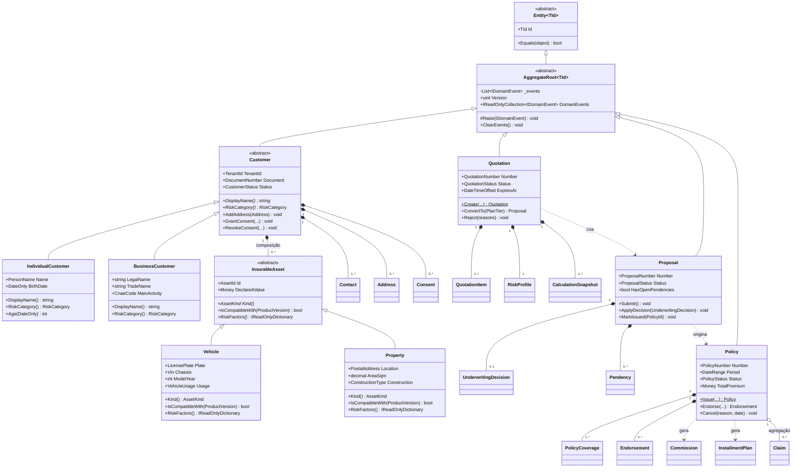

# Modelo orientado a objetos — PortalDoCorretor

Este documento demonstra os mecanismos de OO exigidos: herança, composição, associação, agregação,
polimorfismo, encapsulamento, interfaces, classes abstratas, aggregate roots, entidades, value
objects, serviços de domínio, eventos, invariantes, repositórios e specifications.

**Princípio inegociável:** modelo de domínio **rico**. Não existe classe que seja apenas um saco de
`get`/`set`. Toda regra de negócio vive na entidade, no agregado ou em um serviço de domínio —
nunca no controller, nunca no repositório, nunca em um "manager" genérico.

## 1. Diagrama de classes — núcleo



**Leitura das relações:**

- **Herança** (`<|--`) — `Customer → IndividualCustomer/BusinessCustomer`;
  `InsurableAsset → Vehicle/Property`. É herança **verdadeira**: as subclasses respondem
  diferentemente a `RiskCategory()` e `RiskFactors()`, e o polimorfismo é usado pelo motor de
  cálculo. Não é herança por reuso de campos.
- **Composição** (`*--`) — o ciclo de vida do filho depende do pai: apagar o `Customer` apaga
  seus `Contact`s. Persistido com `ON DELETE CASCADE`.
- **Agregação** (`o--`) — `Policy` e `Claim` existem independentemente; o sinistro referencia a
  apólice por ID e sobrevive ao seu vencimento.
- **Associação/dependência** (`..>`) — `Quotation` cria `Proposal`, mas não a possui.

## 2. Polimorfismo aplicado (não decorativo)

O motor de cálculo consome fatores de risco sem conhecer o tipo concreto do bem:

```csharp
public abstract class InsurableAsset : Entity<AssetId>
{
    public TenantId TenantId { get; protected set; }
    public Money DeclaredValue { get; protected set; }

    public abstract AssetKind Kind { get; }
    public abstract bool IsCompatibleWith(ProductVersion product);

    /// <summary>Fatores que o motor de precificação consome sem conhecer o tipo concreto.</summary>
    public abstract IReadOnlyDictionary<string, decimal> RiskFactors();
}

public sealed class Vehicle : InsurableAsset
{
    public LicensePlate Plate { get; private set; }
    public int ModelYear { get; private set; }
    public VehicleUsage Usage { get; private set; }
    public PostalCode OvernightLocation { get; private set; }

    public override AssetKind Kind => AssetKind.Vehicle;

    public override bool IsCompatibleWith(ProductVersion product) =>
        product.Branch == InsuranceBranch.Auto;

    public override IReadOnlyDictionary<string, decimal> RiskFactors() => new Dictionary<string, decimal>
    {
        ["age"]           = DateTime.UtcNow.Year - ModelYear,
        ["usage"]         = Usage.RiskWeight,
        ["region"]        = OvernightLocation.RegionRiskWeight,
        ["declaredValue"] = DeclaredValue.Amount
    };
}

public sealed class Property : InsurableAsset
{
    public decimal AreaSqm { get; private set; }
    public ConstructionType Construction { get; private set; }
    public int BuiltYear { get; private set; }

    public override AssetKind Kind => AssetKind.Property;

    public override bool IsCompatibleWith(ProductVersion product) =>
        product.Branch == InsuranceBranch.Residential;

    public override IReadOnlyDictionary<string, decimal> RiskFactors() => new Dictionary<string, decimal>
    {
        ["buildingAge"]   = DateTime.UtcNow.Year - BuiltYear,
        ["construction"]  = Construction.RiskWeight,
        ["area"]          = AreaSqm,
        ["region"]        = Location.RegionRiskWeight,
        ["declaredValue"] = DeclaredValue.Amount
    };
}
```

Acrescentar um novo tipo de bem (equipamento, embarcação) exige uma subclasse e uma migration de
enum — **nenhum `switch` existente muda**. É o Open/Closed Principle sendo estrutural, não retórico.

**Persistência da herança:** *Table Per Hierarchy* (TPH) com discriminador para `Customer`
(subclasses compartilham a maioria dos campos, consultas quase sempre polimórficas) e
*Table Per Type* (TPT) para `InsurableAsset` (atributos muito divergentes; TPH deixaria a tabela
cheia de `NULL` e impediria `NOT NULL` nos campos obrigatórios de cada tipo). O trade-off está
registrado em ADR-0005.

## 3. Interfaces e abstrações

```csharp
// Marcadores de domínio — ficam em SharedKernel, sem dependência de framework
public interface IAggregateRoot;
public interface IDomainEvent
{
    Guid EventId { get; }
    DateTimeOffset OccurredAt { get; }
    TenantId TenantId { get; }
}
public interface ITenantScoped { TenantId TenantId { get; } }
public interface ISoftDeletable { DateTimeOffset? DeletedAt { get; } }
public interface IAuditable
{
    DateTimeOffset CreatedAt { get; }
    UserId CreatedBy { get; }
    DateTimeOffset? UpdatedAt { get; }
    UserId? UpdatedBy { get; }
}

// Porta (Hexagonal): definida no domínio, implementada na infraestrutura
public interface IRepository<TAggregate, TId> where TAggregate : IAggregateRoot
{
    Task<TAggregate?> FindAsync(TId id, CancellationToken ct);
    Task<TAggregate> GetAsync(TId id, CancellationToken ct);   // lança se não existir
    void Add(TAggregate aggregate);
}

public interface IPolicyRepository : IRepository<Policy, PolicyId>
{
    Task<Policy?> FindByProposalAsync(ProposalId proposalId, CancellationToken ct);
    Task<bool> ExistsOverlappingAsync(AssetId asset, ProductId product, DateRange period, CancellationToken ct);
    Task<IReadOnlyList<Policy>> FindExpiringAsync(DateOnly reference, int withinDays, CancellationToken ct);
}

public interface IUnitOfWork
{
    Task<int> SaveChangesAsync(CancellationToken ct);
    Task ExecuteInTransactionAsync(Func<Task> operation, CancellationToken ct);
}

// Abstrações que mantêm o domínio determinístico e testável
public interface IClock { DateTimeOffset UtcNow { get; } }
public interface IPolicyNumberGenerator { Task<PolicyNumber> NextAsync(int year, CancellationToken ct); }
```

O domínio depende de `IClock` em vez de `DateTime.UtcNow`: sem isso, testar "cotação expira em 30
dias" exigiria esperar 30 dias ou usar hacks estáticos. É também o que torna o cálculo de prêmio
reproduzível.

## 4. Specifications

Regras de elegibilidade componíveis, testáveis isoladamente e traduzíveis para SQL quando usadas
em consulta:

```csharp
public abstract class Specification<T>
{
    public abstract Expression<Func<T, bool>> ToExpression();
    public bool IsSatisfiedBy(T entity) => ToExpression().Compile()(entity);

    public Specification<T> And(Specification<T> other) => new AndSpecification<T>(this, other);
    public Specification<T> Or(Specification<T> other)  => new OrSpecification<T>(this, other);
    public Specification<T> Not()                       => new NotSpecification<T>(this);
}

public sealed class VehicleAgeWithinLimitSpec : Specification<Vehicle>
{
    private readonly int _maxAge;
    private readonly int _currentYear;

    public VehicleAgeWithinLimitSpec(int maxAge, int currentYear) =>
        (_maxAge, _currentYear) = (maxAge, currentYear);

    public override Expression<Func<Vehicle, bool>> ToExpression() =>
        v => _currentYear - v.ModelYear <= _maxAge;
}

// Composição legível no ponto de uso
var eligible = new VehicleAgeWithinLimitSpec(product.MaxVehicleAge, clock.UtcNow.Year)
    .And(new DeclaredValueWithinRangeSpec(product.MinValue, product.MaxValue))
    .And(new NoActiveClaimFraudFlagSpec());
```

A mesma specification serve para validar um objeto em memória (`IsSatisfiedBy`) e para filtrar no
banco (`ToExpression()` traduzida pelo EF Core) — a regra existe **uma vez**, e não pode divergir
entre validação e consulta.

## 5. Serviços de domínio

Usados apenas quando a regra **não pertence naturalmente a um agregado** — isto é, quando cruza
agregados ou depende de política externa.

```csharp
/// <summary>
/// Cálculo simulado e determinístico de prêmio. Puro: sem I/O, sem relógio, sem aleatoriedade.
/// A fórmula é documentada e versionada — o CalculationSnapshot registra a versão usada.
/// </summary>
public sealed class PremiumCalculationService : IPremiumCalculator
{
    public const string EngineVersion = "1.0.0";

    public CalculationSnapshot Calculate(
        ProductVersion product, InsurableAsset asset,
        RiskProfile profile, IReadOnlyList<CoverageSelection> coverages, PlanTier plan)
    {
        var factors = asset.RiskFactors();                       // polimorfismo
        var basePremium = product.BaseRate.MultiplyBy(asset.DeclaredValue);

        var riskMultiplier = 1m
            + (profile.Score.Value / 1000m * product.RiskSensitivity)
            + factors.Sum(f => product.FactorWeight(f.Key) * f.Value);

        var planMultiplier = plan.Multiplier;

        var premium = basePremium
            .MultiplyBy(Percentage.Of(riskMultiplier))
            .MultiplyBy(Percentage.Of(planMultiplier));

        // Snapshot imutável: permite reproduzir o cálculo meses depois, campo a campo
        return CalculationSnapshot.Create(
            engineVersion: EngineVersion,
            productVersionId: product.Id,
            inputs: factors,
            riskScore: profile.Score,
            riskMultiplier: riskMultiplier,
            planMultiplier: planMultiplier,
            basePremium: basePremium,
            finalPremium: premium);
    }
}

/// <summary>Cruza Policy e CommissionRule — não pertence a nenhum dos dois isoladamente.</summary>
public sealed class CommissionEngine
{
    public Commission CalculateFor(Policy policy, CommissionRule rule, BrokerId broker)
    {
        if (!rule.AppliesTo(policy.ProductId, policy.Period.Start))
            throw new DomainException(ErrorCodes.CommissionRuleNotApplicable,
                "Regra de comissão não aplicável a este produto/período.");

        var baseAmount = rule.BaseOn switch
        {
            CommissionBase.NetPremium   => policy.NetPremium,
            CommissionBase.TotalPremium => policy.TotalPremium,
            _ => throw new UnreachableException()
        };

        // Referencia a versão da regra — responde de forma auditável "por que este valor?"
        return Commission.Forecast(policy.Id, broker, rule.Id, rule.Version, rule.Rate, baseAmount);
    }
}
```

## 6. Eventos de domínio

```csharp
public sealed record PolicyIssued(
    PolicyId PolicyId,
    TenantId TenantId,
    ProposalId ProposalId,
    PolicyNumber Number,
    Money TotalPremium,
    DateRange Period,
    BrokerId BrokerId) : IDomainEvent
{
    public Guid EventId { get; } = Guid.CreateVersion7();      // ordenável no tempo
    public DateTimeOffset OccurredAt { get; } = DateTimeOffset.UtcNow;
}
```

**Ciclo de vida do evento:**

1. O agregado acumula o evento em memória (`Raise`).
2. Um interceptor do EF Core, **antes** do commit, drena os eventos dos agregados rastreados.
3. Handlers *in-process* que precisam de consistência forte executam na mesma transação
   (geração de parcelas, cálculo de comissão).
4. Eventos de integração são serializados como `OutboxMessage` **na mesma transação**.
5. `COMMIT`.
6. O Outbox Dispatcher publica com `FOR UPDATE SKIP LOCKED`; consumidores são idempotentes por `message_id`.

Isso resolve o problema clássico de *dual write*: nunca existe estado confirmado sem evento, nem
evento publicado sem estado — porque ambos moram na mesma transação de banco.

## 7. Encapsulamento — o contraste que o case demonstra

**Modelo anêmico (aplicação vulnerável — o antipadrão, implementado de propósito):**

```csharp
// apps/vulnerable-api — NÃO seguir
public class Policy
{
    public Guid Id { get; set; }
    public Guid TenantId { get; set; }          // alterável de fora → cross-tenant
    public string Status { get; set; }          // qualquer string vira status
    public decimal Premium { get; set; }        // pode ser negativo
    public List<PolicyCoverage> Coverages { get; set; }   // mutável por qualquer um
}

// Regra de negócio vazando para o controller:
[HttpPost("issue")]
public IActionResult Issue(IssueDto dto)
{
    var policy = new Policy { TenantId = dto.TenantId, Status = "ACTIVE", Premium = dto.Premium };
    _db.Policies.Add(policy);                   // sem invariante, sem lock, sem auditoria
    _db.SaveChanges();
    return Ok(policy);                          // expõe a entidade diretamente
}
```

**Modelo rico (aplicação segura):**

```csharp
public sealed class Policy : AggregateRoot<PolicyId>
{
    private readonly List<PolicyCoverage> _coverages = [];

    public PolicyStatus Status { get; private set; }               // enum, setter privado
    public Money TotalPremium { get; private set; }                // VO validado
    public IReadOnlyCollection<PolicyCoverage> Coverages => _coverages.AsReadOnly();

    private Policy() { }                                           // só para o ORM
    public static Policy Issue(...) { /* invariantes aqui */ }     // único caminho de criação

    public void Cancel(CancellationReason reason, DateOnly effectiveDate, IClock clock)
    {
        if (Status is not PolicyStatus.Active)
            throw new DomainException(ErrorCodes.PolicyNotActive,
                $"Apólice em status {Status} não pode ser cancelada.");

        if (effectiveDate < Period.Start)
            throw new DomainException(ErrorCodes.InvalidCancellationDate,
                "Data de efeito anterior ao início da vigência.");

        Status = PolicyStatus.Cancelled;
        Raise(new PolicyCancelled(Id, TenantId, reason, effectiveDate));
    }
}
```

A diferença não é estética. No modelo anêmico, **cada chamador** precisa lembrar de validar; basta
um esquecer. No modelo rico, o estado inválido é **inalcançável** — não há caminho de código que
produza uma apólice com prêmio negativo ou status inventado. O Security Lab executa o mesmo ataque
contra as duas versões e mostra exatamente onde a segunda para.

## 8. Catálogo de classes por categoria

| Categoria | Classes |
|---|---|
| **Aggregate Roots** | `Brokerage`, `Broker`, `User`, `Customer`, `InsuranceProduct`, `Quotation`, `Proposal`, `Policy`, `InstallmentPlan`, `Commission`, `Claim`, `Document`, `Notification`, `Agent`, `AgentExecution`, `RegulatoryAccessSession` |
| **Entidades** | `Contact`, `Address`, `Consent`, `InsurableAsset`, `Vehicle`, `Property`, `Coverage`, `Assistance`, `EligibilityRule`, `QuotationItem`, `RiskProfile`, `CalculationSnapshot`, `ProposalDocument`, `Pendency`, `UnderwritingDecision`, `PolicyCoverage`, `Endorsement`, `Renewal`, `Installment`, `Payment`, `CommissionRule`, `CommissionEntry`, `ClaimEvent`, `Damage`, `Session`, `Role`, `Permission`, `AgentSkill`, `SusepRegulatoryUser` |
| **Value Objects** | `Money`, `Percentage`, `EmailAddress`, `PhoneNumber`, `DocumentNumber`, `PostalAddress`, `DateRange`, `PolicyNumber`, `ProposalNumber`, `QuotationNumber`, `CommissionRate`, `RiskScore`, `CoverageLimit`, `Deductible`, `TenantId`, `CorrelationId`, `LicensePlate`, `Vin`, `ContentHash`, `IdempotencyKey`, `AccessPurpose` |
| **Serviços de domínio** | `PremiumCalculationService`, `EligibilityEvaluator`, `UnderwritingService`, `CommissionEngine`, `PolicyIssuanceService`, `RenewalDetectionService` |
| **Eventos de domínio** | `CustomerRegistered`, `ConsentGranted`, `ConsentRevoked`, `QuotationCreated`, `QuotationConverted`, `ProposalSubmitted`, `ProposalApproved`, `PolicyIssued`, `PolicyEndorsed`, `PolicyCancelled`, `InstallmentsGenerated`, `CommissionCalculated`, `CommissionReversed`, `ClaimReported`, `ClaimDecided`, `RenewalDue` |
| **Registros técnicos** | `AuditEvent`, `SecurityEvent`, `OutboxMessage`, `DomainEventRecord` |
