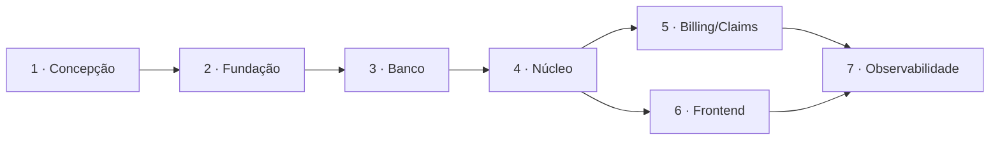

# Plano de implementação

Entrega incremental em 7 fases. Cada fase tem entregáveis, critério de pronto e uma demonstração
verificável — nada é considerado concluído por afirmação, apenas por evidência executável.

| Fase | Escopo | Critério de pronto |
|---|---|---|
| **1 ✅** | Nome, conceito, escopo, requisitos, casos de uso, bounded contexts, modelo de domínio, agregados, VOs, modelo físico, ER, arquitetura, estrutura, plano, ADRs | Documentação revisável e coerente entre si |
| **2** | Fundação: solução .NET, SharedKernel, VOs com testes, Docker Compose base, PostgreSQL, CI mínima | `docker compose up` sobe banco; testes de VO passam; NetArchTest ativo |
| **3** | Banco: migrations completas, tipos compostos, constraints, índices, RLS, particionamento, Outbox, seeds sintéticos | Migrations aplicam e revertem em base limpa; teste de RLS e de constraint passam com PostgreSQL real |
| **4** | Domínio + API do núcleo: Identity, Customers, Products, Quotations, Proposals, Policies; autenticação, autorização, tenant, idempotência, optimistic locking, auditoria, Outbox | Fluxo cliente → cotação → proposta → apólice funciona ponta a ponta; teste de concorrência prova emissão única |
| **5** | Billing, Commissions, Claims, Documents, Notifications, workers | Parcelas, comissão, endosso, renovação e sinistro funcionais; invariante Σ parcelas = prêmio testada |
| **6** | Frontend: design system, autenticação, dashboards, telas de cliente, cotação, proposta, apólice, comissão, sinistro | Telas operando contra a API real; Storybook publicado |
| **7** | Observabilidade + laboratório: Live Processing Console, Query Inspector, Transaction Inspector, Database Explorer, Data Browser, Engineering Lab | 24 passos observáveis na emissão; `EXPLAIN` real no Query Inspector; benchmarks medidos e versionados |

## Ordem e dependências

O banco vem **antes** da API deliberadamente: o case é avaliado principalmente pelo modelo
objeto-relacional, então o esquema, as constraints e a RLS precisam estar corretos e testados
antes de existir código que dependa deles.

## Riscos e mitigações

| Risco | Impacto | Mitigação |
|---|---|---|
| Escopo muito grande para uma pessoa | Entrega incompleta | Fases 2–5 são o núcleo defensável; 6–7 agregam valor mas o case já se sustenta com o banco, o domínio e os testes |
| Benchmarks não reprodutíveis | Perda de credibilidade | Seed fixa, massa determinística, especificação da máquina publicada junto com os números |
| Documentação divergir do código | Case perde consistência | Diagramas em Mermaid versionados; Database Explorer lê o catálogo real; testes referenciam requisitos |

## Como o case é apresentado

O ponto central da apresentação, em uma frase: **o banco de dados, os objetos de domínio, as
regras, as transações, os controles de segurança e os processamentos são reais e podem ser
acompanhados em tempo real — apenas os dados de negócio são sintéticos, por privacidade e
conformidade.**

A demonstração tem foco no banco e não na interface: emitir uma apólice de verdade e ver a
transação, o índice, a RLS, o evento e a auditoria acontecerem; depois violar uma invariante de
propósito e ver o banco recusar, com o controle nomeado.
